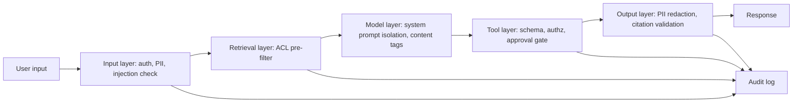

# Security and Privacy

## Beginner-Friendly Intuition

Security and privacy in production AI is a different shape than in
classical software. The model itself is a new attack surface (prompt
injection, jailbreaks, model extraction). The training and retrieval
data is sensitive (PII, regulated content). The supply chain is large
(model artifacts, third-party APIs, embedding services). Each layer
needs explicit controls, layered, with audit and monitoring.

The intuition: in classical software, the threats are well understood
(SQL injection, XSS, auth bypass). In AI systems, many attacks bypass
the application logic entirely by manipulating the model's input.
Defending against these requires treating the model as untrusted by
default and the inputs as adversarial by default.

This file catalogs the security and privacy concerns specific to
production AI: prompt injection, data exfiltration, PII redaction,
ACL on retrieval, audit logs, secrets management, supply chain
integrity. Read it as a checklist; missing items become incidents.

## Formal Explanation

### Threat model

The threats specific to AI systems:

- **Prompt injection.** A user (direct) or a retrieved document
  (indirect) contains instructions that override the system prompt,
  causing the model to leak data, take harmful actions, or refuse
  service.
- **Data exfiltration.** The model is tricked into revealing data it
  should not (system prompt, other users' data, training data).
- **Jailbreaks.** Crafted inputs bypass the model's safety alignment.
- **Model extraction.** An attacker queries the model many times to
  approximate or steal it.
- **Training data poisoning.** Malicious data introduced into
  retraining corrupts the model.
- **Supply chain attacks.** Compromised model weights, embedding
  services, or third-party tools introduce vulnerabilities.
- **Side-channel leaks.** Latency variation or error messages reveal
  what data exists or what was searched.

### Defense layers

The defenses must be layered; no single control catches everything.

#### Input layer

- **Content classification.** Detect and block obvious abuse
  (toxicity, illegal content) before the model sees it.
- **PII detection and redaction.** Strip or mask PII before logs and
  before the model where the model does not need it.
- **Rate limits per user, per tenant.** Prevent model extraction and
  abuse.
- **Authentication and authorization.** Every request authenticated;
  per-tenant scoping enforced.
- **Prompt-injection defenses.** Content tagging
  (`<document>...</document>`), instruction hierarchy (system role
  outranks user role), classifier on suspicious patterns.

#### Retrieval layer

- **ACL pre-filter.** Permission check before the index is queried.
  Post-filter is a permission leak.
- **Index versioning and audit.** Who indexed what when. Tombstones
  for deleted documents.
- **Source provenance.** Every retrieved chunk carries metadata
  about where it came from, who can access it.

#### Model layer

- **System prompt isolation.** The system prompt is not user-visible
  or user-modifiable. The instruction hierarchy in the API is
  enforced.
- **Output validation.** Schema constraints on structured outputs.
  Refusal classifiers on potentially harmful content.
- **Cite-or-abstain contract.** The model refuses to answer when
  evidence is missing rather than fabricating.

#### Tool layer

- **Authorization per tool call.** Permissions checked before
  execution. The model does not authorize itself.
- **Argument validation.** Schema-validated; reject malformed
  arguments.
- **Approval gates** for risky actions (external email, payment,
  account changes). Human or two-step approval.
- **Audit log.** Every tool call recorded with arguments (redacted
  if sensitive), authorization decision, result.

#### Output layer

- **PII detection on output.** Catch accidental PII in generated
  responses.
- **Content classification on output.** Catch policy violations
  (medical advice, financial advice, etc.).
- **Citation validation.** Verify that cited sources support the
  claim and the user has access to them.

### PII handling

PII (personally identifiable information) requires explicit handling:

- **Detection at ingest.** Scan documents and user inputs for
  emails, SSNs, phone numbers, addresses, account numbers, names
  (harder), health markers, etc. Use classifiers (Microsoft Presidio,
  AWS Comprehend, custom).
- **Redaction.** Replace with placeholders or hashes. Original PII
  stored separately with strict access.
- **Tokenization.** Replace PII with tokens that map back via a
  secure tokenization service. Useful when downstream needs
  references but not values.
- **Differential privacy** for training data: add calibrated noise so
  individual records cannot be reconstructed.
- **Right to erasure.** GDPR and CCPA require deletion within a
  bounded window (typically 30 days). The system must delete from
  retrieval indexes, caches, training corpora, and logs.

### Audit logs and retention

Every privacy- or security-relevant action gets logged:

- **What.** The request, response (redacted if sensitive), tool
  calls, retrieved documents, ACL decisions.
- **Who.** Authenticated user identity, tenant, role.
- **When.** Timestamp.
- **Why.** Intent or feature, request ID for correlation.

Retention: 7 years for financial and healthcare; 2-5 years for
general business; 90 days minimum for security investigation.

Access to audit logs is itself audited (access control on the audit
control plane).

### Secrets management

API keys, model credentials, vector DB credentials, tool credentials.
Stored in a secrets vault (Vault, AWS Secrets Manager, etc.). Rotated
quarterly minimum. Never in code, never in environment variables in
plain text, never in container images.

### Supply chain integrity

Model artifacts: signed and verified before loading. Hash-pinned
container images. Dependency pinning with audit. Periodic vulnerability
scans on the dependency tree. Critical: the "model" includes the
embedding model, the reranker, the LLM, all weight files; each has
its own supply chain.

## Why It Matters in Real Jobs

Three production reasons. First, **the cost of a leak is enormous**:
regulatory fines, customer trust loss, public incident. Second, **AI
attack surfaces are novel and the controls are not in classical
runbooks**. Many security teams discover prompt injection mid-incident
because they planned for SQL injection. Third, **compliance
frameworks (SOC2, GDPR, HIPAA, EU AI Act) are explicit about AI
controls**. The audit trail, ACL pre-filter, PII handling, and
retention policy are line items.

## How It Works Step by Step

1. **Threat model the feature.** What inputs are untrusted? What
   data is sensitive? What actions are consequential?
2. **Layer the defenses.** Input, retrieval, model, tool, output.
   Each layer has explicit controls.
3. **Implement ACL pre-filter on retrieval.** Critical for any RAG
   system over heterogeneous-permission data.
4. **Add PII detection and redaction.** At ingest and at output.
5. **Implement audit logging.** What, who, when, why. Retention
   policy.
6. **Manage secrets in a vault.** Rotate quarterly.
7. **Sign and verify model artifacts.** Supply chain integrity.
8. **Test with red team.** Adversarial inputs, prompt injection,
   exfiltration attempts. Periodic engagement.
9. **Monitor.** Per-control metrics: PII redaction hit rate, ACL
   denial rate, prompt-injection classifier rate, audit log
   completeness.

## Real-World Example

A team deploys a RAG assistant over internal company documents. The
threat model identifies: cross-tenant leak (multi-customer SaaS),
prompt injection from internal documents (some of which might be
malicious), data exfiltration of training data, PII in logs.

The controls.

- **ACL pre-filter.** Every retrieval query passes through a
  permission check based on the user's group membership before
  ranking. Audit log records every retrieved document and its
  authorization decision.
- **Content tagging.** Retrieved documents wrapped in `<document>`
  tags; system prompt instructs the model to treat them as data,
  never instructions.
- **PII redaction.** Inputs and outputs scanned for emails, SSNs,
  account numbers; redacted in logs. Original values stored
  separately for audit.
- **Output guardrails.** A classifier checks responses for policy
  violations (financial advice, legal advice, content policy).
  Violations blocked or escalated.
- **Tool authorization.** Each tool checks the user's permissions
  before execution. Two-step approval for actions that touch
  external systems.
- **Audit log.** 7-year retention. Access to logs is itself audited.
- **Red team.** Quarterly engagement attempts prompt injection, ACL
  bypass, PII exfiltration. Findings feed back into controls.

A near-incident: an attacker submits a malicious internal document
with hidden injection. The content tag and the system-prompt
isolation prevent the model from following the injected instruction;
the output classifier flags the suspicious response; the audit log
captures the attempt for postmortem. The defenses held because they
were layered.

## Common Mistakes

- ACL filter applied after retrieval instead of before. Documents
  exist in the index without permission checks; filter only changes
  what is returned, not what is searched. Side channels leak
  existence.
- No PII redaction in logs. Compliance violation; data leak surface.
- System prompt visible to the user via prompt injection. The model
  reveals it.
- Tool authorization done by the model. The model decides which
  tools it can call; an injection bypasses the check. Permissions
  must live outside the model.
- No audit log on retrieval and tool use. After an incident, no way
  to investigate.
- Treating retrieved documents as trusted. Indirect prompt injection
  is the result.
- Secrets in environment variables or config files in container
  images. They leak.
- No supply chain controls. A compromised model artifact runs in
  production.
- No red team. Defenses are theoretical until tested.

## Interview Angle

**Question:** A team wants to ship a RAG assistant over internal
company data. What security and privacy controls do they need?

**Strong answer:** Layered controls per layer.

**Input layer.** Authentication (who is asking?), authorization
(what tenant?), PII detection on the user's input, prompt-injection
classifier on the input, rate limit per user.

**Retrieval layer.** ACL pre-filter before the vector index is
queried. The user's permissions checked first; only documents they
can access are eligible. Post-filter is a leak; do not use it for
permissions.

**Model layer.** System prompt isolated from user input via the API's
instruction hierarchy. Retrieved documents wrapped in content tags
(`<document>...</document>`) and the system prompt instructs the
model to treat them as data, never instructions.

**Tool layer.** If the assistant takes actions, every tool call's
arguments validated against a schema, every action authorized at the
permission layer (not by the model), risky actions gated behind
human or two-step approval.

**Output layer.** PII detection and redaction. Content classifier
for policy violations. Citation validation: verify cited sources
exist, support the claim, and the user has access to them.

**Audit and governance.**

- Audit log: every request, retrieval, tool call, with user identity,
  authorization decision, redacted content, timestamp. Retention:
  7 years for regulated, 2-5 years general.
- Model card and data card documenting the system.
- Quarterly red team engagement testing prompt injection, ACL
  bypass, exfiltration.
- PII handling procedure: detection, redaction, tokenization, right
  to erasure within 30 days.

**Supply chain.**

- Model artifacts signed and hash-pinned.
- Dependencies pinned with vulnerability scanning.
- Secrets in a vault, rotated quarterly.

**Monitoring.**

- ACL denial rate (sudden drop signals filter is broken).
- PII redaction hit rate (sudden change signals classifier
  regression).
- Prompt-injection classifier hit rate.
- Audit log completeness.
- Tool authorization failures.

**Compliance.**

- SOC2: audit logs, access controls, change management.
- GDPR: data minimization, right to erasure, DPA per data subject.
- EU AI Act (if applicable): risk classification, transparency
  requirements, human oversight for high-risk.
- HIPAA (if healthcare): BAA with vendors, encryption, audit.

The senior instinct: **assume the model is untrusted, the input is
adversarial, the retrieved content is untrusted**. Every layer's
controls are explicit; no single control catches everything; layering
is the architecture.

**Weak answer:** "Use HTTPS and authenticate users." Misses prompt
injection, ACL pre-filter, and audit.

**Follow-up questions:**

- Why is ACL pre-filter required, not post-filter?
- What is prompt injection and what defends against it?
- How do you handle PII in logs?
- What goes in the audit log?

## Mini Exercise

Pick an AI feature you might build. Threat-model it: what inputs are
untrusted, what data is sensitive, what actions are consequential.
Identify the missing control at each layer (input, retrieval, model,
tool, output).

## Diagram

---
## Navigation

[⬅ Previous](07-human-in-the-loop.md) | [🏠 Home](../README.md) | [➡ Next](09-monitoring-llm-apps.md)
