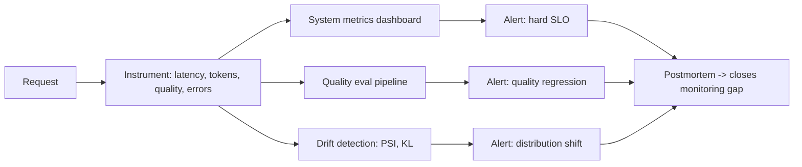

# Monitoring LLM Apps

## Beginner-Friendly Intuition

Monitoring an LLM application is harder than monitoring a classical web
service because failures are often silent. A web service that fails
returns a 500 error, which is easy to alert on. An LLM application
that fails often returns a fluent, confident, wrong answer. You only
notice if you measure the right things in the right way.

The intuition: production LLM monitoring needs three layers. **System
metrics** (latency, error rate, cost) are familiar from classical
ops. **Quality metrics** (faithfulness, refusal rate, citation
accuracy) are LLM-specific and need an evaluation pipeline. **Drift
metrics** (input distribution shift, retrieval distribution shift,
output distribution shift) catch silent regressions before users
complain.

This file catalogs what to log, what to alert on, what dashboards to
build, and how to design alert thresholds that catch problems
without firing all night.

## Formal Explanation

### What to log

Per request, capture:

- **Request metadata.** Request ID, user/tenant, timestamp, route,
  model version, prompt version, retrieval index version.
- **Latency breakdown.** Time to first token (TTFT), full response
  time, per-stage latency (retrieval, reranker, LLM), queue wait
  time.
- **Token counts.** Input tokens, output tokens, cached prefix tokens.
  Cost per request derives from these.
- **Quality signals.** Confidence scores, abstention flag, citations
  emitted, faithfulness score (if computed inline), structured
  output validation result.
- **Retrieval signals.** Top-K chunk IDs, retrieval scores, ACL
  decisions.
- **Tool calls.** For agents: tool name, arguments (redacted), result
  status, latency per call.
- **Errors.** Status code, exception, retry count, fallback path
  taken.
- **User feedback.** Thumbs up/down, edit, escalation, conversation
  abandon.

### Three layers of metrics

#### System metrics (familiar)

- **Latency p50/p95/p99.** Per route and per tier.
- **Error rate.** 5xx rate, timeout rate, fallback rate.
- **Throughput.** QPS, tokens per second.
- **Cost per request, daily spend per tenant.**
- **Cache hit rate.** Per cache layer.
- **Availability.** Per dependency and end-to-end.

These map to classical ops dashboards.

#### Quality metrics (LLM-specific)

- **Faithfulness.** Fraction of generated claims supported by
  retrieved evidence. Measured by LLM-as-judge or NLI classifier on
  a sample.
- **Citation accuracy.** Fraction of cited sources that actually
  support the claim.
- **Abstention rate.** Fraction of requests where the model declined
  to answer. Sudden spike signals corpus staleness or retrieval
  failure.
- **Refusal rate.** Fraction blocked by safety guardrails. Spike
  signals attack or policy change.
- **Structured-output validity.** Fraction of responses that parse
  correctly against the schema.
- **Edit rate.** For copilot-style products, the fraction of
  suggestions the user modifies before accepting.
- **User feedback rate.** Thumbs up/down ratio.

These need an evaluation harness; see
[10-evaluation-driven-development.md](10-evaluation-driven-development.md).

#### Drift metrics (silent regressions)

- **Input distribution shift.** PSI or KL divergence on query
  embeddings between current week and a baseline.
- **Retrieval distribution shift.** Same on retrieved chunk IDs:
  which documents are getting retrieved is itself a distribution.
- **Output distribution shift.** Same on response embeddings or
  topic classifications.
- **Quality drift.** Faithfulness or other quality metrics over
  time; trend analysis on a 7-day rolling window.
- **Cost drift.** Cost per request trending up signals cache hit
  rate dropping or context size growing.

Drift detection alerts when the distribution moves more than a
threshold (e.g., PSI > 0.25). The team investigates: is it a real
shift in user behavior, or a silent regression in the system?

### Dashboards

A production LLM dashboard typically has:

- **Overview.** Latency p95/p99, error rate, cost per request,
  abstention rate, all over time.
- **Per-route.** Same metrics broken down by feature or use case.
- **Per-tier.** For routed systems: traffic share, latency, cost,
  quality per tier.
- **Per-tenant.** For multi-tenant systems: heavy users, anomalies.
- **Quality.** Faithfulness, citation accuracy, refusal rate over
  time. Compare to baseline.
- **Drift.** Distribution shift indicators per dimension.
- **Cost.** Daily spend, per-tenant attribution, cache hit rate.

Each chart has a story it tells; alerts are configured for the
threshold that signals "something needs investigation".

### Alert thresholds

Three categories:

- **Hard SLO breach.** Latency p95 above target for 5+ minutes.
  Error rate above 1 percent. Pages on-call immediately.
- **Soft signal.** Abstention rate above baseline + 3 standard
  deviations. Drift PSI above 0.25. Cost per request up 20 percent
  week-over-week. Creates a ticket; investigated within a business
  day.
- **Trend.** Quality metric down 5 percent week-over-week for 2
  consecutive weeks. Slow burn; investigated as part of weekly review.

Alert design rules: actionable (the on-call can do something),
specific (which dependency, which route), unsymmetric (false negative
costs more than false positive for hard alerts), and dampened
(re-alert only after a cool-down to prevent floods).

### LLM-specific monitoring patterns

- **Sampled detailed traces.** Log every step of every request is
  expensive; sample 100 percent of errors and 1-10 percent of
  successes. Trace storage is a real cost line.
- **Replay tooling.** Given a request ID, recreate the full context
  (prompt, retrieved chunks, model version) for debugging. Without
  this, postmortems are guesses.
- **Distributed tracing.** OpenTelemetry across components: web
  service, retrieval, LLM, tools. Single request ID correlates them.
- **Per-tenant attribution.** Cost, latency, error rate per tenant.
  Catches noisy-neighbor problems and per-tenant regressions.
- **Model version tracking.** Every metric tagged by the model
  version that produced it. After an upgrade, compare the new
  version to baseline; revert if regression detected.

## Why It Matters in Real Jobs

Three production reasons. First, **LLM failures are silent**.
Without quality monitoring, the team finds out about regressions from
the support inbox or the customer escalation. Second, **drift is
real** and constant: model vendors update, traffic shifts, the
retrieval corpus grows. Drift detection is the only way to catch
these silently. Third, **cost runaway is the second-most-common LLM
production incident** (after quality regression). Per-request and
per-tenant cost monitoring is non-negotiable.

## How It Works Step by Step

1. **Instrument every stage.** Request metadata, latency, tokens,
   quality signals, errors.
2. **Build dashboards** for system, quality, drift, and cost.
3. **Define SLOs and alert thresholds.** Per-route, per-tier,
   per-dependency.
4. **Build the eval harness for quality metrics.** Faithfulness,
   citation accuracy, abstention. Run periodically and alert on
   regression.
5. **Add drift detection** on input, retrieval, output distributions.
6. **Sample detailed traces** with replay tooling.
7. **Tag everything by model version.** Enables post-upgrade
   regression detection.
8. **Run incident postmortems** that close the monitoring gap each
   time. The system gets better with every incident.

## Real-World Example

A team runs a RAG assistant. The first month after launch:

- A latency spike fires at 2 AM. The dashboard shows reranker p99
  jumped from 80ms to 800ms; the retrieval index just received a
  large batch of new documents and HNSW efSearch was tuned for the
  smaller index. Tuned `efSearch` down; latency recovers in 5
  minutes.
- A quality regression detected by the weekly faithfulness eval:
  score dropped from 0.93 to 0.87. Investigation: the embedding model
  was silently upgraded by the vendor (a new default version).
  Pinned the model version; re-embedded the corpus; faithfulness
  recovered.
- A cost spike per tenant: one customer's bill 5x normal. Trace
  replay shows 30,000-token inputs (they uploaded a 60-page PDF as a
  single chunk). Added per-request input cap; alerted the customer.
- A drift alert: input distribution shifted 30 percent over a week.
  Investigation: a competitor's product launched and users were
  asking comparison questions the model had never seen. Added the
  new query type to the eval set and the regression suite.

In each case, the monitoring caught the issue within hours; without
it, weeks of degraded user experience would have accumulated. The
monitoring infrastructure is the difference between a team that
ships once and one that ships continuously.

## Common Mistakes

- Monitoring only system metrics. Quality regressions are silent.
- Logging only the final answer. Per-stage debugging impossible.
- No drift detection. Silent regressions accumulate.
- Alert thresholds set too tight. False positives flood the channel;
  the team mutes them.
- Alert thresholds set too loose. Real incidents missed.
- No replay tooling. Postmortems become guesses.
- No per-tenant cost attribution. The bill surprises everyone.
- No model version tagging. Post-upgrade regression invisible.
- Logging full requests with PII. Compliance violation.
- Treating monitoring as set-and-forget. Thresholds drift; metrics
  age.

## Interview Angle

**Question:** Design the monitoring stack for a production LLM
application.

**Strong answer:** Three layers of metrics; per-stage instrumentation;
alert design with explicit categories.

**Layer 1: system metrics.** Latency p50/p95/p99, error rate,
throughput, cost per request, cache hit rate, availability per
dependency. Familiar from classical ops; familiar dashboards.

**Layer 2: quality metrics.** Faithfulness (per-claim support by
retrieved evidence), citation accuracy, abstention rate, refusal
rate, structured-output validity, edit rate, user feedback ratio.
Computed by an evaluation harness running periodically (continuously
on a sample, weekly on a frozen eval set).

**Layer 3: drift metrics.** Input distribution shift (PSI or KL on
query embeddings), retrieval distribution shift, output distribution
shift, quality drift trend. Alerts when distributions move more than
a threshold; team investigates real shift vs silent regression.

**Per-stage instrumentation.** Distributed tracing (OpenTelemetry)
across the web service, retrieval, LLM, tools. Every span tagged
with request ID, user, tenant, model version, prompt version, index
version. Replay tooling reconstructs full request context for
debugging.

**Sampling strategy.** Log 100 percent of errors and slow requests
(p95+); 1-10 percent of normal traffic; full traces stored for 7
days, summary metrics retained longer. Storage cost is a real
budget; engineer accordingly.

**Alert design.** Three categories.

- **Hard SLO breach** (pages on-call): latency p95 above target for
  5 minutes; error rate above 1 percent; cost per request 2x baseline.
- **Soft signal** (creates ticket): abstention rate 3 sigma above
  baseline; PSI above 0.25; faithfulness drop > 3 percent.
- **Trend** (weekly review): quality metric trending down 2
  consecutive weeks; cost per request trending up.

Each alert is **actionable** (the on-call can do something),
**specific** (which route, which dependency), and **dampened**
(cool-down to prevent floods).

**LLM-specific patterns.**

- Per-tenant cost attribution. Heavy users visible.
- Model version tagging on every metric. Post-upgrade regression
  detection by comparing new version to baseline.
- Per-route quality break-down. A route can regress while others are
  fine.
- PII redaction in logs. Compliance.

**Dashboards.** Overview, per-route, per-tier, per-tenant, quality,
drift, cost. Each tells a specific story; each has alert thresholds.

**Postmortem culture.** Every incident closes a monitoring gap. The
"the dashboard did not show this" finding triggers a metric, an
alert, or a dashboard change. The system gets better with each
incident.

The senior instinct: **what you do not measure, you cannot
operate**. The team that ships monitoring with the feature catches
regressions in hours; the team that defers it catches them in weeks
after customer complaints.

**Weak answer:** "Use Datadog." Misses the LLM-specific layers,
quality and drift.

**Follow-up questions:**

- What is faithfulness and how do you compute it in production?
- How do you detect drift?
- What goes in the audit log vs the metrics dashboard?
- How do you sample detailed traces without storage cost blowup?

## Mini Exercise

Pick an LLM feature. List the metrics across the three layers
(system, quality, drift) you would track. Define the alert threshold
for each. Identify the metric most likely to catch a silent
regression.

## Diagram

---
## Navigation

[⬅ Previous](08-security-and-privacy.md) | [🏠 Home](../README.md) | [➡ Next](10-evaluation-driven-development.md)
