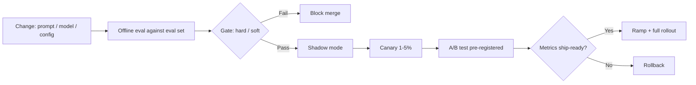

# Evaluation-Driven Development

## Beginner-Friendly Intuition

Evaluation-driven development (EDD) is the discipline of treating the
eval harness as the contract: every change to the system (prompt,
model, retrieval config, chunking, reranker) is gated against a
representative eval set with explicit metrics. If the eval scores
worse, the change does not ship. The team that practices EDD ships
faster and breaks less; the team that does not relies on vibes.

The intuition: in classical software, tests are the safety net that
catches regressions. In AI systems, the eval set is the test suite.
Without it, every model upgrade, every prompt edit, every retrieval
tweak is a gamble. With it, change is grounded in measurement; "did
it improve?" has a numerical answer.

This file covers the EDD loop: build the eval set, integrate into
CI, gate launches on regression criteria, separate offline metrics
from online metrics, design A/B tests, and handle the tricky case of
model upgrades. The eval harness is the most underrated piece of
production AI infrastructure.

## Formal Explanation

### The eval harness

A production-grade eval harness includes:

- **Eval set.** 50 to 5000 representative inputs with reference
  outputs or rubrics. Stratified across query types, user segments,
  difficulty levels.
- **Metrics.** Task-specific (faithfulness for RAG, exact match for
  extraction, BLEU for translation, code-pass-rate for code,
  human-grade for open-ended generation).
- **Methods.** Reference-based (deterministic, fast), human review
  (slow, expensive, gold standard), LLM-as-judge (scalable, must be
  calibrated).
- **Hard-example regression suite.** Specific inputs that broke the
  system in the past. Every change must keep these working.
- **Automation.** Runs on every PR, every model version change,
  weekly on production traffic samples.
- **Storage.** Versioned eval set; metric history per release;
  ability to compare any two runs.

### Gating launches

A change ships only if it passes the gate. Three components:

- **Hard gate** (blocks merge): regression on the hard-example suite,
  drop on a critical metric (e.g., faithfulness below baseline -1
  percent), structured output validity below 99 percent.
- **Soft gate** (requires review): drop on a non-critical metric,
  flat performance with significant cost or latency increase.
- **Pass.** Improvement on at least one metric without regression on
  any other.

The thresholds are calibrated to traffic and cost-of-error. A
high-stakes feature has tighter thresholds; a low-stakes feature
ships on softer signals.

### Offline vs online metrics

Two distinct dimensions:

- **Offline metrics** are computed against the eval set. Fast,
  reproducible, controllable. The gate runs offline. Examples:
  faithfulness on a 200-question eval set, code-pass-rate on a
  benchmark, exact match on a labeled extraction set.
- **Online metrics** are measured on real production traffic. Slow,
  noisy, real. The truth. Examples: user thumbs-up rate, edit rate,
  conversion rate, retention.

The two correlate but not perfectly. A change that improves offline
faithfulness by 3 points may show no online improvement; a change
that does nothing offline may improve online retention because of
some subtle quality the eval set did not capture.

The discipline: **gate launches on offline metrics; validate
launches on online metrics**. Both are needed. Offline-only is
optimistic; online-only is slow.

### A/B testing

For changes that pass the offline gate, A/B test in production:

- **Random or hash-based traffic split.** 50/50, or canary at 1-5
  percent first.
- **Run for at least one full traffic cycle.** Two weeks for
  consumer products to absorb day-of-week and seasonality.
- **Power analysis.** How many users does the test need to detect
  the expected effect? Most teams under-power; the test becomes
  inconclusive.
- **Guardrail metrics.** A change that improves the primary metric
  must not regress guardrails (latency, cost, complaint rate).
- **Pre-registration.** State the hypothesis, the metric, the
  threshold for ship, the run length, before starting. Post-hoc
  reading is biased.

### Model upgrades

The trickiest case. A vendor releases a new model version; the
team wants to migrate. The flow:

- **Run the new model against the offline eval set.** Compare to
  baseline.
- **Re-tune prompts** if necessary. Some prompts that worked on the
  old model break on the new.
- **Re-run the regression suite.** Catches breakages.
- **Shadow mode in production.** New model serves no users but
  produces outputs in parallel; metrics tracked.
- **Canary at 1 percent** for a week. Monitor online metrics.
- **Ramp** if metrics hold.
- **Hard rollback path** if any guardrail regresses.

Model upgrades are the highest-risk single change in an LLM system.
EDD is what makes them survivable.

### Eval set construction

The eval set is the system's contract; building it well matters.

- **Representative.** Samples cover the actual production traffic
  distribution. Stratified by query type, user segment, language.
- **Includes hard cases.** Real failures from production, edge
  cases, adversarial inputs.
- **Labeled or rubric-defined.** A reference answer or a rubric the
  judge can score against.
- **Versioned and frozen.** Eval set changes require explicit
  approval; otherwise metric drift is invisible.
- **Refreshed periodically.** Add new failure modes from production
  incidents; remove obsolete cases.

Size: 50-200 for small teams or new features; 500-2000 for serious
production launches; 5000+ for large model upgrades.

### LLM-as-judge calibration

Many quality metrics are computed by another LLM (judge) scoring the
output. The judge must be calibrated:

- **Pilot against humans.** Score the same 50-100 examples with
  judge and human; compute agreement (Cohen's kappa, weighted
  agreement). Below 0.6 kappa, the judge is unreliable.
- **Bias check.** Length bias (favors longer answers), position
  bias (in pairwise comparisons, favors first or last), self-
  preference (judge favors its own family). Mitigate by randomizing
  position, using a different model family as judge.
- **Drift check.** Recompute calibration when the judge model is
  updated.

## Why It Matters in Real Jobs

Three production reasons. First, **without EDD, every change is a
gamble**. The team that wants to upgrade a prompt has no idea whether
the new version is better; ships it; learns about regressions from
customer complaints. Second, **EDD turns quality into a tractable
problem**. Improvements are measured; the team can iterate
deliberately. Third, **EDD is what makes model upgrades survivable**.
A vendor model version change without an eval harness is a P0
incident waiting; with the harness, it is a routine migration.

## How It Works Step by Step

1. **Build the eval set.** 50-200 representative inputs to start;
   grow over time. Reference answers or rubrics.
2. **Pick metrics.** Task-specific. Methods: reference-based, LLM-
   as-judge (calibrated), human review for high-stakes.
3. **Build hard-example regression suite.** Real failures, edge
   cases.
4. **Integrate into CI.** Every PR runs the eval; gates merge on
   regression criteria.
5. **Define hard and soft gates.** Calibrated to cost-of-error.
6. **A/B test in production** for changes passing the offline gate.
   Pre-register, power-analyze, run a full cycle.
7. **Track online metrics** alongside offline. Validate that the
   eval set predicts online behavior.
8. **Iterate the eval set.** Add new failures, remove obsolete
   cases, refresh quarterly.

## Real-World Example

A team migrates from one frontier LLM vendor to another. Cost is the
motivation: 40 percent cheaper per token at similar quality.

The EDD flow:

- **Offline eval.** New model on the 500-question eval set.
  Faithfulness 0.91 (vs 0.92 baseline); answer relevance 0.94 (vs
  0.93 baseline); structured-output validity 99.6 percent (vs 99.8
  baseline).
- **Hard-example suite.** All 80 cases pass except 4 (specific
  formatting on rare query types). Investigated: prompt change fixes
  3, leaves 1 known regression that is acceptable.
- **Prompt re-tuning.** New model interprets a previously-clear
  instruction differently. Adjusted; eval improves.
- **Shadow mode.** New model runs alongside old for a week; metrics
  collected. Offline-online gap is small (<1 percent on
  faithfulness).
- **Canary at 5 percent for a week.** Online metrics: thumbs-up
  rate flat; edit rate up 0.3 percent (within noise); cost down 38
  percent.
- **Ramp** by doubling daily for 4 days; monitor; full rollout. Old
  model decommissioned after 30 days of new model stability.

Total elapsed time: 6 weeks. Without EDD, this would have been a
months-long project with multiple incidents along the way; with EDD,
it was a routine migration.

## Common Mistakes

- No eval set. Every change is a gamble.
- Eval set too small (<50). Statistical noise dominates; metrics
  flap.
- Eval set unrepresentative. Production traffic looks different;
  offline gains do not transfer.
- LLM-as-judge uncalibrated. Judge biases produce false signals.
- Hard-example suite missing. Old failures recur.
- No gate in CI. Eval is a thing the team runs sometimes; not a
  contract.
- Soft gate not enforced. Slow regressions accumulate.
- A/B test under-powered. Inconclusive results; no decision.
- No online metric correlation check. Offline-online gap unnoticed
  until launch.
- Eval set never updated. Becomes stale; misses real production
  failure modes.

## Interview Angle

**Question:** Design the evaluation pipeline for a production LLM
feature.

**Strong answer:** Eval harness as the contract; offline gate;
online validation; iterate.

**Step 1: build the eval set.** 200-500 representative inputs to
start; stratified across query types, user segments, difficulty.
Reference answers or rubrics. Versioned and frozen; updates require
explicit approval.

**Step 2: define metrics.** Task-specific. For RAG: faithfulness
(per-claim support), citation accuracy, answer relevance, context
recall. For extraction: F1 on extracted spans. For generation:
BLEU/ROUGE plus LLM-as-judge calibrated against humans. For code:
pass rate on test cases.

**Step 3: hard-example regression suite.** 50-200 cases that broke
the system in the past. Every change must keep these working.

**Step 4: CI integration.** Every PR runs the eval against a 200-
case representative subset (5-10 minute run). Pre-merge gate.
Weekly nightly runs the full eval set against production traffic
samples.

**Step 5: gating policy.** Hard gate: regression on hard-example
suite, faithfulness drop > 1 percent, structured-output validity
below 99 percent. Soft gate: drop on non-critical metric without
offsetting gain. Pass: improvement on at least one metric without
regression on any other.

**Step 6: A/B test in production.** Pre-register hypothesis,
metric, threshold, run length. Power-analyze. Random or hash-based
split. Run for at least one full traffic cycle (2 weeks consumer).
Guardrail metrics (latency, cost, complaint rate) must not
regress. Decision based on the pre-registered threshold, not on
post-hoc reading.

**Step 7: online metric correlation.** Track offline-online gap.
Periodic check: does an offline-faithfulness improvement predict an
online-feedback improvement? If not, the eval set is missing
something.

**Step 8: model upgrade flow.** Vendor model upgrade or new model:
offline eval -> prompt re-tuning if needed -> regression suite ->
shadow mode -> canary -> ramp -> full rollout. Hard rollback at
every stage.

**LLM-as-judge calibration.** Pilot judge vs human on 50-100
examples; compute agreement. Bias checks (length, position, self-
preference). Recompute calibration when judge model updates.

**Eval set maintenance.** Add cases from production failures.
Remove obsolete cases. Refresh quarterly. The eval set is a living
artifact.

The senior instinct: **the eval harness is more valuable than any
single model**. A team can swap models, prompts, retrieval configs
freely if they have a strong eval. Without it, the team is locked
into the current configuration because they cannot tell if a change
helped.

**Weak answer:** "Spot-check 10 examples." Ignores statistical
power, gating, online validation, and calibration.

**Follow-up questions:**

- How would you build a faithfulness eval?
- How do you calibrate an LLM-as-judge?
- When does offline gain not translate to online?
- How do you handle a model vendor upgrade?

## Mini Exercise

Pick an AI feature. Design the eval pipeline: 5 representative test
cases (description and reference answer), 1 hard-example regression
case, 1 metric, the gate threshold for shipping a change. Identify
the failure mode if any element is missing.

## Diagram

---
## Navigation

[⬅ Previous](09-monitoring-llm-apps.md) | [🏠 Home](../README.md) | [➡ Next](11-ai-product-metrics.md)
