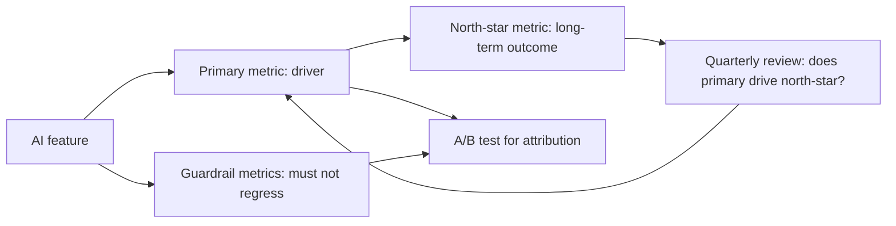

# AI Product Metrics

## Beginner-Friendly Intuition

AI product metrics translate technical signals (latency, accuracy,
faithfulness) into business outcomes (revenue, retention, cost
reduction, customer satisfaction). The team that ships a model with
0.92 faithfulness but does not measure user retention is gambling
that quality matters. The team that measures both knows whether the
investment is paying off.

The intuition: the right metric depends on what the AI feature is
supposed to do for the business. A copilot wants edit rate (how often
do users accept the suggestion?). A support assistant wants
deflection rate (what fraction of tickets resolve without a human?).
A search wants click-through and dwell time. A code assistant wants
pass rate on real PRs. Each metric is a proxy for "is this AI
feature creating value?"

This file covers the metric families, the north-star vs guardrail
distinction, proxy metrics for slow signals, and the discipline of
attribution (proving the AI feature, not something else, drove the
change).

## Formal Explanation

### Three metric tiers

- **North-star metric.** The single number that captures user value
  or business outcome. Long-term retention, revenue per user, time
  saved per session. Slow to move; hard to attribute; what the team
  is ultimately accountable for.
- **Primary metric (driver).** A metric the team can move directly
  that plausibly drives the north-star. Acceptance rate, deflection
  rate, edit rate, time to first useful response. The team's
  weekly-iteration metric.
- **Guardrail metrics.** Metrics that must not regress while chasing
  the primary. Latency, cost, complaint rate, refund rate. A change
  that improves the primary at the cost of a guardrail does not
  ship.

### Metric families by feature type

**Copilot (code, writing).**
- Acceptance rate: fraction of suggestions accepted as-is.
- Edit rate: fraction modified before acceptance.
- Time-to-first-suggestion: latency proxy.
- Sessions with at least one accepted suggestion: engagement proxy.
- Long-term: developer velocity (commit frequency, PR throughput).

**Customer support assistant.**
- Deflection rate: fraction of tickets resolved without escalation.
- Cost per resolved ticket.
- CSAT or thumbs-up rate.
- Escalation rate (the inverse of deflection).
- Long-term: retention, churn.

**Search and recommendation.**
- Click-through rate.
- Dwell time on the clicked result.
- Conversion rate (purchase, signup).
- Long-term: retention, revenue per session.

**Generative content (summaries, translations).**
- Edit rate or accept-as-is rate.
- Reader satisfaction (thumbs, scroll completion).
- Time saved per task.

**Agents.**
- Task completion rate.
- Steps per task.
- Cost per task.
- Human-handoff rate.

### Proxy metrics for slow signals

The north-star metrics (retention, lifetime value, revenue) are slow.
Proxy metrics that correlate with the north-star but move faster:

- **Engagement proxies.** Daily active users among new accounts.
- **Activation proxies.** Time to first value.
- **Quality proxies.** Edit rate, faithfulness on a sample.
- **Cost proxies.** Cost per resolved ticket, cost per session.

The team uses proxies for daily iteration and validates against the
north-star quarterly.

### Goodhart's law in AI metrics

"When a measure becomes a target, it ceases to be a good measure."
AI metrics are particularly vulnerable.

- **Acceptance rate** can be gamed by suggesting only high-confidence
  trivial completions.
- **Deflection rate** can be gamed by giving plausible-sounding
  answers that the user accepts and then suffers from later.
- **Length-based scoring** rewards verbose answers without measuring
  quality.

Mitigations: track multiple metrics together; require guardrails;
periodic human eval; long-term outcome correlation.

### Attribution

Did the AI feature cause the metric change, or did something else?
Standard methods:

- **A/B test.** Random assignment is the gold standard. Causally
  attributes the change to the feature.
- **Difference-in-differences.** When A/B is not possible, compare
  metric changes between users who got the feature and users who did
  not, before and after launch.
- **Holdback.** Permanently keep a small fraction of users on the
  pre-feature experience to measure long-term effect.
- **Regression discontinuity.** When the feature is rolled out by a
  threshold (e.g., to users above a usage level), compare just-above
  to just-below.

Without one of these, attribution is correlation, which can mislead.

### Cost metrics

Cost per outcome is the third axis after quality and value:

- **Cost per resolved ticket.** Total LLM spend divided by tickets
  resolved without escalation.
- **Cost per accepted suggestion.** For copilots.
- **Cost per session.** For chat.
- **Marginal cost per query.** For routing decisions.

The right operating point balances cost against value. A 10 percent
deflection rate at $0.50 per ticket is worse than a 5 percent
deflection rate at $0.10 per ticket if the savings differ.

### Negative metrics

Metrics that go up when the system is bad:

- **Complaint rate.** Customer support tickets about the AI feature.
- **Edit rate** for tasks where edits indicate a wrong answer.
- **Refund rate.**
- **Abandonment rate.** Users leaving mid-conversation.

Track these alongside positive metrics; a feature that increases the
primary while increasing complaints is suspect.

## Why It Matters in Real Jobs

Three production reasons. First, **AI features are expensive**, and
without product metrics there is no way to justify the cost. The CFO
asks "what is the ROI?" and the team must answer in dollars or
hours saved. Second, **metric design shapes the team's behavior**.
Optimizing acceptance rate without an edit-rate guardrail produces
sycophantic suggestions; optimizing deflection without a complaint-
rate guardrail produces confident-sounding wrong answers. Third,
**attribution matters for credit and learning**. The team that ships
a change and sees retention go up wants to know whether it was the
change or something else; without an A/B test, the answer is a guess.

## How It Works Step by Step

1. **Define the north-star.** What user value or business outcome
   does this feature create?
2. **Identify the primary metric.** What can the team move that
   plausibly drives the north-star?
3. **Identify guardrails.** What must not regress?
4. **Build proxy metrics for slow signals.**
5. **Instrument.** Every relevant event logged with user, request,
   feature version.
6. **Build dashboards.** Time series with confidence intervals;
   per-segment break-downs.
7. **A/B test or holdback** for attribution.
8. **Iterate.** Weekly review of primary; quarterly review of
   north-star.
9. **Watch for Goodhart.** Periodic human eval; cross-metric
   monitoring.

## Real-World Example

A team builds an AI customer support assistant. The metric design:

- **North-star.** 30-day retention of users who interacted with the
  assistant.
- **Primary metric.** Deflection rate: fraction of tickets resolved
  by the assistant without human escalation.
- **Guardrails.** CSAT score (must not drop), latency p95 (must
  stay under 5 seconds), cost per resolved ticket (must stay under
  $0.10).

After 3 months: deflection rose from 12 percent to 28 percent; CSAT
held at 4.2/5; cost per resolved ticket dropped from $1.40 (full
human) to $0.06 (assistant); 30-day retention up 1.8 percentage
points (causally attributed via A/B test).

A near-miss: at month 2, deflection jumped to 35 percent overnight.
Investigation: a prompt change made the assistant always-confident,
including on questions it should have escalated. CSAT was about to
drop; the team caught it via the guardrail and rolled back. The
deflection metric without the CSAT guardrail would have shipped a
worse experience disguised as a better one.

## Common Mistakes

- One metric, no guardrails. Optimization gets gamed.
- Metric does not correspond to user value. The team optimizes
  vanity numbers.
- North-star only, no proxy. Iteration cycle is slow.
- Proxy only, no north-star validation. Long-term outcome unknown.
- No attribution method. Credit goes to the wrong cause.
- Metric not segmented. Aggregate hides per-segment regressions.
- Negative metrics ignored. Complaints accumulate.
- Cost metric missing. Value-cost tradeoff invisible.
- Metric defined post-hoc. Bias.
- Metric never re-examined. Stale signals as the product evolves.

## Interview Angle

**Question:** Design the metrics for an AI copilot feature.

**Strong answer:** Three tiers. North-star, primary, guardrails.

**North-star.** Long-term user value: developer productivity proxy
(commits per week, PRs merged per week, time-to-merge), or
ultimately retention/upgrade.

**Primary metric.** Acceptance rate: fraction of suggestions accepted
as-is. Plausibly drives the north-star (more accepted suggestions =
more code shipped). The team's weekly metric.

**Secondary primary.** Edit rate: fraction modified before
acceptance. A complement to acceptance: a high-acceptance,
high-edit-rate suggestion is still useful even if not accepted as-is.

**Guardrails.**
- Latency p95 to first suggestion (must stay under 200 ms).
- Cost per session.
- Complaint rate or "stop suggesting" rate.
- Code quality proxy (does the accepted code pass tests, build,
  lint?).

**Proxy metrics for slow signals.**
- Engagement: sessions per developer per week.
- Activation: time-to-first-accept.
- Time saved: estimated by a separate study (eye-tracking, A/B
  comparison of accepted vs unaccepted code paths).

**Attribution.** A/B test: random 50/50 split. Pre-register the
hypothesis, the threshold, the run length (4 weeks for developer
products to absorb sprint cycles). Power-analyze.

**Goodhart watch.** Acceptance can be gamed by suggesting trivial
completions; track the trend of suggestion length and quality
proxies. Edit rate can be gamed by making suggestions match what the
developer would have typed anyway; periodic human eval.

**Per-segment.** New developers (early adopters) vs experienced
developers; per-language; per-IDE. Aggregate hides where the feature
is weak.

**Cost metric.** Cost per accepted suggestion. Cost per session. The
operating point balances quality (acceptance) against cost.

**Long-term validation.** Quarterly check: does the primary metric
actually correlate with the north-star? If not, the primary is the
wrong proxy and should be revised.

The senior instinct: **metric design is the first product decision**.
The team that defines the metrics carefully, tracks them
rigorously, and iterates with attribution ships value; the team that
copies vanity metrics from a blog post optimizes the wrong thing.

**Weak answer:** "Track accuracy." Misses the business value, the
guardrails, the attribution.

**Follow-up questions:**

- What is Goodhart's law and how does it apply?
- How do you balance primary metric and guardrails?
- What is a proxy metric and when do you need one?
- How would you attribute a metric change to a feature?

## Mini Exercise

Pick an AI feature. Define the three metric tiers (north-star,
primary, guardrails) and one proxy metric. Identify how Goodhart's
law could bite the primary metric and a mitigation.

## Diagram

---
## Navigation

[⬅ Previous](10-evaluation-driven-development.md) | [🏠 Home](../README.md) | [➡ Next](12-building-enterprise-ai-systems.md)
