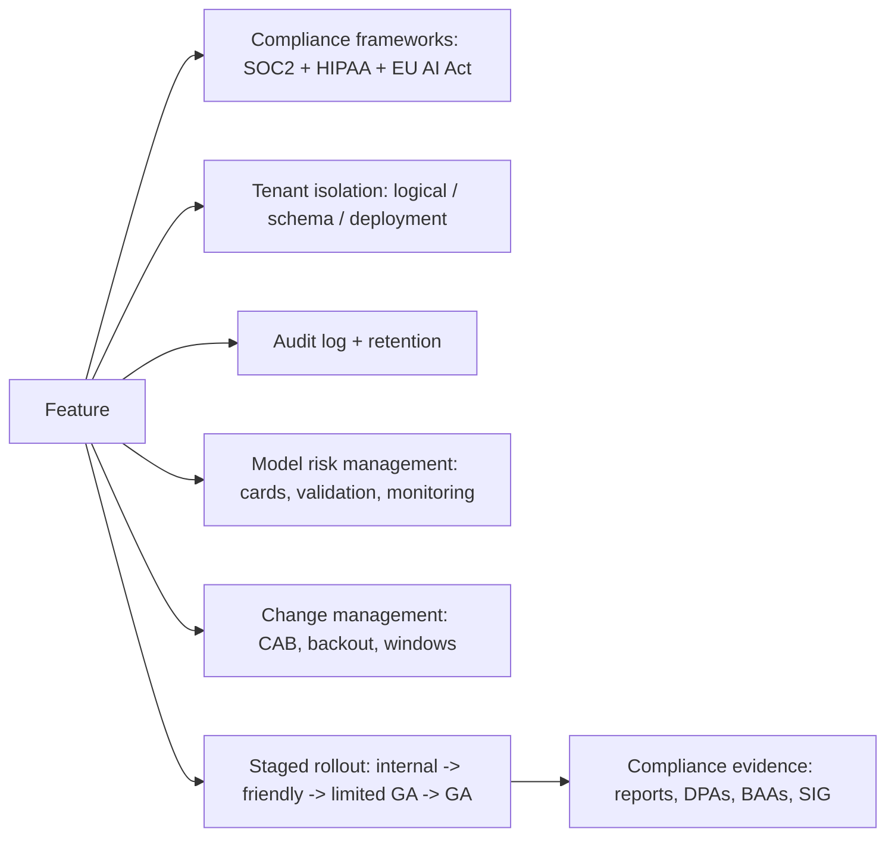

# Building Enterprise AI Systems

## Beginner-Friendly Intuition

Enterprise AI is consumer AI plus a much heavier set of constraints:
SOC2, GDPR, HIPAA, EU AI Act, on-premise or VPC-only deployment,
multi-tenant isolation with strict ACL, audit trails kept for years,
change management with approvals, and a long sales cycle that depends
on passing security review. The model is the easy part. The
infrastructure to make the model trustworthy to a Fortune 500
procurement team is the hard part.

The intuition: a feature that works for one customer must work for
1000 customers without leaking across them, must be auditable for the
compliance team, must integrate with the customer's identity
provider, must run inside the customer's network if asked, must
generate the documentation the customer's risk team requires. Each
constraint is real engineering, not optional polish.

This file covers the enterprise concerns: compliance frameworks,
multi-tenant isolation, change management, model risk management,
compliance evidence, and the rollout strategy that gets through
procurement.

## Formal Explanation

### The compliance landscape

The frameworks that matter for enterprise AI:

- **SOC 2.** Security, availability, confidentiality controls.
  Annual audit. Most B2B SaaS requires it. Touchpoints: access
  control, audit logs, change management, incident response,
  vendor management.
- **GDPR (EU).** Data protection. Right to access, correct, delete.
  Data Processing Agreement (DPA) per data subject. Data
  minimization. 30-day deletion SLA.
- **HIPAA (US healthcare).** Protected Health Information (PHI)
  handling. Business Associate Agreement (BAA) with vendors.
  Encryption, audit, access control.
- **CCPA / CPRA (California).** Consumer rights, opt-out, deletion.
  Similar shape to GDPR.
- **EU AI Act (EU, 2024+).** Risk classification (prohibited, high-
  risk, limited risk, minimal). High-risk requires risk management
  system, data governance, technical documentation, human
  oversight, accuracy and cybersecurity, conformity assessment.
- **NIST AI RMF (US).** Voluntary framework. Govern, map, measure,
  manage. Used as a reference standard.
- **SR 11-7 (US banking).** Model Risk Management. Validation,
  documentation, ongoing monitoring, governance.
- **ISO 27001, ISO 42001.** Security management and AI management
  systems standards.

The team selling into a Fortune 500 typically faces SOC 2 plus one
or more of GDPR, HIPAA, or industry-specific frameworks.

### Multi-tenant isolation

The single largest enterprise concern: data from one tenant must not
leak to another. Patterns:

- **Logical isolation.** Single deployment, tenant ID scopes every
  query. Cheaper but vulnerable to bugs (a missing filter is a
  cross-tenant leak).
- **Schema isolation.** Separate database schemas per tenant.
  Stronger but more operational overhead.
- **Deployment isolation.** Per-tenant deployment (separate database,
  separate compute). Strongest; required for some regulated
  customers; expensive.

Practical defaults: logical isolation with rigorous testing for B2B
SaaS at low scale; schema or deployment isolation for high-stakes
verticals.

The vector index, the cache, the audit log, and the model artifacts
all need tenant-scoping. Cross-tenant data leakage at any layer is
the same incident.

### Change management

Enterprise customers expect a controlled change process:

- **Change approval.** Every production change reviewed by a CAB
  (Change Advisory Board) or equivalent. The reviewer signs off; the
  artifact is stored.
- **Release windows.** Customer expectations on when changes can land
  (no Friday deploys, advance notice for major changes).
- **Backout plan.** Every change has a documented rollback
  procedure tested before release.
- **Change history.** Every change traceable: what changed, when,
  by whom, approved by whom, with what test evidence.

Change management is what makes "did we cause this regression?"
answerable.

### Model risk management

For high-stakes use cases (financial, healthcare, legal), formal
model risk management:

- **Model inventory.** Every model in production listed with owner,
  purpose, risk tier, validation status.
- **Validation.** Independent (not the modeler) review of model
  performance, fairness, robustness. Documented.
- **Monitoring.** Ongoing performance tracking. Alerts on
  degradation.
- **Documentation.** Model card, data card, risk assessment.
- **Retirement.** When a model is decommissioned, the process and
  the migration documented.

SR 11-7 is the canonical framework; many regulated industries use it
or a close variant.

### Compliance evidence

Auditors and procurement teams want artifacts:

- **Model card.** What the model does, training data, performance
  metrics, fairness analysis, intended use, known limitations.
- **Data card.** Data sources, lineage, consent, retention,
  protection.
- **Audit logs.** Who accessed what when. Retention per the
  regulation (7 years for financial, 6+ for healthcare).
- **Penetration test reports.** Annual third-party security test.
- **Vendor list.** Every third-party service the system depends on,
  with their certifications.
- **DPA / BAA per customer.** Data processing agreement (GDPR) or
  business associate agreement (HIPAA).
- **Sub-processor list.** Third-party services that touch customer
  data.
- **Incident response runbook.** With named on-call rotation.

The team that ships these artifacts proactively closes deals faster
than the team that scrambles to produce them under deadline.

### Rollout strategy

Enterprise rollout is staged carefully:

- **Internal pilot.** Friendly internal users, controlled
  environment. Catches obvious failures.
- **Friendly customer pilot.** 1-3 customers willing to test in
  exchange for a discount or roadmap influence. Real production
  conditions; customer feedback drives iteration.
- **Limited GA.** Available to customers but with controls (per-
  customer enablement, feature flag, capacity caps).
- **General availability.** Open to all customers.

Each stage has explicit exit criteria: latency, error rate,
customer-reported issues, support load. A bad metric at any stage
delays advancement.

### On-premise and VPC deployment

Some customers cannot send data to a hosted service. Deployment
options:

- **Hosted (SaaS).** Data goes to the vendor's cloud. Cheapest,
  fastest, lowest-friction.
- **VPC peering.** Vendor's service runs in the customer's network
  (or a peered VPC). Data does not transit the public internet.
- **Customer cloud.** Vendor deploys into the customer's AWS/GCP/
  Azure account. Customer controls the infrastructure.
- **On-premise.** Vendor ships software the customer runs on their
  own hardware. Most expensive to support; required for some
  air-gapped customers.

The model selection narrows under deployment constraints. A
fully-hosted system can use any frontier model; an on-premise
deployment requires self-hostable models (Llama, Mistral, Qwen).

## Why It Matters in Real Jobs

Three production reasons. First, **enterprise sales close on the
controls, not the features**. The deal that hangs on "do you have
SOC 2?" is lost without it. Second, **enterprise customers stay**.
Once integrated, they renew at high rates if the system is
trustworthy; the upfront investment in compliance pays back over
years. Third, **the controls built for enterprise customers protect
all customers**. SOC 2 audit logs catch incidents in consumer
products too; GDPR data minimization improves data hygiene
generally.

## How It Works Step by Step

1. **Identify the customer segment** and its compliance
   requirements.
2. **Map controls to frameworks.** SOC 2 + GDPR + industry-specific.
3. **Design tenant isolation.** Logical, schema, or deployment
   based on stakes.
4. **Implement audit logging** with retention policy.
5. **Build the model risk management process.** Inventory,
   validation, monitoring, documentation.
6. **Generate compliance evidence.** Model card, data card, audit
   reports, vendor list.
7. **Stage the rollout.** Internal pilot, friendly customer pilot,
   limited GA, GA. Each with exit criteria.
8. **Maintain.** Quarterly compliance review; annual third-party
   audit; continuous monitoring.

## Real-World Example

A team builds an AI assistant for healthcare claims processing.
Customer: a Fortune 100 health insurer.

Controls.

- **Compliance.** SOC 2 Type II, HIPAA, ISO 27001 in progress.
- **Tenant isolation.** Per-customer deployment in the customer's AWS
  account; no shared infrastructure.
- **Data handling.** PHI redacted at ingest; original PHI in
  encrypted store with break-glass access; BAA with the customer.
- **Audit logs.** 10-year retention per healthcare regulations.
  Quarterly internal audit; annual external audit.
- **Model risk management.** Model card per model; independent
  validation by a different team; quarterly performance review;
  documented retirement when models are replaced.
- **Change management.** Every production change goes through CAB
  approval with backout plan; release windows respected; customer
  notified of major changes.
- **Rollout.** 6 weeks internal pilot; 12 weeks friendly customer
  pilot with 2 sister hospitals; limited GA to 5 customers; GA at
  month 9 of the engagement.
- **Documentation.** Model card, data card, security
  questionnaire response (SIG-Lite, CAIQ), penetration test report,
  SOC 2 report, vendor list with sub-processors.

Total elapsed time from prototype to first customer revenue: 14
months. The model accounted for maybe 5 percent of the work; the rest
was the compliance and the controls. The team that ships the
controls closes the deal; the team that does not loses to a less
capable but more compliant competitor.

## Common Mistakes

- Treating compliance as an end-stage check instead of a design
  constraint. Retrofitting controls is more expensive than designing
  them in.
- Logical tenant isolation when stakes require schema or deployment
  isolation. The first cross-tenant leak ends the customer
  relationship.
- No audit log retention policy. Compliance violation discovered at
  audit.
- Model card written post-hoc. Often inaccurate; auditors notice.
- No change management. The team blames the AI for an outage that
  was a deploy gone wrong; nobody can prove which.
- Skipping model risk management because "it is just a chatbot". Then
  it touches a regulated workflow and the team is exposed.
- One-size-fits-all deployment. Forces hosted on customers who need
  on-premise; loses the deal.
- No vendor list with sub-processors. Customer asks; team scrambles.
- Treating the rollout as a single launch. The first incident
  affects all customers; staged rollout limits blast.

## Interview Angle

**Question:** A team wants to sell their AI feature to a Fortune
500 healthcare customer. What does that change about the
engineering?

**Strong answer:** A lot. Healthcare adds HIPAA on top of the
standard SOC 2 / GDPR baseline. Enterprise adds change management,
audit, multi-tenant isolation, and a long compliance review cycle.

**Compliance frameworks.**

- SOC 2 Type II annual audit. Required by procurement; covers
  security, availability, confidentiality, processing integrity,
  privacy.
- HIPAA. PHI handling: encryption at rest and in transit; access
  control with least privilege; audit logs; BAA with the customer.
- GDPR if any EU subjects are affected. Data minimization, right to
  erasure, DPA.
- EU AI Act if the system affects EU users and is in a high-risk
  category (medical decisions). Risk management system, technical
  documentation, human oversight, accuracy and cybersecurity,
  conformity assessment.

**Tenant isolation.** Healthcare PHI under HIPAA effectively
requires schema or deployment isolation. Logical isolation in a
shared database is too risky. Many enterprise healthcare contracts
require per-customer deployment in the customer's AWS account.

**Audit logging.** 7-10 year retention. Every PHI access logged
with who, what, when. Access to logs is itself audited.

**Model risk management.** Model card per model. Independent
validation. Performance monitoring with alerts on degradation.
Documentation in a registry. Retirement procedure.

**Change management.** Production changes go through Change
Advisory Board approval with backout plan; release windows
respected (no deploys during the customer's high-traffic windows);
customer notified of major changes.

**Compliance evidence.** Pre-built artifacts to send to procurement:
SOC 2 report, HIPAA attestation, penetration test report, vendor
list with sub-processors, security questionnaire response (SIG-Lite,
CAIQ), DPAs and BAAs templated.

**Rollout.** Staged: internal pilot, 1-2 friendly customer pilots,
limited GA, full GA. Each stage with exit criteria (latency, error
rate, customer issues, support load).

**Deployment options.** Some customers cannot send PHI to a hosted
service. Offer VPC peering or customer-cloud deployment as options.
This narrows model selection: frontier hosted models may not be
usable; self-hostable models (Llama, Mistral) become the default.

**Engineering investment.** Compliance is 30-50 percent of the
engineering work for a regulated enterprise launch. The model is
maybe 5 percent. The team that recognizes this scopes the work
correctly; the team that does not misses the deadline by a year.

The senior instinct: **enterprise AI is mostly engineering around
the model**. The team that ships the controls closes the deal; the
team that ships only the model loses.

**Weak answer:** "Add encryption." Misses the rest.

**Follow-up questions:**

- What is SR 11-7 model risk management?
- How would you handle PHI in audit logs?
- What is a BAA and when is it required?
- How would you stage the rollout?

## Mini Exercise

Pick an AI feature you might sell to enterprises. List the
compliance frameworks that would apply, the tenant isolation
strategy, three pieces of compliance evidence the customer would
ask for, and the one rollout stage you would skip in a startup but
not in enterprise.

## Diagram

---
## Navigation

[⬅ Previous](11-ai-product-metrics.md) | [🏠 Home](../README.md) | [➡ Next](../mlops/01-what-is-mlops.md)
