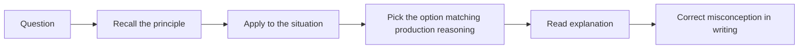

# ML Fundamentals Quiz

## Instructions

Ten questions on the foundations: bias-variance, leakage, baseline
discipline, metric selection, and error analysis. Pick one option
per question. Read the answer key only after attempting. For each
miss, write a one-sentence correction in your own words.

## Questions

1. **Foundational.** A model has 0.99 train accuracy and 0.62
   validation accuracy. The most likely diagnosis is:
   A. The model is underfitting and needs more parameters.
   B. The model is overfitting; reduce capacity or add regularization.
   C. The validation set is too small to trust.
   D. The training data is too clean.

2. **Foundational.** A model has 0.65 train accuracy and 0.64
   validation accuracy on a task where humans achieve 0.95. The
   most likely diagnosis is:
   A. The model is overfitting.
   B. The model is underfitting; add capacity, features, or
      training time.
   C. The validation set is leaking into training.
   D. The labels are noisy.

3. **Foundational.** A churn model trained with the column
   "days_since_last_login_at_churn" achieves 0.99 AUC offline. In
   production it returns 0.55 AUC. The most likely cause is:
   A. Distribution shift in the test population.
   B. Target leakage; the column is only known after the churn
      event.
   C. The model needs retraining on more recent data.
   D. The serving features are computed in a different language.

4. **Intermediate.** A binary classifier on a 1-percent positive
   class shows 99-percent accuracy. The single most useful next
   step is:
   A. Report the accuracy and ship the model.
   B. Compute precision, recall, and PR-AUC; aggregate accuracy is
      misleading on imbalanced data.
   C. Switch to a deeper model.
   D. Oversample the negatives to balance the classes.

5. **Intermediate.** Before training a complex model on a new
   problem, the strongest first move is:
   A. Run a hyperparameter sweep.
   B. Build a simple baseline (rule, mean, logistic regression) and
      measure it.
   C. Collect more data.
   D. Pick the architecture by reading recent papers.

6. **Intermediate.** A model performs well overall but poorly on a
   high-stakes segment representing 5 percent of traffic. The
   senior response is:
   A. Ignore it; aggregate metrics are what the product cares
      about.
   B. Per-segment evaluation reveals the gap; investigate features,
      data coverage, and label quality for that segment before
      shipping.
   C. Retrain with the segment up-weighted by 20x.
   D. Drop the segment from the eval set so the metric looks better.

7. **Intermediate.** "Train-test contamination" means:
   A. The training data has noisy labels.
   B. Information from the test set has influenced training (shared
      rows, look-ahead features, or statistics computed on combined
      data).
   C. The training process did not converge.
   D. The test set is too small.

8. **Advanced.** A model's predicted probabilities are systematically
   too confident: when it predicts 0.9, the true positive rate is
   0.7. This is a:
   A. Calibration problem; use Platt scaling, isotonic regression,
      or temperature scaling on a held-out set.
   B. Overfitting problem; reduce capacity.
   C. Underfitting problem; add capacity.
   D. Data drift problem; retrain.

9. **Advanced.** Error analysis is most valuable when it focuses on:
   A. The hardest examples by raw loss.
   B. Sliced subgroups, hard segments, mislabeled examples, and
      systematic patterns rather than random worst cases.
   C. Top-1 errors only.
   D. Examples the model is already correct on.

10. **Advanced.** A team chooses accuracy as the primary metric for
    a fraud system where missing fraud costs 10x more than a false
    decline. The senior critique:
    A. Accuracy is fine; the cost asymmetry is captured by the
       business team.
    B. Use a cost-weighted metric (expected loss, recall at fixed
       FPR, or net dollars saved) so optimization matches the
       decision cost.
    C. Use F1 instead, which always beats accuracy.
    D. Use AUC, which captures cost asymmetry.

## Answer Key

1. **B.** A 37-point train-validation gap is overfitting. Reduce
   capacity, add regularization, increase data, or simplify
   features. The "too clean training data" option is meaningless.

2. **B.** A 30-point gap below human performance with both metrics
   stuck low is underfitting. The model has not yet captured
   patterns the data supports.

3. **B.** "At_churn" is computed using post-event information.
   Production cannot supply it before the decision, so the offline
   AUC reflects label leakage. Audit every feature for "at_event"
   semantics.

4. **B.** On a 1-percent positive class, a model that always
   predicts negative gets 99 percent accuracy with zero recall.
   Precision, recall, PR-AUC, and per-class metrics show whether
   the model has any signal.

5. **B.** The baseline tells you what a simple system already
   delivers; the harder the baseline is to beat, the more honest
   any complexity claim becomes. Skipping the baseline is the
   single most common interview red flag.

6. **B.** Aggregate metrics hide subgroup gaps. The 5-percent
   segment may be the high-value users; per-segment monitoring
   plus root-cause investigation is the senior pattern.

7. **B.** Contamination includes shared rows, time-based leakage
   (training data from after the test period), and statistics
   (mean / scaler) computed on combined data. The fix is strict
   pipeline hygiene before splitting.

8. **A.** Calibration measures the gap between predicted
   probabilities and observed frequencies. Post-hoc calibration on
   a held-out set fixes the gap without retraining the model.

9. **B.** Random hard examples often reveal nothing. Sliced
   subgroups, hard segments, label noise, and systematic patterns
   produce actionable insights.

10. **B.** Cost asymmetry is the optimization target, not an
    afterthought. Pick a metric that mirrors the decision cost so
    the optimizer pushes toward the right point on the
    precision-recall curve.

## Mini Exercise

Pick a recent ML system you know. Identify the metric it
optimizes, one segment where the metric likely hides a gap, and
one leakage pathway that a careless engineer might introduce.

## Diagram

---
## Navigation

[⬅ Previous](../mocks/10-full-loop-big-tech-ai-mock.md) | [🏠 Home](../README.md) | [➡ Next](02-linear-algebra-quiz.md)
