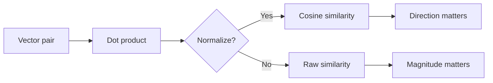

# Linear Algebra Quiz

## Instructions

Ten questions on the linear-algebra ideas that show up in ML
practice: rank, eigenvalues, SVD, condition number, projections,
and dot products as similarity. One option per question. Read the
key only after attempting.

## Questions

1. **Foundational.** The dot product of two unit vectors equals:
   A. The Euclidean distance between them.
   B. The cosine of the angle between them.
   C. The L2 norm of their sum.
   D. The covariance of their entries.

2. **Foundational.** A 5x3 matrix has rank at most:
   A. 3.
   B. 5.
   C. 8.
   D. 15.

3. **Foundational.** Two vectors are orthogonal when:
   A. Their sum is zero.
   B. Their dot product is zero.
   C. They have the same norm.
   D. They lie in the same direction.

4. **Intermediate.** Cosine similarity is preferred over raw dot
   product in semantic search because:
   A. It is faster to compute.
   B. It removes magnitude differences so similarity reflects
      direction rather than length.
   C. It always returns values between zero and one.
   D. It is differentiable.

5. **Intermediate.** Principal component analysis projects data onto
   the eigenvectors of:
   A. The Gram matrix of labels.
   B. The covariance matrix of features (or a centered data
      matrix's right singular vectors via SVD).
   C. The identity matrix.
   D. The Jacobian of the loss.

6. **Intermediate.** A square matrix is singular (non-invertible)
   when:
   A. Its determinant is one.
   B. Its determinant is zero, or equivalently it has at least one
      zero eigenvalue and rank below full.
   C. All its entries are positive.
   D. It is symmetric.

7. **Advanced.** A linear system is "ill-conditioned" when the
   condition number is large. The practical implication:
   A. The solver runs slowly.
   B. Small input perturbations cause large output changes; numerical
      precision and regularization matter.
   C. The matrix has too many rows.
   D. The eigenvalues are negative.

8. **Advanced.** The truncated SVD of a matrix M is used in
   recommender systems because:
   A. It produces sparse outputs.
   B. The top-k singular vectors give the best rank-k
      approximation under Frobenius norm and surface latent
      factors.
   C. It runs in linear time.
   D. It avoids matrix multiplication.

9. **Advanced.** Projecting a vector v onto the column space of a
   matrix A solves:
   A. argmin_x ||A x - v||^2 (least-squares).
   B. argmin_x ||x||^2.
   C. The eigenvalue problem A x = lambda x.
   D. The determinant equation det(A - lambda I) = 0.

10. **Advanced.** The matrix A^T A appearing in the normal equations
    is:
    A. Always invertible.
    B. Symmetric and positive semi-definite; invertible iff A has
       full column rank.
    C. Always full-rank.
    D. Equal to the identity.

## Answer Key

1. **B.** For unit vectors, dot product equals cosine of the
   angle. This identity is the foundation of cosine similarity in
   embedding search.

2. **A.** Rank is bounded by min(rows, columns). A 5x3 matrix has
   at most 3 linearly independent rows or columns.

3. **B.** Orthogonality is defined by zero dot product. Same norm
   or zero sum are unrelated conditions.

4. **B.** Magnitude can vary with text length, image brightness,
   or other irrelevant factors; cosine normalizes it out so the
   metric focuses on direction. The "always between zero and one"
   claim is incorrect (cosine ranges from -1 to 1).

5. **B.** PCA finds eigenvectors of the covariance matrix; the
   equivalent operation via SVD on the centered data matrix
   yields the same components.

6. **B.** Singular means determinant zero and rank below full.
   The matrix has a non-trivial null space.

7. **B.** Condition number is the ratio of largest to smallest
   singular values. Large values amplify input noise; ridge
   regularization improves conditioning by adding a positive
   multiple of the identity.

8. **B.** Eckart-Young: the top-k truncation is the best rank-k
   approximation. Recommender systems interpret the singular
   vectors as latent user and item factors.

9. **A.** Orthogonal projection minimizes the squared distance
   between v and its image; this is the least-squares formulation
   used to fit linear models.

10. **B.** A^T A is symmetric (transpose equals itself) and
    positive semi-definite. Full rank of A is required for it to
    be invertible; otherwise normal equations have infinite
    solutions and ridge regularization is the standard fix.

## Mini Exercise

Compute the cosine similarity between [1, 0, 1] and [1, 1, 0] by
hand. Then explain why this metric is preferred over raw dot
product when comparing word embeddings of different magnitudes.

## Diagram

---
## Navigation

[⬅ Previous](01-ml-fundamentals-quiz.md) | [🏠 Home](../README.md) | [➡ Next](03-statistics-quiz.md)
