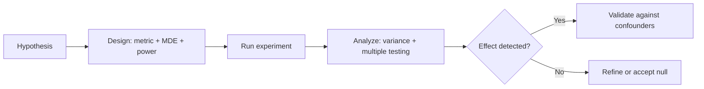

# Statistics Quiz

## Instructions

Ten questions on probability, hypothesis testing, A/B design,
confidence intervals, and Bayesian thinking. One option per
question. Read the key only after attempting.

## Questions

1. **Foundational.** A p-value of 0.03 means:
   A. There is a 3-percent chance the null hypothesis is true.
   B. If the null hypothesis were true, results this extreme or
      more would occur 3 percent of the time.
   C. The effect is large.
   D. The test has 97-percent power.

2. **Foundational.** The 95-percent confidence interval [2.1, 4.8]
   for a treatment effect means:
   A. There is a 95-percent probability the true effect is in
      this interval.
   B. If the experiment were repeated many times, 95 percent of
      such intervals would contain the true effect.
   C. The effect is statistically significant at p = 0.05.
   D. Both B and C are correct interpretations.

3. **Foundational.** Statistical power is:
   A. The probability of rejecting the null when the alternative
      is true (1 minus the type-II error rate).
   B. The probability of accepting the null when it is true.
   C. The same as the p-value threshold.
   D. The sample size divided by the effect size.

4. **Intermediate.** A team runs 20 A/B tests and finds 1
   statistically significant at p < 0.05. The senior interpretation:
   A. The team found a real effect.
   B. With 20 independent tests under the null, expected false
      positives are 1; multiple-testing correction (Bonferroni,
      BH-FDR) is required before claiming the result.
   C. The team should run 80 more tests for confidence.
   D. The p-value threshold should be raised.

5. **Intermediate.** A drug appears effective in two patient
   subgroups but ineffective overall. This pattern is:
   A. A measurement error.
   B. Simpson's paradox; a confounder differs across subgroups
      and aggregating reverses the effect.
   C. Statistical significance fluke.
   D. Impossible.

6. **Intermediate.** Sample size for an A/B test depends primarily
   on:
   A. The variance of the metric and the minimum detectable
      effect, with target power and significance.
   B. The number of features.
   C. The model architecture.
   D. The traffic volume alone.

7. **Advanced.** A Bayesian posterior depends on:
   A. The likelihood only.
   B. The prior and the likelihood, normalized; the prior matters
      more when data is sparse and less as data accumulates.
   C. The prior only.
   D. The maximum-likelihood estimate.

8. **Advanced.** A peeking-during-A/B-test problem occurs when:
   A. The team checks p-values continuously and stops at the
      first significant result, inflating false-positive rate;
      sequential or always-valid tests address this.
   B. The team forgets to randomize.
   C. The team uses too small a sample.
   D. The team selects the wrong metric.

9. **Advanced.** A skewed metric (revenue per user) reaches
   significance with 1000 users in one variant. The senior concern:
   A. The result is robust because the sample is large.
   B. Heavy-tailed metrics need either trimming, log-transformation,
      bootstrap or rank-based tests, or much larger samples; raw
      means are unstable.
   C. The metric should be discarded.
   D. The result should be reported without caveat.

10. **Advanced.** Causal inference from observational data requires:
    A. A large sample.
    B. Identifying and adjusting for confounders, ideally via
       randomization, instrumental variables, regression
       discontinuity, or DAG-based selection of conditioning sets.
    C. A complex model.
    D. A statistically significant correlation.

## Answer Key

1. **B.** P-value is the probability of the data (or more
   extreme) under the null. It does not directly state the
   probability the null is true; that requires a Bayesian setup.

2. **B.** The frequentist interpretation is about the procedure,
   not a single interval. The Bayesian credible interval allows
   the "95-percent probability" claim, but only with a stated
   prior.

3. **A.** Power is 1 - beta. Higher power requires larger samples,
   larger effects, or lower variance.

4. **B.** Under the null, 5 percent of tests are expected to be
   "significant" by chance. Multiple-testing correction (Bonferroni
   for strict control, BH for FDR) prevents over-claiming.

5. **B.** Simpson's paradox is real and common. The fix is
   identifying the confounder and analyzing within strata or via
   regression with the confounder included.

6. **A.** Variance, MDE, alpha, and beta determine sample size.
   Architecture and traffic-volume alone do not. Power analysis
   formalizes this; small effects in noisy metrics need very
   large samples.

7. **B.** Posterior proportional to prior times likelihood. With
   abundant data, the likelihood dominates; with sparse data, the
   prior matters and choosing it well is part of the skill.

8. **A.** Continuous peeking inflates type-I error. Pre-registered
   stopping rules, sequential probability ratio tests, or always-
   valid p-values handle the issue.

9. **B.** Heavy tails (a few whales) make raw mean tests unstable
   even with thousands of users. Rank-based, bootstrap, or
   trimmed-mean approaches give honest inference.

10. **B.** Correlation with confounders adjusted is the standard
    causal toolkit. Without randomization, the burden is on the
    analyst to argue that all important confounders have been
    addressed.

## Mini Exercise

Pick an A/B test you have read about. State the metric, the
sample size, the minimum detectable effect, and at least one
confounder that would make the conclusion fragile if not handled.

## Diagram

---
## Navigation

[⬅ Previous](02-linear-algebra-quiz.md) | [🏠 Home](../README.md) | [➡ Next](04-classical-ml-quiz.md)
