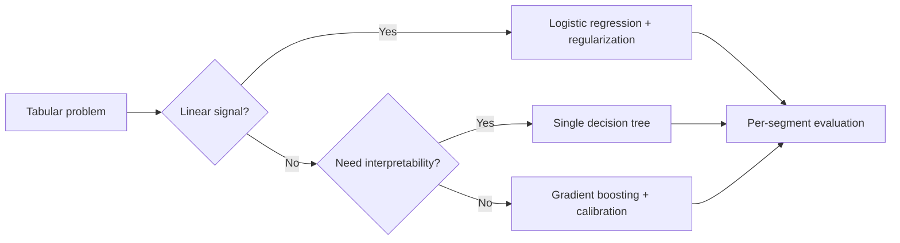

# Classical ML Quiz

## Instructions

Ten questions on logistic regression, trees, ensembles,
regularization, kernels, and calibration. One option per question.

## Questions

1. **Foundational.** L1 regularization (lasso) versus L2 (ridge):
   A. L1 shrinks coefficients smoothly; L2 sets some to exactly
      zero.
   B. L1 sets some coefficients to exactly zero (sparsity); L2
      shrinks all coefficients smoothly.
   C. They are equivalent for linear models.
   D. L1 always outperforms L2.

2. **Foundational.** Decision trees overfit when:
   A. They are too shallow.
   B. They grow too deep without pruning, regularization, or a
      minimum-leaf-samples constraint.
   C. The features are scaled.
   D. The target is balanced.

3. **Foundational.** Random forests reduce variance by:
   A. Boosting weak learners sequentially.
   B. Averaging predictions of many decorrelated trees trained on
      bootstrap samples with random feature subsets.
   C. Increasing tree depth.
   D. Removing categorical features.

4. **Intermediate.** Gradient boosting beats a single deep tree
   because:
   A. It uses more data.
   B. It builds an additive model where each weak learner corrects
      the residual errors of the prior ensemble; bias decreases
      systematically.
   C. It runs faster.
   D. It avoids regularization.

5. **Intermediate.** Logistic regression assumes:
   A. The target is normally distributed.
   B. The log-odds is linear in the features (after any feature
      engineering); features are not perfectly collinear.
   C. The features are independent.
   D. The errors are heteroscedastic.

6. **Intermediate.** Class imbalance hurts a classifier most when:
   A. The model is forced to predict the majority class because the
      loss rewards it; precision-recall trade-offs and class
      weighting or resampling matter.
   B. The features are noisy.
   C. The dataset is small.
   D. The model is too deep.

7. **Advanced.** k-Nearest-Neighbors performs poorly in
   high-dimensional spaces because:
   A. The algorithm has bugs.
   B. Distances become uniform as dimensionality grows ("curse of
      dimensionality"); discrimination between near and far is
      lost.
   C. It cannot handle categorical features.
   D. It is computationally too expensive.

8. **Advanced.** A support vector machine's kernel trick:
   A. Replaces the model entirely.
   B. Computes inner products in a high-dimensional feature space
      implicitly, allowing nonlinear decision boundaries without
      explicit feature mapping.
   C. Speeds up training.
   D. Only works for image data.

9. **Advanced.** Calibrating a tree-based classifier (XGBoost or
   random forest) typically uses:
   A. Platt scaling (sigmoid) or isotonic regression on a held-out
      set.
   B. Oversampling the minority class.
   C. Increasing the tree depth.
   D. Switching to a neural network.

10. **Advanced.** Naive Bayes is "naive" because:
    A. It assumes features are independent given the class; the
       assumption is often violated yet the classifier remains
       useful for text.
    B. It uses no training data.
    C. It cannot handle continuous features.
    D. It always overfits.

## Answer Key

1. **B.** L1's geometry (corners on the unit ball) drives sparsity;
   L2's smooth shrinkage spreads weight. Use L1 for feature
   selection, L2 for stable shrinkage, elastic net for both.

2. **B.** Unconstrained trees memorize. Standard controls are max
   depth, min samples per leaf, min impurity decrease, and
   pruning.

3. **B.** Bagging plus feature subsampling decorrelates trees so
   averaging reduces variance. Trees stay individually high-
   variance, but the ensemble is stable.

4. **B.** Boosting reduces bias by fitting each new learner to the
   residuals of the prior ensemble. Regularization (learning rate,
   max depth, min child weight) prevents the variance from
   exploding.

5. **B.** Linearity is in the log-odds, not the raw features.
   Feature engineering (interactions, transforms) keeps the
   linearity assumption usable.

6. **A.** Imbalance plus accuracy loss favors the majority class.
   Solutions include class weighting in the loss, resampling,
   threshold tuning, or switching to a metric matched to the
   business cost.

7. **B.** In high dimensions, points become roughly equidistant.
   kNN, kernel density, and other distance-based methods degrade;
   dimensionality reduction or learned embeddings help.

8. **B.** The kernel evaluates inner products in an implicit
   higher-dimensional space without computing the mapping.
   Polynomial, RBF, and string kernels are common.

9. **A.** Tree-based models are not naturally calibrated.
   Post-hoc calibration on a held-out set (CalibratedClassifierCV)
   produces probabilities suitable for thresholding or downstream
   decisions.

10. **A.** The conditional-independence assumption fails in
    practice yet Naive Bayes remains a competitive text baseline
    because the decision boundary is robust to the assumption
    violation.

## Mini Exercise

Pick a tabular problem you know. Choose between logistic
regression, random forest, and gradient boosting. State the choice
plus one reason and one risk.

## Diagram

---
## Navigation

[⬅ Previous](03-statistics-quiz.md) | [🏠 Home](../README.md) | [➡ Next](05-model-evaluation-quiz.md)
