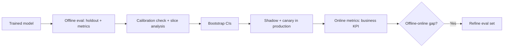

# Model Evaluation Quiz

## Instructions

Ten questions on metrics, evaluation strategies, online versus
offline measurement, and the gotchas that turn good models into
bad decisions. One option per question.

## Questions

1. **Foundational.** ROC-AUC versus PR-AUC:
   A. They are interchangeable.
   B. PR-AUC is more informative when the positive class is rare;
      ROC-AUC can look strong on highly imbalanced data while
      precision is poor.
   C. ROC-AUC is always preferred.
   D. PR-AUC requires balanced data.

2. **Foundational.** F1 score balances:
   A. Accuracy and AUC.
   B. Precision and recall via the harmonic mean.
   C. Sensitivity and specificity.
   D. Bias and variance.

3. **Foundational.** Cross-validation is preferred over a single
   train-test split when:
   A. Data is plentiful.
   B. Data is scarce; k-fold gives a more stable estimate of out-
      of-sample performance and uses every example for both
      training and validation across folds.
   C. The model is fast.
   D. The metric is accuracy.

4. **Intermediate.** Time-series cross-validation must:
   A. Use random shuffles.
   B. Respect temporal order; train on past, validate on future,
      typically expanding-window or rolling-window splits.
   C. Use stratified k-fold.
   D. Use leave-one-out.

5. **Intermediate.** Bootstrapping is used in evaluation to:
   A. Replace the model.
   B. Estimate confidence intervals on a metric by resampling the
      evaluation set with replacement and recomputing the metric.
   C. Generate training data.
   D. Reduce variance in training.

6. **Intermediate.** Online metrics often disagree with offline
   metrics because:
   A. The offline data is too small.
   B. Real users behave, interact, and select differently than
      logs imply (selection bias, distribution shift, feedback
      loops).
   C. Online metrics are computed wrong.
   D. The online system is slower.

7. **Advanced.** Power analysis for an A/B test answers:
   A. Whether the model is overfitting.
   B. The required sample size given target detectable effect,
      variance, significance level, and desired power; under-
      powered tests produce inconclusive results.
   C. Whether to log data.
   D. Whether the metric is correct.

8. **Advanced.** Evaluating an LLM with another LLM as judge
   requires:
   A. Nothing special; trust the judge model.
   B. Calibration against human scores on a representative sample,
      bias audits (length, position, self-preference), and re-
      calibration on judge model upgrade.
   C. Using the same judge model as the production model.
   D. Using GPT-3.5 as the cheapest option.

9. **Advanced.** A regression suite in CI for ML protects against:
   A. Bugs in the codebase.
   B. Silent quality regressions on a frozen set of canonical
      cases (specific inputs, expected behaviors) that previous
      changes broke.
   C. Slow training.
   D. Hardware failures.

10. **Advanced.** A model with 0.92 offline F1 ships and the
    business KPI does not move. The most likely cause:
    A. The model is broken.
    B. Offline-online gap: the eval set does not match production
       traffic, or the metric does not align with the user
       decision.
    C. The KPI is wrong.
    D. The deployment failed.

## Answer Key

1. **B.** On a 1-percent positive rate, ROC-AUC easily reaches 0.9
   while precision at usable recall is single-digit. PR-AUC and
   precision-recall curves expose this.

2. **B.** F1 is the harmonic mean of precision and recall. It
   penalizes extreme imbalances between the two.

3. **B.** k-fold (typical k=5 or 10) gives multiple estimates of
   the metric, exposing variance. Stratified k-fold preserves
   class balance per fold for classification.

4. **B.** Random splits on time series leak future information
   into training. Expanding or rolling windows mirror how the
   model will be used in deployment.

5. **B.** Bootstrap resamples the evaluation set thousands of
   times and recomputes the metric, yielding a sampling
   distribution and CI without parametric assumptions.

6. **B.** Logged data reflects a previous policy and biased
   coverage. Real users encounter different distributions, and
   the new model's outputs change what users do, causing feedback
   loops.

7. **B.** Power analysis is the antidote to "we ran an A/B test
   but the result was inconclusive." Pre-register sample size
   based on MDE, variance, and target power.

8. **B.** LLM judges have biases (favoring longer answers, the
   first option, or their own family). Calibration against humans
   on a slice plus periodic re-calibration is standard practice.

9. **B.** Regression suites freeze specific inputs with expected
   outputs. Each change runs the suite; failures block the
   change. This catches silent quality drops that aggregate
   metrics miss.

10. **B.** Offline-online gap is the most common production-ML
    issue. Eval sets sampled from logs miss novel queries; metrics
    chosen for convenience diverge from the user decision.

## Mini Exercise

Pick a model you have evaluated. State the offline metric, the
online metric the business cares about, and one plausible reason
they would disagree.

## Diagram

---
## Navigation

[⬅ Previous](04-classical-ml-quiz.md) | [🏠 Home](../README.md) | [➡ Next](06-feature-engineering-quiz.md)
