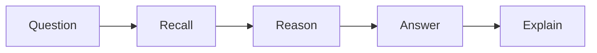

# Feature Engineering Quiz

## Instructions

Answer without looking at the key. For each miss, write a one-sentence correction and one example
from a real ML, LLM, RAG, agent, or production AI system.

## Questions

1. In the context of Feature Engineering, what should you clarify first?
   A. The user decision, available data, baseline, and success metric.
   B. Start with the largest model available
   C. Ignore the baseline if the final system will be advanced
   D. Evaluate only on examples used during development
2. In the context of Feature Engineering, why is a baseline important?
   A. It proves whether added complexity creates measurable value.
   B. Start with the largest model available
   C. Ignore the baseline if the final system will be advanced
   D. Evaluate only on examples used during development
3. In the context of Feature Engineering, what is a common leakage risk?
   A. Training or validation data can contain information that would not exist at prediction time.
   B. Start with the largest model available
   C. Ignore the baseline if the final system will be advanced
   D. Evaluate only on examples used during development
4. In the context of Feature Engineering, how should you choose a metric?
   A. Match the metric to the cost of errors and the product decision.
   B. Start with the largest model available
   C. Ignore the baseline if the final system will be advanced
   D. Evaluate only on examples used during development
5. In the context of Feature Engineering, what should error analysis inspect?
   A. False positives, false negatives, hard segments, missing data, and rare cases.
   B. Start with the largest model available
   C. Ignore the baseline if the final system will be advanced
   D. Evaluate only on examples used during development
6. In the context of Feature Engineering, when is a complex model justified?
   A. When a simpler approach is measured, insufficient, and the extra cost is worth it.
   B. Start with the largest model available
   C. Ignore the baseline if the final system will be advanced
   D. Evaluate only on examples used during development
7. In the context of Feature Engineering, what should be monitored after deployment?
   A. Input quality, drift, latency, cost, output quality, and business outcome metrics.
   B. Start with the largest model available
   C. Ignore the baseline if the final system will be advanced
   D. Evaluate only on examples used during development
8. In the context of Feature Engineering, how should uncertainty be communicated?
   A. State assumptions, confidence, known limits, and the decision impact.
   B. Start with the largest model available
   C. Ignore the baseline if the final system will be advanced
   D. Evaluate only on examples used during development
9. In the context of Feature Engineering, what is a strong interview answer structure?
   A. Problem, data, baseline, model, metric, risks, and production plan.
   B. Start with the largest model available
   C. Ignore the baseline if the final system will be advanced
   D. Evaluate only on examples used during development
10. In the context of Feature Engineering, what is the safest next step after poor validation results?
   A. Inspect data and errors before changing models randomly.
   B. Start with the largest model available
   C. Ignore the baseline if the final system will be advanced
   D. Evaluate only on examples used during development

## Answer Key and Explanations

1. **A.** The user decision, available data, baseline, and success metric. This keeps the answer tied to measurable behavior. The other options skip framing, create leakage risk, or confuse model complexity with quality.
2. **A.** It proves whether added complexity creates measurable value. This keeps the answer tied to measurable behavior. The other options skip framing, create leakage risk, or confuse model complexity with quality.
3. **A.** Training or validation data can contain information that would not exist at prediction time. This keeps the answer tied to measurable behavior. The other options skip framing, create leakage risk, or confuse model complexity with quality.
4. **A.** Match the metric to the cost of errors and the product decision. This keeps the answer tied to measurable behavior. The other options skip framing, create leakage risk, or confuse model complexity with quality.
5. **A.** False positives, false negatives, hard segments, missing data, and rare cases. This keeps the answer tied to measurable behavior. The other options skip framing, create leakage risk, or confuse model complexity with quality.
6. **A.** When a simpler approach is measured, insufficient, and the extra cost is worth it. This keeps the answer tied to measurable behavior. The other options skip framing, create leakage risk, or confuse model complexity with quality.
7. **A.** Input quality, drift, latency, cost, output quality, and business outcome metrics. This keeps the answer tied to measurable behavior. The other options skip framing, create leakage risk, or confuse model complexity with quality.
8. **A.** State assumptions, confidence, known limits, and the decision impact. This keeps the answer tied to measurable behavior. The other options skip framing, create leakage risk, or confuse model complexity with quality.
9. **A.** Problem, data, baseline, model, metric, risks, and production plan. This keeps the answer tied to measurable behavior. The other options skip framing, create leakage risk, or confuse model complexity with quality.
10. **A.** Inspect data and errors before changing models randomly. This keeps the answer tied to measurable behavior. The other options skip framing, create leakage risk, or confuse model complexity with quality.

## Mini Exercise

Create one additional question about a failure mode in Feature Engineering, then answer it with the same level
of explanation used in the key.

## Diagram

---
## Navigation

[⬅ Previous](05-model-evaluation-quiz.md) | [🏠 Home](../README.md) | [➡ Next](07-deep-learning-quiz.md)
