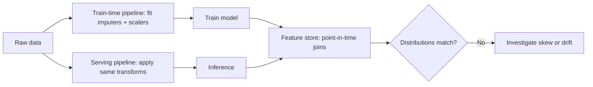

# Feature Engineering Quiz

## Instructions

Ten questions on encoding, scaling, time windows, leakage in
feature pipelines, and the gotchas that separate competent feature
work from incident-prone feature work.

## Questions

1. **Foundational.** A high-cardinality categorical feature (e.g.,
   user_id with 10 million values) handled with one-hot encoding:
   A. Is the standard approach.
   B. Explodes dimensionality and rarely helps; use embeddings,
      target encoding (with leak protection), or hashing.
   C. Is faster than embeddings.
   D. Is required for tree models.

2. **Foundational.** Standardization (zero mean, unit variance)
   matters most for:
   A. Tree-based models.
   B. Models that depend on distances or gradients (kNN, linear
      regression with regularization, SVMs, neural networks).
   C. Naive Bayes.
   D. Categorical features only.

3. **Foundational.** Missing values handled by imputing the column
   mean computed on the entire dataset (including test) is:
   A. Best practice.
   B. A leakage pattern; compute imputation statistics on training
      only and apply to validation and test.
   C. Faster.
   D. Required for some models.

4. **Intermediate.** A "lookahead" feature in time-series modeling:
   A. Is allowed if the test set is small.
   B. Is leakage; the feature uses information not available at
      decision time, inflating offline metrics. Use lagged windows
      that respect the prediction-time clock.
   C. Helps the model learn faster.
   D. Is acceptable in batch but not online.

5. **Intermediate.** Target encoding (replacing a category with the
   mean target value for that category) requires:
   A. No special handling.
   B. K-fold or out-of-fold encoding so the target for each row is
      not used in computing its own encoding; otherwise leakage.
   C. Standardization.
   D. One-hot encoding first.

6. **Intermediate.** Feature scaling is computed:
   A. Once on all data.
   B. On the training set only; the same parameters (mean, std,
      quantiles) are applied to validation, test, and production.
   C. Per fold but recomputed on test.
   D. On the test set.

7. **Advanced.** Time-windowed aggregations (e.g., user clicks in
   last 7 days) must:
   A. Use the same data source as the labels.
   B. Be computed using only events available at prediction time;
      typically materialized in a feature store with point-in-
      time correctness.
   C. Be re-trained for each model version.
   D. Use raw timestamps without aggregation.

8. **Advanced.** Categorical features with rare values often:
   A. Require dropping.
   B. Benefit from frequency-based grouping (rare to "other") or
      smoothing in target encoding to avoid memorizing noise.
   C. Should be left as-is.
   D. Need standardization.

9. **Advanced.** Training-serving skew at the feature layer is
   detected by:
   A. Reading code carefully.
   B. Logging feature values at inference and comparing
      distributions to training; per-feature monitoring (PSI,
      KL) and shadow-mode comparison are standard.
   C. Re-training the model.
   D. Increasing the model size.

10. **Advanced.** A feature whose distribution shifts dramatically
    between training and production:
    A. Should always be dropped.
    B. Calls for investigation: real-world change, pipeline bug,
       or sampling bias; address the cause and consider drift-
       robust transformations or re-training schedule.
    C. Means the model is bad.
    D. Is solved by standardization.

## Answer Key

1. **B.** 10M one-hot dimensions waste memory and provide no
   generalization. Embeddings (learned), hashing (cheap), or
   target encoding (with leak protection) work better.

2. **B.** Distance and gradient-based methods are sensitive to
   feature scale. Trees split on thresholds and are scale-
   invariant; standardization adds nothing.

3. **B.** Computing imputation stats on the full dataset leaks
   test information into training. The fix is to fit on train
   only.

4. **B.** Lookahead leakage produces inflated offline metrics
   that vanish in production. Strict pipeline hygiene with
   prediction-time-aware feature definitions is the cure.

5. **B.** Naive target encoding leaks because the target of the
   row appears in the encoding statistic. K-fold or
   leave-one-out encoding plus smoothing for low-count
   categories is the standard pattern.

6. **B.** Scaling parameters fit once on training. The same
   transformation applies to all downstream stages, including
   production. Otherwise distributions shift between sets.

7. **B.** Production cannot peek at future events. Feature-store
   point-in-time joins reconstruct what was knowable at any
   historical instant.

8. **B.** Rare values plus high target variance cause the model
   to memorize random patterns. Grouping or smoothing reduces
   variance without dropping signal.

9. **B.** Training-serving skew is the most common silent failure.
   Per-feature drift monitoring catches the moment a pipeline
   diverges; shadow mode catches it before user impact.

10. **B.** Distribution shift can be a real-world change (which
    the system must adapt to) or a bug (which the system must
    fix). The diagnosis matters more than a generic transformation.

## Mini Exercise

Pick three features from a model you know. For each, state how it
is computed at inference time and how the same value would be
reconstructed point-in-time during training.

## Diagram

---
## Navigation

[⬅ Previous](05-model-evaluation-quiz.md) | [🏠 Home](../README.md) | [➡ Next](07-deep-learning-quiz.md)
