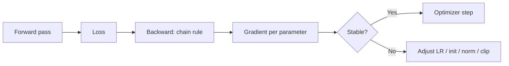

# Deep Learning Quiz

## Instructions

Ten questions on backpropagation, initialization, normalization,
optimizers, and the failure modes of training neural networks.

## Questions

1. **Foundational.** Backpropagation computes:
   A. The forward pass.
   B. The gradient of the loss with respect to each parameter via
      the chain rule, propagating from output to input.
   C. The Hessian.
   D. The model output.

2. **Foundational.** The vanishing gradient problem in deep
   networks:
   A. Means gradients become huge during training.
   B. Means gradients shrink as they propagate backward through
      many layers, slowing or stopping learning in early layers;
      ReLU, residual connections, and careful initialization
      mitigate it.
   C. Means the loss is zero.
   D. Only affects shallow networks.

3. **Foundational.** Dropout regularizes by:
   A. Removing random neurons permanently.
   B. Randomly zeroing activations during training, forcing the
      network to learn redundant representations; disabled at
      inference.
   C. Slowing the optimizer.
   D. Reducing the learning rate.

4. **Intermediate.** Batch normalization stabilizes training by:
   A. Removing batch noise.
   B. Normalizing per-layer activations across the batch
      dimension, reducing internal covariate shift and allowing
      higher learning rates.
   C. Scaling the gradients.
   D. Replacing dropout.

5. **Intermediate.** Adam beats vanilla SGD on most deep-learning
   tasks because:
   A. It is faster per step.
   B. It adapts learning rates per parameter using running
      estimates of first and second moments; converges faster on
      noisy or sparse-gradient problems.
   C. It uses less memory.
   D. It does not require a learning rate.

6. **Intermediate.** A learning rate that is too large produces:
   A. Slow convergence.
   B. Loss explosion or NaN; the optimizer overshoots and
      destabilizes. A warm-up schedule plus a cosine or step
      decay is standard.
   C. Better generalization.
   D. Lower training accuracy.

7. **Advanced.** Residual (skip) connections in ResNets help by:
   A. Adding parameters.
   B. Letting gradients flow directly to earlier layers, enabling
      training of much deeper networks; the identity shortcut
      stabilizes optimization.
   C. Reducing the number of layers.
   D. Replacing batch normalization.

8. **Advanced.** Mixed-precision training (fp16 or bf16) provides:
   A. Better accuracy.
   B. Faster training and lower memory at the cost of numerical
      precision; typically combined with loss scaling to prevent
      underflow.
   C. Smaller models.
   D. No tradeoffs.

9. **Advanced.** A training loss that decreases while validation
   loss starts increasing indicates:
   A. The optimizer is broken.
   B. Overfitting is starting; early stopping, regularization, or
      more data are the standard responses.
   C. The learning rate is too small.
   D. The model is too small.

10. **Advanced.** Weight initialization matters because:
    A. It determines the final solution.
    B. Poor initialization (all zeros, too large, too small)
       breaks symmetry or causes exploding or vanishing
       activations early in training; Xavier and He
       initialization match the activation function.
    C. It affects only convergence speed.
    D. It is irrelevant with batch normalization.

## Answer Key

1. **B.** Backprop is the chain rule applied recursively across
   layers. Forward pass computes outputs; backward pass computes
   gradients.

2. **B.** Vanishing gradients made very deep networks untrainable
   before residual connections, ReLU, and careful initialization.
   The opposite (exploding gradients) is also possible and is
   addressed by gradient clipping.

3. **B.** Dropout creates an implicit ensemble of subnetworks.
   At inference, all neurons are active, with weights scaled.

4. **B.** BatchNorm normalizes activations to zero mean and unit
   variance per mini-batch. LayerNorm and GroupNorm are
   alternatives that do not depend on batch size, useful for
   transformers and small batches.

5. **B.** Adam tracks first moment (mean of gradients) and
   second moment (variance) per parameter. The adaptive learning
   rate accelerates convergence on many real-world losses.

6. **B.** Loss explosion is the visible symptom; NaN often
   follows. The fix is a smaller LR or a warmup schedule.
   Conservative LR plus a schedule is the senior pattern.

7. **B.** Skip connections preserve gradient flow. Without them,
   networks beyond ~30 layers were impractical; ResNet enabled
   100+ layers.

8. **B.** fp16 cuts memory and increases throughput on modern
   GPUs. Loss scaling avoids gradient underflow. bf16 has wider
   dynamic range than fp16 and often does not need loss scaling.

9. **B.** Diverging train and validation curves signal
   overfitting. The standard response is early stopping plus
   reducing capacity or adding regularization.

10. **B.** All-zero initialization breaks symmetry; too-large
    initialization causes activation explosions; too-small
    initialization causes vanishing. Xavier scales by 1/sqrt(n)
    for tanh; He scales by sqrt(2/n) for ReLU.

## Mini Exercise

Pick a training run that diverged. Identify the most likely
cause among learning rate, initialization, batch size, data, or
architecture. Describe the diagnostic that would confirm it.

## Diagram

---
## Navigation

[⬅ Previous](06-feature-engineering-quiz.md) | [🏠 Home](../README.md) | [➡ Next](08-transformers-quiz.md)
