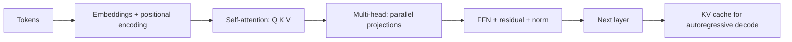

# Transformers Quiz

## Instructions

Ten questions on self-attention, KV cache, positional encoding,
attention variants, and scaling laws. One option per question.

## Questions

1. **Foundational.** Self-attention scales:
   A. Linearly with sequence length.
   B. Quadratically with sequence length, because each token
      attends to every other token.
   C. Logarithmically with sequence length.
   D. With the model dimension only.

2. **Foundational.** Multi-head attention runs:
   A. One attention computation with the full hidden dimension.
   B. Several parallel attention computations on lower-
      dimensional projections, concatenated and re-projected;
      heads can specialize on different relations.
   C. Attention sequentially across layers.
   D. Attention only on the last token.

3. **Foundational.** Positional encoding is needed because:
   A. Embeddings are too small.
   B. Self-attention is order-invariant; without positional
      information, the model cannot tell "the cat sat on the mat"
      from "the mat sat on the cat".
   C. The decoder needs it.
   D. Tokenization removes positions.

4. **Intermediate.** The KV cache stores:
   A. The model weights.
   B. The keys and values from previous tokens during
      autoregressive decoding so each new token attends without
      recomputing the entire prefix; memory grows with sequence
      length.
   C. The output logits.
   D. The training data.

5. **Intermediate.** Multi-Query Attention (MQA) and Grouped-Query
   Attention (GQA) reduce:
   A. Compute.
   B. KV-cache memory by sharing keys and values across query
      heads; trade a small quality loss for major memory and
      bandwidth savings.
   C. The number of layers.
   D. The vocabulary size.

6. **Intermediate.** RoPE (rotary positional encoding) advantages
   over absolute positional encoding:
   A. Smaller embeddings.
   B. Encodes relative positions through rotation in the
      attention computation; extrapolates better to longer
      sequences than fixed-length absolute encodings.
   C. Faster training only.
   D. Requires more parameters.

7. **Advanced.** Encoder-only, decoder-only, and encoder-decoder
   architectures map to:
   A. The same set of tasks.
   B. Different task families: encoder-only (BERT) for
      classification and embedding; decoder-only (GPT) for
      autoregressive generation; encoder-decoder (T5) for
      sequence-to-sequence tasks.
   C. Old, current, and future generations.
   D. CPU, GPU, and TPU.

8. **Advanced.** Flash-Attention speeds up attention by:
   A. Reducing the number of attention heads.
   B. Reorganizing the computation to keep intermediate values in
      fast SRAM rather than HBM, recomputing rather than storing
      the attention matrix; memory and wall-clock both improve.
   C. Skipping attention.
   D. Using lower precision exclusively.

9. **Advanced.** Scaling laws (Kaplan, Chinchilla) suggest:
   A. Always make the model bigger.
   B. Optimal compute allocation balances model size, training
      tokens, and compute; under-trained large models are
      sub-optimal compared to right-sized models trained on more
      tokens.
   C. Training data does not matter.
   D. Smaller models always win.

10. **Advanced.** Long-context transformers face the challenge of:
    A. Vocabulary size.
    B. Quadratic attention cost plus diluted attention over many
       tokens; sparse attention, sliding-window attention, and
       state-space hybrids attempt to address it.
    C. Tokenization quality.
    D. Output length.

## Answer Key

1. **B.** Each token computes attention with every other token.
   At sequence length n, the cost is O(n^2) in compute and
   memory. This is the dominant constraint at long context.

2. **B.** Multi-head attention enables specialization. Different
   heads attend to different patterns (syntax, coreference,
   long-range structure).

3. **B.** Self-attention treats the input as a set; positions
   carry no inherent meaning. Positional encodings restore order
   information.

4. **B.** The cache trades memory for compute. KV memory grows
   with sequence length and dominates inference memory at long
   context; MQA, GQA, and offload strategies address this.

5. **B.** MQA shares keys and values across all heads; GQA
   shares within groups. Memory savings are dramatic; quality
   loss is small relative to the memory bandwidth gain.

6. **B.** RoPE's rotation captures relative positions implicitly
   in the attention computation. It generalizes better to
   sequence lengths beyond training.

7. **B.** Architecture choice depends on task structure.
   Embedding tasks favor encoder-only; chat and generation favor
   decoder-only; structured transformations (translation,
   summarization) favor encoder-decoder.

8. **B.** Flash-Attention computes attention block by block in
   on-chip memory, avoiding the materialization of the full
   attention matrix. The recomputation tradeoff is worthwhile
   given the memory-bandwidth bottleneck on modern GPUs.

9. **B.** Chinchilla-optimal models are smaller and trained on
   more tokens than Kaplan-era practice. Right-sizing matters;
   under-trained large models leave performance on the table.

10. **B.** Long context is constrained by O(n^2) attention cost
    and by the fact that more context dilutes per-token
    attention. Approximate-attention methods and hybrid
    architectures (state-space models) are active research areas.

## Mini Exercise

For a transformer model you know, estimate the KV-cache memory
for a 32K context with 32 attention heads, 128-dim per head, in
fp16. Then state one engineering response if that exceeds
available memory.

## Diagram

---
## Navigation

[⬅ Previous](07-deep-learning-quiz.md) | [🏠 Home](../README.md) | [➡ Next](09-nlp-quiz.md)
