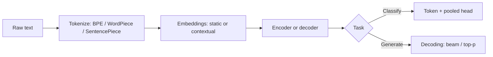

# NLP Quiz

## Instructions

Ten questions on tokenization, BPE, classical NLP tasks,
embeddings, and modern instruction-following. One option per
question.

## Questions

1. **Foundational.** Byte-Pair Encoding (BPE) tokenization:
   A. Splits text into individual characters.
   B. Merges frequent character or byte pairs iteratively to
      build a sub-word vocabulary; balances coverage and
      vocabulary size.
   C. Splits at spaces only.
   D. Uses a fixed dictionary.

2. **Foundational.** Stop-word removal in modern NLP pipelines:
   A. Always improves performance.
   B. Helps for some classical methods (TF-IDF, BM25) but
      generally hurts modern transformer-based models that benefit
      from full context.
   C. Reduces accuracy in all settings.
   D. Is required for embeddings.

3. **Foundational.** Named Entity Recognition (NER) typically
   produces:
   A. Word frequencies.
   B. Token-level labels (B-I-O scheme) marking entity spans and
      types (person, organization, location).
   C. Sentence sentiment scores.
   D. Translation pairs.

4. **Intermediate.** Word2Vec and GloVe produce:
   A. Contextual embeddings that change with sentence.
   B. Static word embeddings (one vector per word) trained on
      co-occurrence statistics; same vector regardless of context.
   C. Token-level transformer embeddings.
   D. One-hot encodings.

5. **Intermediate.** BERT differs from Word2Vec because:
   A. It is faster.
   B. BERT produces contextual embeddings (the same word has
      different vectors in different sentences) via transformer
      self-attention over the whole input.
   C. It uses no neural network.
   D. It is unsupervised only.

6. **Intermediate.** Cross-encoder rerankers outperform bi-encoder
   retrieval for relevance ranking because:
   A. They are smaller.
   B. They jointly attend to query and candidate, capturing fine-
      grained interactions; cost is higher per pair, so they are
      typically used after a cheaper retrieval stage.
   C. They are deterministic.
   D. They use sparse vectors.

7. **Advanced.** Beam search during decoding:
   A. Always finds the optimal sequence.
   B. Approximates the most-likely sequence by maintaining the
      top-k partial hypotheses at each step; better than greedy
      for translation, often biased toward shorter outputs in
      open-ended generation.
   C. Is purely random.
   D. Is the same as nucleus sampling.

8. **Advanced.** Nucleus (top-p) sampling and top-k sampling differ
   in:
   A. They are equivalent.
   B. Top-k samples from the k most-likely tokens; top-p samples
      from the smallest set whose cumulative probability is at
      least p, adapting to the distribution shape.
   C. The number of layers used.
   D. The model size.

9. **Advanced.** Instruction tuning (supervised fine-tuning on
   instruction-response pairs) plus RLHF:
   A. Replaces pre-training.
   B. Aligns a pre-trained language model with desired behaviors:
      following instructions, refusing harmful requests, producing
      helpful structured outputs; pre-training provides knowledge,
      tuning shapes behavior.
   C. Increases model capacity.
   D. Reduces hallucination to zero.

10. **Advanced.** Embedding evaluation typically uses:
    A. Cross-entropy loss.
    B. Tasks like MTEB (Massive Text Embedding Benchmark) that
       measure retrieval, classification, clustering, semantic
       textual similarity across many domains.
    C. Just cosine similarity on a few examples.
    D. Perplexity.

## Answer Key

1. **B.** BPE handles unseen words by composing them from
   subwords. The vocabulary covers common roots and rare
   compositional forms without exploding.

2. **B.** Stop-words are uninformative for sparse-vector methods
   but contribute syntactic structure that transformers exploit.
   Modern pipelines rarely strip them.

3. **B.** B-I-O (Begin-Inside-Outside) labels mark entity
   boundaries and types. Modern NER uses transformer encoders
   plus a token classification head.

4. **B.** Static embeddings are pre-computed and shared. They
   miss polysemy; "bank" has the same vector for river and
   financial uses.

5. **B.** Contextual embeddings disambiguate by attending to
   surrounding tokens. The cost is computation per query
   instead of a lookup.

6. **B.** Two-stage retrieve-then-rerank is the standard
   architecture for high-quality search. The reranker spends
   compute only on the top candidates.

7. **B.** Beam search trades exploration for exploitation. Length
   normalization and coverage penalties address its biases for
   open-ended generation.

8. **B.** Top-p adapts to the distribution: when the model is
   confident, the nucleus is small; when uncertain, it is wide.
   Top-k uses a fixed cutoff regardless of confidence.

9. **B.** Pre-training learns world knowledge from unlabeled
   text; instruction tuning and RLHF shape how the model
   responds. Hallucination is reduced but not eliminated.

10. **B.** MTEB and similar benchmarks evaluate embeddings
    across diverse tasks. Single-task evaluation overfits to
    that task's idiosyncrasies.

## Mini Exercise

Pick a tokenizer for a model you have used. Tokenize the phrase
"unforgettable" and explain why BPE produces multiple subword
tokens rather than a single token. State one consequence for
multilingual coverage.

## Diagram

---
## Navigation

[⬅ Previous](08-transformers-quiz.md) | [🏠 Home](../README.md) | [➡ Next](10-computer-vision-quiz.md)
