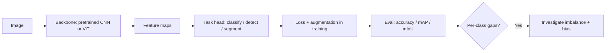

# Computer Vision Quiz

## Instructions

Ten questions on convolutions, pooling, transfer learning, data
augmentation, and the architecture choices that matter. One
option per question.

## Questions

1. **Foundational.** A convolution layer's parameters per filter:
   A. Depend on the input image size.
   B. Depend on kernel height, width, and input channel count, plus
      a bias; do not depend on input image spatial dimensions.
   C. Equal the number of output classes.
   D. Equal the input dimensions.

2. **Foundational.** Max pooling performs:
   A. A learned downsampling.
   B. A non-learned downsampling that takes the maximum within
      each receptive window; reduces spatial size and provides
      mild translation invariance.
   C. A normalization step.
   D. A regularization step.

3. **Foundational.** A 3x3 convolution with stride 1 and padding 1:
   A. Reduces spatial dimensions by 2.
   B. Preserves spatial dimensions; the standard "same" padding
      configuration.
   C. Increases spatial dimensions.
   D. Removes channels.

4. **Intermediate.** Transfer learning from ImageNet pre-training
   helps a small dataset because:
   A. ImageNet contains the target classes.
   B. The pre-trained backbone learns generic visual features
      (edges, textures, parts) that transfer to many downstream
      tasks; fine-tuning adapts the higher layers.
   C. It avoids overfitting completely.
   D. It removes the need for labels.

5. **Intermediate.** Data augmentation in vision typically
   includes:
   A. Adding random labels.
   B. Random crops, horizontal flips, color jitter, and stronger
      methods like Mixup or CutMix; augmentations should preserve
      the semantic class.
   C. Removing classes.
   D. Reducing image size.

6. **Intermediate.** Batch normalization layers in a fine-tuning
   workflow:
   A. Should always be reset.
   B. Often perform better when frozen with the pre-training
      statistics if the new dataset is small or differs in
      distribution; otherwise the running stats can drift.
   C. Should never be used.
   D. Are equivalent to dropout.

7. **Advanced.** Vision Transformers (ViT) versus CNNs:
   A. ViT always wins.
   B. ViT shines on large-scale data and benefits from global
      attention; CNNs retain efficiency, locality bias, and a
      lower-data win on smaller benchmarks. Hybrid architectures
      are common.
   C. CNNs are obsolete.
   D. ViT requires no positional information.

8. **Advanced.** Object detection metrics like mAP@0.5 measure:
   A. Pixel-level accuracy.
   B. Mean average precision averaged across classes at an IoU
      threshold of 0.5; mAP@0.5:0.95 averages across IoU thresholds
      from 0.5 to 0.95 (COCO standard).
   C. Frame rate.
   D. Color accuracy.

9. **Advanced.** A CV model overfits a 5K-image dataset. The
   first response:
   A. Make the model bigger.
   B. Heavier augmentation, transfer learning from a strong
      backbone, regularization, and more data; the model size
      should match the data scale, not the other way around.
   C. Reduce the augmentation.
   D. Increase the learning rate.

10. **Advanced.** Class imbalance in image classification (e.g.,
    1-percent positive defects) is addressed by:
    A. Always upsampling the positive class.
    B. Combinations: focal loss, class-weighted loss, balanced
       sampling, and threshold tuning; pick by what the cost
       structure rewards.
    C. Ignoring imbalance.
    D. Increasing the model size.

## Answer Key

1. **B.** Filter parameters are kH x kW x C_in plus bias. The
   parameter budget grows with kernel size and input channels,
   not image dimensions; this is what makes CNNs efficient.

2. **B.** Max pool is a non-learned op. Average pool is the
   alternative. Strided convolution can replace pooling and is
   common in modern architectures.

3. **B.** Same padding preserves spatial size for stride-1
   convolutions, making it easy to stack layers.

4. **B.** Pre-training learns reusable hierarchical features.
   Adapting only the head with a small LR on the backbone is the
   common pattern; full fine-tuning when the target dataset is
   large enough.

5. **B.** Augmentation expands the effective dataset and improves
   robustness. Strong augmentations (Mixup, CutMix, RandAugment)
   regularize on top of the basic ones.

6. **B.** Small or shifted datasets can corrupt running BN stats
   during fine-tuning. Freezing BN to pre-training statistics is
   a common mitigation; switching to GroupNorm is another.

7. **B.** Inductive biases matter at small scale; ViT's global
   attention pays off at large scale. Most modern vision systems
   use hybrid (convolution-stem-plus-attention) architectures.

8. **B.** mAP averages precision across recall levels per class
   then across classes. The IoU threshold defines what counts as
   a correct detection.

9. **B.** Heavy augmentation plus transfer learning is the
   standard small-data response. Starting from a strong backbone
   recovers months of additional data collection.

10. **B.** No single technique is universal. Focal loss helps
    when the easy negatives dominate; class weighting and
    sampling redistribute attention; threshold tuning matches the
    operating point to the cost structure.

## Mini Exercise

Pick a vision task with a small dataset. Sketch a transfer-
learning plan: backbone choice, freezing strategy, augmentation
list, and one fairness or distribution-shift concern.

## Diagram

---
## Navigation

[⬅ Previous](09-nlp-quiz.md) | [🏠 Home](../README.md) | [➡ Next](11-recommenders-quiz.md)
