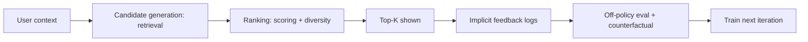

# Recommenders Quiz

## Instructions

Ten questions on retrieval-and-ranking, two-tower models, cold
start, exposure bias, and the production patterns that make
recommenders work. One option per question.

## Questions

1. **Foundational.** The two-stage architecture for production
   recommenders splits work into:
   A. Training and serving.
   B. Candidate generation (retrieval, hundreds to thousands per
      user) and ranking (dozens to scores per user); each stage
      uses different objectives, models, and latency budgets.
   C. Online and offline.
   D. Batch and streaming.

2. **Foundational.** Collaborative filtering (matrix factorization)
   models user-item preference by:
   A. Decomposing the user-item interaction matrix into low-rank
      user and item factors; predictions are inner products of the
      factors.
   B. Using only item content.
   C. Using only user content.
   D. Direct lookup in a database.

3. **Foundational.** Cold-start refers to:
   A. The first model deployment.
   B. Recommending for new users or new items with no interaction
      history; content-based features and contextual bandits help.
   C. The training start.
   D. The serving startup.

4. **Intermediate.** A two-tower retrieval model:
   A. Trains user and item encoders independently.
   B. Trains a user tower and an item tower with a shared loss
      so user and item embeddings live in the same space; serving
      retrieves nearest items by ANN.
   C. Has only one layer.
   D. Always uses transformer backbones.

5. **Intermediate.** Exposure bias occurs when:
   A. Users see too many items.
   B. The training data reflects what the previous policy showed,
      not what users would have liked across the full catalog;
      naive training reinforces the existing policy.
   C. Items have varying popularity.
   D. The model is too small.

6. **Intermediate.** Implicit feedback (clicks, watches) versus
   explicit feedback (ratings) is preferred for production
   recommenders because:
   A. It is cheaper.
   B. It is far more abundant and reflects actual behavior;
      explicit ratings are sparse and biased toward strong
      opinions.
   C. It is more accurate.
   D. It avoids cold start.

7. **Advanced.** Diversity-aware ranking:
   A. Always reduces engagement.
   B. Promotes a balance of relevant items across categories or
      content types; pure relevance ranking can collapse into a
      narrow filter bubble that hurts long-term engagement and
      catalog coverage.
   C. Replaces relevance.
   D. Means random recommendations.

8. **Advanced.** Sequence-based recommenders (RNN, transformer)
   model:
   A. Single user state.
   B. The temporal order of user actions; capture short-term
      intent that pooled representations miss.
   C. Item content only.
   D. Random patterns.

9. **Advanced.** Offline NDCG improving by 5 percent does not
   guarantee online engagement improving because:
   A. Offline metrics are unreliable.
   B. Counterfactual evaluation gaps: the model is judged on
      historical data shaped by the previous policy; new policies
      can perform worse online if exposure bias was not addressed.
   C. The online system is slow.
   D. The user base changed.

10. **Advanced.** Fairness in recommenders typically focuses on:
    A. Identical recommendations for all users.
    B. Provider-side fairness (catalog coverage, exposure across
       creators or sellers) and user-side fairness (similar
       quality across user segments); both can be measured and
       optimized.
    C. Random recommendations.
    D. Removing all personalization.

## Answer Key

1. **B.** Two-stage is universal at scale. Retrieval is cheap
   per item but covers the catalog; ranking is expensive per
   item but only sees a shortlist.

2. **A.** Matrix factorization assumes a low-rank structure in
   user-item preferences. The factors are learned from observed
   interactions.

3. **B.** Cold-start is the production challenge of recommending
   without history. Content features, demographic priors, and
   exploration policies (epsilon-greedy, Thompson sampling) are
   standard responses.

4. **B.** Two-tower architectures shine at retrieval scale.
   Pre-computed item embeddings plus ANN search handle catalogs
   in the millions.

5. **B.** The serving policy biases what users see, which biases
   the next training set. Off-policy evaluation, exploration, and
   inverse-propensity weighting address it.

6. **B.** Implicit feedback is plentiful and unbiased by user
   willingness to rate. Explicit ratings are valuable but rare
   and skewed.

7. **B.** Pure relevance ranking exploits at the cost of
   exploration. Diversity penalties, MMR, and constraint
   satisfaction balance immediate engagement with long-term
   value.

8. **B.** Order matters; a user who just searched for "running
   shoes" wants different recommendations than the same user
   yesterday. Sequence models capture this.

9. **B.** Offline metrics use logged data shaped by the previous
   model. New policies that recommend differently from history
   look worse offline even when they would perform better
   online; counterfactual evaluation is hard.

10. **B.** Fairness has two sides in recommenders. Both
    user-side (quality parity) and provider-side (exposure
    parity) need attention; the right balance is product-
    specific.

## Mini Exercise

For a recommender you have used, name the candidate generator,
the ranker, the primary metric, and one fairness concern. State
the key tradeoff between relevance and diversity.

## Diagram

---
## Navigation

[⬅ Previous](10-computer-vision-quiz.md) | [🏠 Home](../README.md) | [➡ Next](12-mlops-quiz.md)
