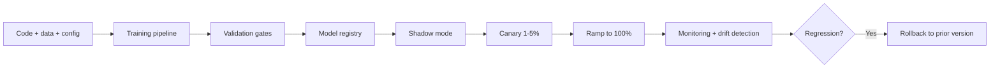

# MLOps Quiz

## Instructions

Ten questions on feature stores, model registries, drift
detection, deployment, and the operational discipline that keeps
production ML alive. One option per question.

## Questions

1. **Foundational.** A feature store solves:
   A. Slow training.
   B. Training-serving skew (different feature definitions
      between training and inference) and feature reuse across
      teams; offers offline tables and online low-latency lookup.
   C. Model selection.
   D. Hyperparameter tuning.

2. **Foundational.** A model registry tracks:
   A. Only the latest version.
   B. Every registered model version with metadata, lineage,
      stage transitions (staging, canary, production,
      deprecated), and approval records.
   C. Training data only.
   D. Source code only.

3. **Foundational.** Reproducibility in ML requires versioning:
   A. Code only.
   B. Code, data, training config, environment (container or
      lockfile), and the link from each artifact to the trained
      model.
   C. Data only.
   D. Hyperparameters only.

4. **Intermediate.** Data drift detection typically uses:
   A. The model's loss only.
   B. Statistical tests on input distributions: PSI per feature,
      KL divergence, KS test for continuous, chi-squared for
      categorical, MMD for joint distributions.
   C. Manual inspection.
   D. The output distribution only.

5. **Intermediate.** Concept drift differs from data drift in:
   A. They are the same.
   B. Data drift is a change in input distributions; concept
      drift is a change in the input-output relationship,
      detected by performance degradation or proxies when fresh
      labels arrive slowly.
   C. Concept drift is faster.
   D. Concept drift only affects classification.

6. **Intermediate.** Canary deployment in ML:
   A. Deploys to all users at once.
   B. Routes a small percentage of traffic (1-5 percent) to the
      new model, monitors metrics, and gradually ramps; rollback
      is fast if metrics regress.
   C. Replaces the production model with random sampling.
   D. Only deploys at night.

7. **Advanced.** Shadow mode for ML rollouts:
   A. Disables logging.
   B. Runs the new model in parallel with production on real
      traffic without exposing users; metrics are collected and
      compared offline before promoting.
   C. Replaces production silently.
   D. Is identical to canary.

8. **Advanced.** A feature store's online and offline parity
   guarantee depends on:
   A. Database tuning.
   B. Computing features once and materializing to both stores
      via the same code path; point-in-time correctness in the
      offline store and TTL-managed freshness in the online store.
   C. Model size.
   D. Network speed.

9. **Advanced.** Continuous training (CT) without validation gates
   is dangerous because:
   A. Training is slow.
   B. A bad data refresh silently produces a bad model that
      auto-promotes; gates plus shadow mode plus canary rollout
      are required for CT to be safe.
   C. The cost is high.
   D. The serving system rejects new models.

10. **Advanced.** A model in production starts returning predictions
    that systematically drift toward one class. The first
    diagnostic:
    A. Increase model size.
    B. Inspect input feature drift (PSI per feature), check for
       upstream pipeline changes, verify model version, and
       compare against a stable reference model on a fixed
       sample.
    C. Retrain immediately.
    D. Roll back blindly.

## Answer Key

1. **B.** Feature stores prevent the bug where the online
   service computes a feature differently than training did.
   Shared computation and standardized serving close that gap.

2. **B.** The registry is the audit trail and the deployment
   contract. Every state transition is recorded; every served
   model traces back to a registered version with full
   lineage.

3. **B.** All five elements are needed. Code-only versioning
   misses the data dependency that makes ML systems fragile.

4. **B.** PSI is the industry standard for tabular drift.
   Choose the test by the feature type and required sensitivity.

5. **B.** Concept drift is the relationship change. It can
   happen with stable inputs (the world reacted to your model)
   or alongside data drift. Detection requires fresh labels or
   proxy signals.

6. **B.** Canary limits blast radius by exposing the new model
   to a small slice. Combined with auto-rollback on critical
   metric regression, it is the safest production rollout.

7. **B.** Shadow mode is risk-free quality validation on real
   traffic. The catch is doubled inference cost during the
   shadow period.

8. **B.** Same code path is the answer. Many teams maintain
   two pipelines and pay for it later in skew incidents.

9. **B.** Auto-promote without gates is the path to silent
   regressions. The fix is a CI/CD pipeline that validates
   every continuously-trained model.

10. **B.** The senior diagnostic walks the stack. Drift in
    inputs, pipeline changes, version mismatches, and
    reference-model comparisons each isolate the cause; blind
    retrain or rollback can mask the real bug.

## Mini Exercise

Pick a model in production. Sketch the rollout path: PR check,
training trigger, validation gates, shadow, canary, ramp,
rollback. State one place where the path is most likely to fail
silently.

## Diagram

---
## Navigation

[⬅ Previous](11-recommenders-quiz.md) | [🏠 Home](../README.md) | [➡ Next](13-generative-ai-quiz.md)
