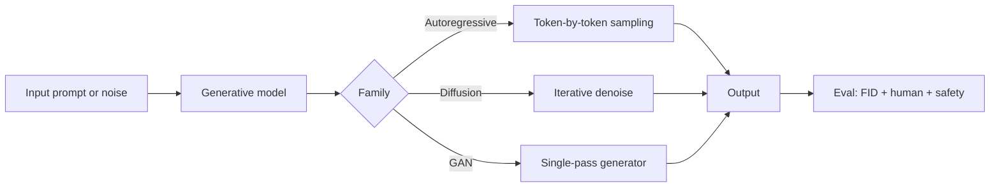

# Generative AI Quiz

## Instructions

Ten questions on generative model families, sampling, evaluation
pitfalls, and the failure modes that trip up production
deployments. One option per question.

## Questions

1. **Foundational.** Autoregressive language models generate text
   by:
   A. Predicting all tokens at once.
   B. Sampling one token at a time conditioned on the prior
      tokens; each step the model produces a probability
      distribution over the vocabulary.
   C. Selecting from a fixed library of phrases.
   D. Compressing input into a single vector.

2. **Foundational.** Diffusion models for image generation:
   A. Train an encoder-decoder.
   B. Learn to reverse a noising process: gradually add noise
      to data, then train to denoise step by step; sampling is
      the iterative reverse process.
   C. Sample directly from a learned distribution in one step.
   D. Are GANs.

3. **Foundational.** GANs versus diffusion models:
   A. GANs are always faster.
   B. GANs train a generator-discriminator adversarial pair (fast
      sampling, training instability); diffusion is more stable
      to train but slower to sample, with techniques like DDIM
      and consistency models reducing sample steps.
   C. They produce identical outputs.
   D. GANs are obsolete.

4. **Intermediate.** Classifier-free guidance in diffusion:
   A. Removes the classifier.
   B. Combines conditional and unconditional model outputs at
      sampling time, with a guidance scale controlling fidelity-
      diversity trade-off; high scales produce strong adherence
      to the prompt but can over-saturate.
   C. Uses a separate classifier.
   D. Skips conditioning.

5. **Intermediate.** Decoding temperature in language models
   controls:
   A. Training speed.
   B. The sharpness of the next-token distribution; low
      temperature is more deterministic and conservative, high
      temperature is more diverse and risky.
   C. Model size.
   D. Context length.

6. **Intermediate.** Mode collapse in GAN training means:
   A. The generator produces a narrow set of outputs ignoring
      most of the data distribution; the discriminator easily
      tells real from fake on the missing modes.
   B. Training stops.
   C. The discriminator fails.
   D. The optimizer diverges.

7. **Advanced.** Image generation evaluation typically uses:
   A. Pixel accuracy.
   B. Frechet Inception Distance (FID) and Inception Score (IS)
      plus human evaluation; FID compares feature distributions
      of real and generated samples.
   C. Cross-entropy loss only.
   D. Mean squared error.

8. **Advanced.** A common evaluation pitfall in generative
   models:
   A. Using too much data.
   B. Training and evaluation sets contain near-duplicates;
      models that memorize score well on metrics that should
      reward generalization.
   C. Using the wrong optimizer.
   D. Measuring training loss only.

9. **Advanced.** Watermarking generated content:
   A. Always works perfectly.
   B. Embeds a detectable signal in the output (token-distribution
      bias, image pixel patterns); robust against minor edits but
      defeated by determined adversaries; useful as one layer in
      provenance.
   C. Replaces content moderation.
   D. Is impossible.

10. **Advanced.** Latent-space manipulation in diffusion or VAE
    models:
    A. Is random.
    B. Operations on latent vectors (interpolation, arithmetic)
       produce semantically meaningful changes in the decoded
       output; the interpretability of latent dimensions varies
       by model.
    C. Has no effect.
    D. Requires retraining.

## Answer Key

1. **B.** Autoregressive sampling is the inference loop. Each
   step uses the full prior context. Inference cost scales
   with sequence length squared without caching, linearly with
   KV cache.

2. **B.** Diffusion's reverse-process formulation is the key.
   Sampling iteratively denoises from pure noise to a coherent
   image, typically over 20-1000 steps depending on the
   sampler.

3. **B.** GANs are fast but unstable; diffusion is stable but
   slow. Modern fast-diffusion variants (DDIM, consistency
   models) close the speed gap.

4. **B.** CFG is the standard tool for prompt adherence in
   image diffusion. High guidance produces sharp matches;
   excessive guidance over-saturates and drops diversity.

5. **B.** Temperature scales logits before softmax. Production
   systems usually pick low temperature (0.0-0.4) for factual
   tasks and higher (0.7-1.0) for creative ones.

6. **A.** Mode collapse is the GAN failure mode. The generator
   finds a few outputs the discriminator cannot reject and
   sticks there. Solutions: minibatch discrimination,
   progressive training, alternative losses.

7. **B.** FID compares feature distributions; lower is better.
   Human eval remains the gold standard for nuanced quality
   judgments, especially for fidelity to prompts.

8. **B.** Memorization shows up as inflated metrics on
   contaminated splits. Deduplication of training and
   evaluation data is essential.

9. **B.** Watermarks are useful as one layer of provenance,
   not a complete solution. C2PA-style metadata plus model-
   specific watermarks plus content classifiers form a
   layered defense.

10. **B.** Latent space arithmetic ("smiling - neutral + face")
    can be meaningful in well-trained generative models.
    Disentangled representations make this more reliable.

## Mini Exercise

For a generative system you have used, identify the sampling
strategy, the typical failure mode (memorization, mode
collapse, hallucination), and one evaluation method beyond
single-metric scoring.

## Diagram

---
## Navigation

[⬅ Previous](12-mlops-quiz.md) | [🏠 Home](../README.md) | [➡ Next](14-llm-quiz.md)
