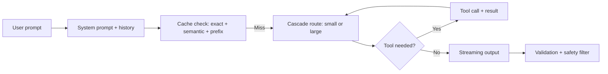

# LLM Quiz

## Instructions

Ten questions on tokens, decoding, system prompts, tool use,
structured output, and the production patterns that turn LLM
calls into reliable systems.

## Questions

1. **Foundational.** A token in a modern LLM corresponds to:
   A. One word.
   B. A subword unit (typically a few characters); common words
      may be one token, rare words split into several.
   C. One character.
   D. One sentence.

2. **Foundational.** The context window is:
   A. The training data.
   B. The maximum number of tokens the model can attend to in a
      single inference (input plus output); longer windows cost
      more compute and memory.
   C. The output length only.
   D. The prompt template.

3. **Foundational.** A system prompt sets:
   A. The model architecture.
   B. The behavior, persona, format, and constraints the model
      should follow throughout the conversation; instruction
      hierarchy gives it more weight than user input.
   C. The training objective.
   D. The tokenization scheme.

4. **Intermediate.** Greedy decoding versus sampling at
   temperature 0.7:
   A. Always produces the same output.
   B. Greedy returns the single most likely token at each step
      (deterministic, can be repetitive); sampling at moderate
      temperature explores plausible alternatives, useful for
      creative tasks.
   C. Greedy is faster only.
   D. They are interchangeable for production.

5. **Intermediate.** Function calling (tool use) lets an LLM:
   A. Generate code only.
   B. Output a structured call to a named function with typed
      arguments; the runtime executes the call and returns the
      result for the model to continue.
   C. Search the web automatically.
   D. Replace the API.

6. **Intermediate.** Structured outputs (JSON Schema, Pydantic)
   benefit production by:
   A. Reducing model size.
   B. Constraining the model to a known shape so downstream
      parsers do not break on freeform text; failure modes
      become predictable validation errors.
   C. Improving accuracy.
   D. Increasing token count.

7. **Advanced.** Hallucination in LLM outputs:
   A. Is a bug in tokenization.
   B. Reflects the model generating plausible-but-wrong content
      because it predicts the next token without verifying
      against a source; mitigations include retrieval grounding,
      citation, abstention, and verification.
   C. Is solved by larger models.
   D. Is unfixable.

8. **Advanced.** Prompt injection attacks succeed when:
   A. The model is too small.
   B. Untrusted content (user input or retrieved documents) is
      treated as instructions instead of data; defenses include
      content tagging, instruction hierarchy, output filtering,
      and treating retrieved content as untrusted.
   C. The temperature is too high.
   D. The system prompt is too long.

9. **Advanced.** A streaming LLM API benefits the user by:
   A. Lower cost.
   B. Returning tokens as they generate, reducing time-to-first-
      token (TTFT) and giving the user a visible signal that the
      system is working; full-response latency may be unchanged.
   C. Higher accuracy.
   D. Eliminating the need for a backend.

10. **Advanced.** A production LLM system that costs $0.50 per
    request can be optimized by:
    A. Always using the cheapest model.
    B. Cascade routing (cheap model first, escalate to expensive
       on uncertainty), caching (semantic, prefix), prompt
       compression, batching at the GPU, and choosing model size
       per task; costs typically drop 5-10x.
    C. Reducing context.
    D. Refusing more requests.

## Answer Key

1. **B.** BPE-style tokenization compresses common patterns and
   splits rare ones. A useful rule of thumb: 1 token is roughly
   3-4 English characters or 0.75 words.

2. **B.** Context limits dominate LLM design. Long-context
   models exist but pay quadratic attention cost; KV-cache memory
   is the bottleneck during decoding.

3. **B.** System prompts shape behavior. Modern APIs grant them
   priority over user content via instruction hierarchy, which
   is a key defense against prompt injection.

4. **B.** Greedy is fine for deterministic tasks; temperature
   sampling for creative ones. Top-p (nucleus) sampling is the
   common middle ground.

5. **B.** Tool use is the bridge from chat to action. The model
   emits a call; the runtime executes it; the result feeds back
   into the model's next step.

6. **B.** Structured outputs make integration robust. Schema-
   constrained generation eliminates entire categories of
   downstream parsing bugs.

7. **B.** Hallucination is the model's most-discussed failure
   mode. Grounding via retrieval plus citation plus abstention
   is the standard production response.

8. **B.** Prompt injection is the OWASP LLM Top 10 number one.
   Indirect injection (from retrieved content) is hardest to
   defend; treat retrieved content as data, never as
   instructions.

9. **B.** Streaming improves perceived latency. The first token
   appearing within a few hundred milliseconds creates a
   responsive feel; the user sees the answer building.

10. **B.** Production LLM systems use cascading and caching as
    default. The single largest cost lever is matching model
    size to task; the second is caching at multiple layers.

## Mini Exercise

For an LLM feature you have used, estimate the cost per
request: input tokens times input price plus output tokens
times output price. Identify the largest line item and one
strategy that would cut it by half without quality loss.

## Diagram

---
## Navigation

[⬅ Previous](13-generative-ai-quiz.md) | [🏠 Home](../README.md) | [➡ Next](15-prompting-quiz.md)
