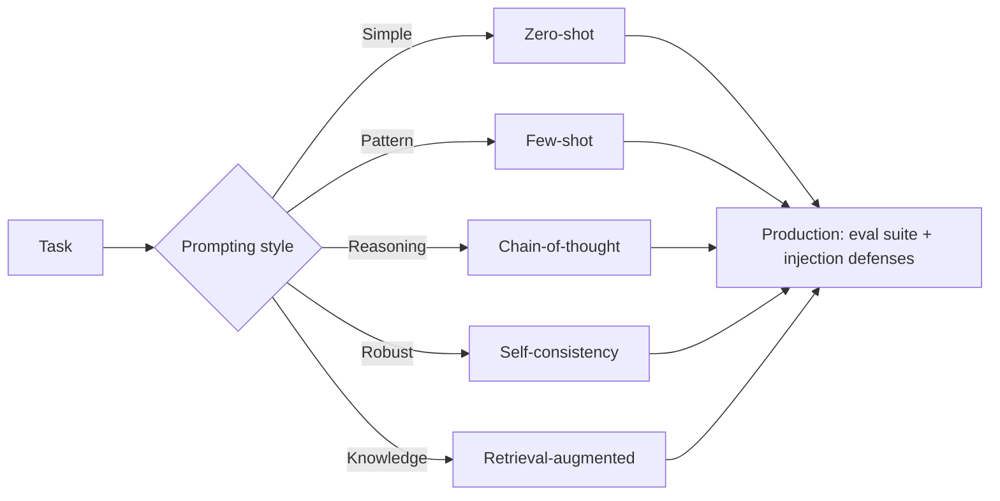

# Prompting Quiz

## Instructions

Ten questions on few-shot, chain-of-thought, self-consistency,
prompt injection, and the brittleness patterns that real prompts
hit. One option per question.

## Questions

1. **Foundational.** Zero-shot prompting:
   A. Provides examples in the prompt.
   B. Provides only the task instruction without examples;
      relies on the model's pre-trained behavior.
   C. Fine-tunes the model.
   D. Uses retrieval.

2. **Foundational.** Few-shot prompting works because:
   A. It updates model weights.
   B. The examples in the prompt let the model pattern-match the
      task; in-context learning effectively conditions the
      model's behavior without weight updates.
   C. It downloads new data.
   D. It increases model size.

3. **Foundational.** Chain-of-thought (CoT) prompting:
   A. Reduces token usage.
   B. Asks the model to produce intermediate reasoning steps
      before the final answer; improves performance on
      arithmetic, logic, and multi-step problems.
   C. Skips the answer.
   D. Replaces fine-tuning.

4. **Intermediate.** Self-consistency:
   A. Uses one prompt.
   B. Samples multiple chain-of-thought completions and takes the
      majority answer; trades extra inference cost for higher
      accuracy on reasoning tasks.
   C. Trains on its own output.
   D. Uses a single greedy decode.

5. **Intermediate.** Prompt brittleness shows up when:
   A. Small wording changes (synonyms, formatting, ordering)
      shift the model's output substantially; production prompts
      need testing across realistic variations.
   B. The model is too small.
   C. The task is hard.
   D. The temperature is high.

6. **Intermediate.** Retrieval-augmented prompting (RAG)
   addresses:
   A. Latency.
   B. Knowledge cut-offs and hallucination by injecting relevant
      documents into context with citations; performance hinges
      on retrieval quality.
   C. Tokenization.
   D. Multi-modality.

7. **Advanced.** Direct prompt injection in user input is mitigated
   by:
   A. Hoping users do not try.
   B. Instruction hierarchy (system role outranks user content),
      input classifiers, and output filters; defense in depth.
   C. Removing the system prompt.
   D. Using only structured output.

8. **Advanced.** Indirect prompt injection (from retrieved
   documents) is harder to defend because:
   A. The injection looks like normal content.
   B. The model encounters the malicious instructions through
      legitimate operation; defenses include content tagging
      (treat retrieved content as data), output filtering, and
      distrust of all retrieved instructions.
   C. The retriever is broken.
   D. The model is too small.

9. **Advanced.** Reasoning step counts in chain-of-thought:
   A. Should be maximized.
   B. Have a sweet spot; too few hurts accuracy, too many adds
      cost without benefit and can introduce off-track
      reasoning. Match step depth to task complexity.
   C. Are irrelevant.
   D. Always equal three.

10. **Advanced.** A prompt that worked on model A breaks on model B:
    A. Always means model B is worse.
    B. Often reflects different training data, instruction-
       following style, or output format conventions; prompts
       are not portable and need re-tuning per model.
    C. Means the API changed.
    D. Means the prompt was wrong.

## Answer Key

1. **B.** Zero-shot relies on the model's pre-trained ability
   to follow instructions. It is the cheapest prompting style
   and the right starting point.

2. **B.** Few-shot conditions the model on the desired pattern.
   The examples should be representative; biased examples bias
   the output.

3. **B.** CoT gives the model "thinking room". For multi-step
   problems, accuracy improves dramatically. Cost is the
   tradeoff: longer outputs, higher latency.

4. **B.** Self-consistency is sampling-based ensembling.
   Higher cost, higher accuracy on reasoning tasks; useful
   when correctness matters more than per-query cost.

5. **A.** Brittleness is a silent failure mode. Production
   prompts need eval suites that include realistic input
   variations.

6. **B.** RAG is the standard pattern for grounded answering.
   Retrieval quality (recall, ranking) is the dominant lever
   on system quality.

7. **B.** No single defense is sufficient. Layered defenses are
   the architecture; testing them with red-team prompts is
   standard practice.

8. **B.** Indirect injection is the OWASP LLM Top 10 threat.
   The mitigation pattern: tag retrieved content as untrusted,
   filter outputs, and assume the document may be hostile.

9. **B.** CoT has diminishing returns. Calibrate the number of
   reasoning steps to the task; more is not always better.

10. **B.** Prompts are model-specific. Migration plans include
    re-running the eval suite with the new model and adjusting
    the prompt as needed.

## Mini Exercise

Pick a prompt you use. Write three plausible variations
(synonym, format change, order change) and predict whether the
output would shift. State one production guardrail that would
catch a brittle output before users see it.

## Diagram

---
## Navigation

[⬅ Previous](14-llm-quiz.md) | [🏠 Home](../README.md) | [➡ Next](16-vector-database-quiz.md)
