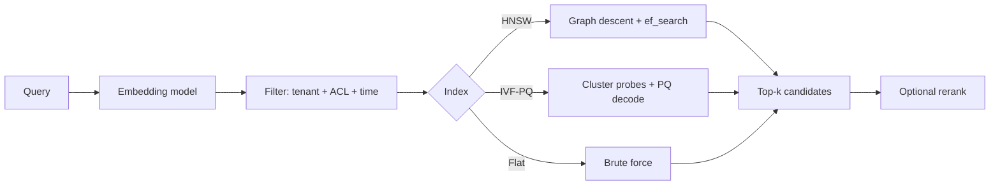

# Vector Database Quiz

## Instructions

Ten questions on ANN indexes, recall@k, search parameters,
filtering, and the operational concerns that show up at scale.
One option per question.

## Questions

1. **Foundational.** A vector database stores:
   A. Documents.
   B. Dense vector embeddings with metadata, indexed for
      approximate nearest-neighbor search; queries return the
      top-k vectors by similarity.
   C. SQL rows only.
   D. Tokens.

2. **Foundational.** Recall@k measures:
   A. The model's accuracy.
   B. The fraction of true top-k nearest neighbors retrieved by
      the approximate index; trades recall for query speed and
      memory.
   C. The number of results returned.
   D. The query latency.

3. **Foundational.** A flat (brute-force) index:
   A. Is fastest.
   B. Computes exact similarity between query and every vector;
      slowest but recall is 1.0; useful as a ground-truth
      baseline.
   C. Requires no memory.
   D. Is a tree structure.

4. **Intermediate.** HNSW (Hierarchical Navigable Small World):
   A. Is a tree.
   B. Builds a multi-layer graph where higher layers have
      sparser connections; search descends from coarse to fine
      via greedy nearest-neighbor steps. High recall and low
      latency at large memory cost.
   C. Uses no graph.
   D. Is exact search.

5. **Intermediate.** IVF-PQ (Inverted File with Product
   Quantization):
   A. Is the same as HNSW.
   B. Partitions vectors into clusters (IVF) and quantizes them
      (PQ) for compact storage; lower memory than HNSW with a
      recall-speed knob (n_probe). Used for billion-scale
      collections.
   C. Has no parameters.
   D. Is exact search.

6. **Intermediate.** The ef_search parameter in HNSW:
   A. Has no effect.
   B. Controls how many candidates are explored at the bottom
      layer; higher ef_search gives higher recall and higher
      latency.
   C. Sets the number of layers.
   D. Sets the embedding dimension.

7. **Advanced.** Filtering on metadata (e.g., tenant_id, time
   range) in vector search:
   A. Is free.
   B. Has cost: pre-filtering then ANN search risks low recall
      if filters are very selective; post-filtering wastes the
      ANN budget. Hybrid strategies (filtered HNSW, IVF with
      attribute partitioning) balance recall and speed.
   C. Improves recall.
   D. Is unnecessary.

8. **Advanced.** Reindexing a vector database:
   A. Is fast and free.
   B. Costs full re-embedding plus index rebuild; needs careful
      planning for embedding-model upgrades. Online index
      updates are supported by some systems but rebalancing has
      overhead.
   C. Is automatic.
   D. Never needed.

9. **Advanced.** ACL filtering on retrieval requires:
   A. No special handling.
   B. Pre-filtering (filter the index before ANN), per-tenant
      partitioning, or per-document ACL metadata combined with
      filtered search; otherwise users may see results they
      cannot access.
   C. Retroactive filtering.
   D. Encryption only.

10. **Advanced.** Hybrid search (sparse plus dense):
    A. Is always slower.
    B. Combines lexical retrieval (BM25) with dense retrieval
       (embeddings); union or interleave then rerank gives
       better recall on queries with proper nouns, product
       codes, or out-of-distribution terms.
    C. Replaces dense search.
    D. Is the same as keyword search.

## Answer Key

1. **B.** Vector databases are about ANN search at scale. They
   plus an embedding model form the standard semantic-search
   stack.

2. **B.** Recall@k is the truth metric for an ANN index. ANN
   trades a small recall loss for major speed gains.

3. **B.** Flat indexes are the ground-truth oracle. Use them
   to calibrate other indexes' recall, not for production at
   scale.

4. **B.** HNSW is the workhorse of dense retrieval. Memory is
   the main constraint; recall and latency are excellent.

5. **B.** IVF-PQ scales to billion-vector indexes by trading
   compute (more probes for higher recall) and memory
   (quantization compresses vectors).

6. **B.** ef_search is the recall-latency knob at query time.
   Tune it to your SLO; higher when accuracy matters, lower
   when latency is tight.

7. **B.** Filtered ANN is harder than unfiltered. Production
   systems plan partitioning by tenant or category and
   parameter tuning for filter selectivity.

8. **B.** Embedding-model upgrades trigger reindexing.
   Operational plans include shadow indexing, dual-write
   periods, and traffic migration.

9. **B.** ACL on retrieval is a hard requirement in
   multi-tenant systems. Per-tenant partitioning is the
   simplest pattern; per-document ACL metadata works for
   shared corpora.

10. **B.** Hybrid retrieval consistently outperforms either
    alone. Reranking on the union surfaces best results
    across both signal types.

## Mini Exercise

For a vector store you have used, state the index type, the
target recall@10, the typical query latency, and the
reindexing cost when you upgrade the embedding model.

## Diagram

---
## Navigation

[⬅ Previous](15-prompting-quiz.md) | [🏠 Home](../README.md) | [➡ Next](17-rag-quiz.md)
