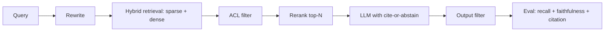

# RAG Quiz

## Instructions

Ten questions on chunking, hybrid search, reranking, citation,
ACL, faithfulness, and the evaluation patterns that gate RAG
system shipment. One option per question.

## Questions

1. **Foundational.** Retrieval-Augmented Generation pipelines:
   A. Train the model on documents.
   B. Retrieve relevant chunks at query time and inject them
      into the LLM context with citations; addresses knowledge
      cut-offs and grounding without retraining.
   C. Replace the LLM entirely.
   D. Use only sparse retrieval.

2. **Foundational.** Chunking strategies affect retrieval because:
   A. Smaller chunks are always better.
   B. Chunks too small lose context; chunks too large dilute
      embeddings and exceed context budget. Typical range is
      256-1024 tokens with overlap; the right size depends on
      document structure.
   C. They do not matter.
   D. Larger chunks are always better.

3. **Foundational.** A baseline RAG metric is:
   A. Model size.
   B. Retrieval recall@k (did the retriever surface chunks
      containing the answer) and answer faithfulness (does the
      response stay grounded in retrieved content).
   C. Query latency only.
   D. Token count.

4. **Intermediate.** Reranking after retrieval:
   A. Replaces retrieval.
   B. Uses a more expensive model (cross-encoder, listwise LLM)
      to re-order the top-N candidates from cheap retrieval;
      improves precision at the top, used when generation
      cost matters.
   C. Is unnecessary.
   D. Only works on text.

5. **Intermediate.** Hybrid search in RAG:
   A. Always uses one strategy.
   B. Combines sparse (BM25, lexical) and dense (embedding)
      retrieval; helps on queries with proper nouns, codes, or
      vocabulary the embedder did not train on.
   C. Is slower than dense alone.
   D. Replaces reranking.

6. **Intermediate.** Citation in RAG outputs:
   A. Is decorative.
   B. Lets users verify claims, lets the system measure
      citation accuracy, and signals the model to stay grounded;
      cite-or-abstain contracts reduce hallucination.
   C. Slows generation.
   D. Is automatic.

7. **Advanced.** Faithfulness evaluation in RAG:
   A. Measures grammar.
   B. Measures whether each claim in the response is supported
      by the retrieved evidence; LLM-as-judge with calibration
      against humans is the standard automated approach.
   C. Measures retrieval recall only.
   D. Is unnecessary.

8. **Advanced.** ACL filtering in RAG:
   A. Filters output text.
   B. Filters retrieval candidates by user permissions before
      ANN search; per-tenant partitioning or per-document ACL
      metadata. Post-filter alone risks leaking results.
   C. Is unnecessary in single-tenant systems only.
   D. Means encryption.

9. **Advanced.** Indirect prompt injection in RAG occurs when:
   A. Users type malicious prompts.
   B. Retrieved documents contain malicious instructions; the
      model follows them as if from the user. Defenses include
      content tagging (treat retrieval as data), output
      filtering, and provenance metadata.
   C. The retriever is broken.
   D. Embeddings are corrupted.

10. **Advanced.** A RAG system shows high retrieval recall but low
    answer quality. The senior diagnostic:
    A. Reduce retrieval count.
    B. The model fails to use the retrieved context: check
       chunking quality, prompt structure (where citations are
       requested), reranker presence, and whether the model is
       conditioned to abstain when evidence is weak.
    C. Increase model size.
    D. Switch retrievers.

## Answer Key

1. **B.** RAG is the dominant pattern for grounded
   knowledge-intensive tasks. The retrieval step is the lever;
   the LLM is largely commoditized.

2. **B.** Chunking is one of the highest-leverage RAG knobs.
   Bad chunking caps the system regardless of model quality.

3. **B.** Two metrics, two failure modes. Recall@k catches
   retrieval gaps; faithfulness catches generation gaps.

4. **B.** Rerankers are the standard quality boost. Two-stage
   retrieve-then-rerank wins on most production tasks.

5. **B.** Hybrid retrieval is a free quality win for many
   corpora. The cost is implementation complexity, which is
   modest.

6. **B.** Citations are a feature, a metric, and a forcing
   function. Cite-or-abstain contracts shape the model's
   behavior toward grounded outputs.

7. **B.** Faithfulness is the RAG-specific quality metric.
   LLM judges, with calibration, are the standard automated
   solution; spot-checked by humans.

8. **B.** ACL pre-filtering is a hard requirement in
   multi-tenant RAG. Skipping it leaks data; this is a
   shipping blocker, not an enhancement.

9. **B.** Indirect injection is the highest-impact RAG
   security threat. Treat all retrieved content as
   potentially hostile.

10. **B.** Recall without quality means the retrieval is
    fine but the generation step does not use it. Audit the
    prompt, the chunking, and the model's tendency to
    fabricate.

## Mini Exercise

For a RAG system you know, name the chunking strategy, the
retriever (sparse / dense / hybrid), the reranker presence,
and the abstention rule. Identify the most likely failure if
the corpus grows 10x.

## Diagram

---
## Navigation

[⬅ Previous](16-vector-database-quiz.md) | [🏠 Home](../README.md) | [➡ Next](18-agents-quiz.md)
