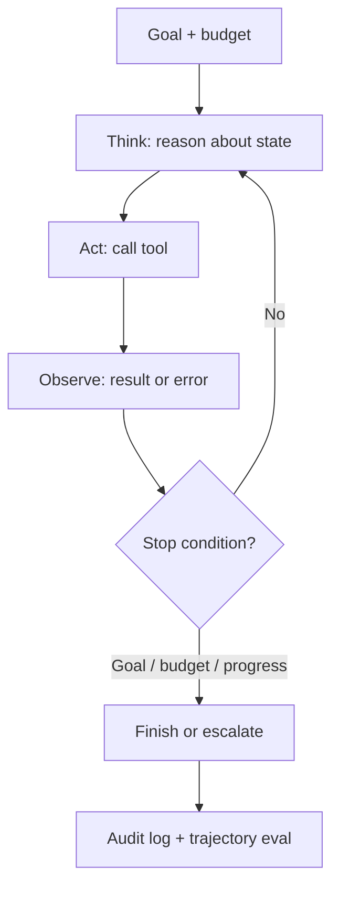

# Agents Quiz

## Instructions

Ten questions on agent loops, ReAct vs plan-execute, kill
switches, tool permissions, idempotency, and the evaluation
patterns that gate agent shipment. One option per question.

## Questions

1. **Foundational.** An agent differs from a single LLM call by:
   A. Using a bigger model.
   B. Running a control loop where the model takes actions via
      tools, observes results, and iterates toward a goal until
      stop conditions fire.
   C. Producing longer outputs.
   D. Using more parameters.

2. **Foundational.** A stop condition for an agent loop should
   include:
   A. Goal completion only.
   B. Goal met, max steps, cost or token budget exhausted, low
      confidence escalation, and progress detector triggering on
      repetition.
   C. Time only.
   D. Token count only.

3. **Foundational.** ReAct (reason and act) versus plan-and-execute:
   A. They are equivalent.
   B. ReAct interleaves reasoning and tool use one step at a
      time, adapting to each observation; plan-and-execute
      builds the full plan up front and runs it. ReAct adapts
      better; plan-and-execute is easier to inspect.
   C. ReAct is always better.
   D. Plan-and-execute is always better.

4. **Intermediate.** Tool design affects agent reliability because:
   A. Tools are usually fine.
   B. Vague descriptions, weak schemas, and unrestricted
      permissions are the dominant failure modes; clear schemas,
      validation, error feedback, and least privilege are the
      controls.
   C. The model handles all errors.
   D. More tools always help.

5. **Intermediate.** Function calling errors should:
   A. Crash the agent.
   B. Be returned to the model as observation messages so the
      model can self-correct or escalate; silent swallowing
      hides bugs.
   C. Be retried indefinitely.
   D. Be logged but not fed back.

6. **Intermediate.** Idempotency keys on agent tool calls:
   A. Prevent caching.
   B. Ensure that retrying a side-effecting call does not
      duplicate the side effect; critical for payments,
      bookings, and any state-changing action.
   C. Speed up retries.
   D. Replace logging.

7. **Advanced.** A kill switch for an autonomous agent:
   A. Reduces accuracy.
   B. Halts running loops and freezes deployments on emergency
      triggers (cost overrun, abuse, error rate, manual). Tested
      regularly so it works when needed.
   C. Is unnecessary in production.
   D. Is the same as a circuit breaker.

8. **Advanced.** Agent evaluation requires:
   A. Final-answer correctness only.
   B. Trajectory metrics: outcome (task success), process
      (steps, cost, tool errors), and safety (unauthorized
      actions, escalation precision); a hard-example suite
      protects against regressions.
   C. Manual review only.
   D. The same metrics as single-call LLM features.

9. **Advanced.** Multi-agent systems are justified when:
   A. The team wants autonomy.
   B. Subtasks are genuinely independent (parallelizable) or
      need distinct tools and contexts. Otherwise, single-agent
      with good prompting is simpler and cheaper.
   C. Always.
   D. The model is small.

10. **Advanced.** Indirect prompt injection in an agent occurs when:
    A. Users type malicious commands.
    B. Tool outputs (retrieved documents, web pages, emails)
       contain instructions the model treats as commands;
       defenses include treating tool output as untrusted data,
       output filtering, and least-privilege tool permissions.
    C. The agent is too autonomous.
    D. The temperature is wrong.

## Answer Key

1. **B.** Loop, tools, observation, iteration. The
   capabilities and the failure modes both come from the loop.

2. **B.** Stop conditions are the difference between an agent
   and an incident. Layered checks (goal, budget, progress,
   confidence) cover the common pathologies.

3. **B.** Pick by predictability. Plan-execute is easier to
   audit; ReAct adapts better. Production agents often combine
   them with replanning.

4. **B.** Tool design is the dominant lever on agent
   reliability. Most "agent failures" are really tool-design
   failures.

5. **B.** Errors as observations let the model self-correct.
   This is the difference between a brittle pipeline and a
   robust loop.

6. **B.** Idempotency is non-negotiable for state-changing
   actions. Without it, retries become incidents.

7. **B.** Kill switches are the safety net. Designed and
   tested before launch; manual override always available.

8. **B.** Trajectory evaluation is the agent-specific
   discipline. Without it, an agent that succeeds 70 percent
   at high cost and occasional unauthorized actions can look
   acceptable on outcome alone.

9. **B.** Default to single-agent. Multi-agent justifies its
   coordination overhead only on genuinely separable work.

10. **B.** Indirect injection is the most underestimated
    agent threat in 2026. Tool outputs from the open web,
    user uploads, or retrieved emails are all attack
    surfaces.

## Mini Exercise

Design a simple agent for an everyday task. Specify the
autonomy level, three tools with permissions, two stop
conditions with concrete values, one kill-switch trigger, and
one trajectory metric you would track.

## Diagram

---
## Navigation

[⬅ Previous](17-rag-quiz.md) | [🏠 Home](../README.md) | [➡ Next](19-production-ai-quiz.md)
