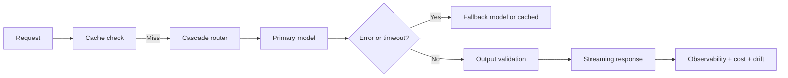

# Production AI Quiz

## Instructions

Ten questions on SLOs, fallbacks, observability, cost
optimization, and the deployment patterns that keep production
AI systems reliable. One option per question.

## Questions

1. **Foundational.** A Service Level Objective (SLO) is:
   A. The maximum throughput.
   B. A target on a measurable indicator (latency, availability,
      quality) over a window; the error budget is the gap
      between target and reality, used to decide risk-taking.
   C. A hard contract.
   D. The training-loss target.

2. **Foundational.** Time-to-first-token (TTFT) matters for
   streaming LLM features because:
   A. It reduces total cost.
   B. Users perceive responsiveness in the first few hundred
      milliseconds; long TTFT feels broken even if total
      response time is fine.
   C. It affects training.
   D. It is identical to total latency.

3. **Foundational.** A circuit breaker in a serving system:
   A. Cuts power.
   B. Trips after consecutive failures, fast-fails downstream
      requests, and resets after a cool-off; prevents cascading
      failure when a dependency is unhealthy.
   C. Restarts the service.
   D. Replaces retries.

4. **Intermediate.** Canary versus blue-green deployment:
   A. They are identical.
   B. Canary routes a small percentage of traffic to the new
      version; blue-green has two full environments and
      switches load. Canary is cheaper; blue-green has faster
      rollback.
   C. Canary is always faster.
   D. Blue-green replaces canary.

5. **Intermediate.** A fallback model for an LLM-powered feature:
   A. Replaces the primary model.
   B. Runs when the primary fails or times out: a cached
      previous response, a smaller model, a rule-based system,
      or a clearly-labeled "system unavailable" message.
      Graceful degradation beats hard failure.
   C. Uses random outputs.
   D. Is unnecessary.

6. **Intermediate.** Semantic caching for LLM features:
   A. Caches identical strings only.
   B. Caches responses keyed by embedding similarity to past
      queries; hits when a paraphrase matches; ACL plus
      similarity threshold need careful design to avoid stale
      or wrong-tenant hits.
   C. Speeds up training.
   D. Eliminates the LLM.

7. **Advanced.** Cascade routing (small model first, escalate to
   large on uncertainty):
   A. Always uses the small model.
   B. Routes by predicted difficulty: cheap classifier or
      embedding similarity; cuts cost 5-10x with limited
      quality loss when the routing signal is calibrated.
   C. Replaces small with large.
   D. Routes randomly.

8. **Advanced.** Observability for AI features goes beyond
   classical SRE:
   A. By logging less.
   B. By adding ML-specific metrics: per-feature drift,
      prediction distribution, abstention rate, faithfulness
      drift, cost per request, plus traditional latency, error
      rate, and saturation.
   C. By using only logs.
   D. By using fewer dashboards.

9. **Advanced.** A 99.9 percent latency SLO under p99 tail:
   A. Is straightforward.
   B. Is dominated by tail behavior: occasional slow tokens,
      cold starts, retries, dependency hiccups; engineering
      attention focuses on the long tail, not the median.
   C. Means everything is fast.
   D. Is the same as p50.

10. **Advanced.** A LLM feature passes offline eval but the
    business KPI does not move. The senior diagnostic:
    A. Increase the eval set size.
    B. Audit the offline-online gap: eval set representativeness,
       metric alignment with the user decision, online metric
       definition, treatment-effect estimation, segment analysis;
       the gap is usually one of these, not the model.
    C. Switch models.
    D. Increase deployment percentage.

## Answer Key

1. **B.** SLO defines the contract; error budget governs how
   much risk the team can take with new releases. Without a
   budget, every regression triggers an emergency.

2. **B.** TTFT is the user-facing latency for streaming.
   Optimize prefill, batching, and routing so the first token
   shows up quickly.

3. **B.** Circuit breakers protect against cascading failure.
   They differ from retries: a tripped circuit fails fast;
   retries keep trying.

4. **B.** Pick by cost and rollback speed. Canary at 1-5
   percent is the standard ML rollout; blue-green when you
   need instant rollback and can afford double infrastructure.

5. **B.** Graceful degradation is the design choice. Hard
   failure on every dependency hiccup is a bad user
   experience.

6. **B.** Semantic caching is high-leverage when paraphrase
   density is high. The threshold and ACL design separate
   safe systems from cross-tenant leak incidents.

7. **B.** Cascade routing is the cost lever for LLM systems.
   Calibrate the routing classifier on real traffic; the
   gain is dramatic when calibrated.

8. **B.** AI observability is operational plus quality plus
   drift plus cost. Classical SRE alone misses silent
   degradation; ML-only misses operational health.

9. **B.** P99 is where engineering effort lives. The median
   is easy; the tail dominates user-perceived availability.

10. **B.** Offline-online gaps are the most common cause of
    "the model is great but nothing changed". Audit the gap
    before changing the model.

## Mini Exercise

For a production AI feature you have used, name the SLO, the
fallback path, the cache strategy, and one cost-optimization
lever. Identify the most likely tail-latency contributor.

## Diagram

---
## Navigation

[⬅ Previous](18-agents-quiz.md) | [🏠 Home](../README.md) | [➡ Next](20-final-review-quiz.md)
