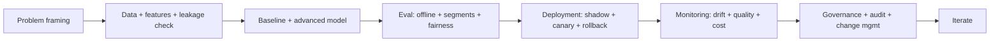

# Final Review Quiz

## Instructions

Ten capstone questions spanning the prior 19 topics: foundations,
modeling, evaluation, LLMs, RAG, agents, and production
operations. Emphasis on tradeoffs and failure modes. One option
per question.

## Questions

1. **Foundational.** The single most-overlooked first step in an
   ML system design interview is:
   A. Choosing the model architecture.
   B. Clarifying the user decision, success metric, available
      data, label availability, and the cost of wrong outputs.
   C. Picking the framework.
   D. Choosing the cloud provider.

2. **Foundational.** Cross-validation prevents:
   A. Bias.
   B. Optimism from a single train-test split; gives a more
      stable estimate of generalization, especially on small
      data. Time-series data needs ordered splits, not random.
   C. Overfitting always.
   D. Slow training.

3. **Foundational.** A feature whose value is only known after the
   prediction is needed represents:
   A. A modeling improvement.
   B. Target leakage; the offline metric is inflated and the
      model fails in production. Audit every feature against
      the prediction-time clock.
   C. A noisy feature.
   D. A regularization target.

4. **Intermediate.** A chatbot returns plausible but wrong
   answers. The senior response:
   A. Increase model size.
   B. Add retrieval grounding, citation, abstention on weak
      evidence, and a faithfulness eval; hallucination is a
      systems problem, not just a model problem.
   C. Lower the temperature only.
   D. Switch models.

5. **Intermediate.** A team retrains weekly without validation
   gates and ships every model. The senior critique:
   A. Weekly cadence is too fast.
   B. Continuous training without gates is dangerous; one bad
      data refresh silently produces a bad model that
      auto-promotes. Gates plus shadow plus canary plus
      rollback are required.
   C. Weekly cadence is fine; let the model decide.
   D. Add more features.

6. **Intermediate.** A RAG system returns confident answers from
   irrelevant chunks. The likely cause:
   A. The model is too small.
   B. Retrieval failure (chunking, hybrid retrieval, reranking)
      combined with no abstention rule; the LLM uses what it
      has even when relevance is low.
   C. The user is wrong.
   D. The temperature is too high.

7. **Advanced.** An agent occasionally takes irreversible actions
   in error. The structural fix:
   A. Use a smarter model.
   B. Classify actions by reversibility, gate irreversible
      actions behind human approval, validate arguments, audit
      every call, and provide a kill switch with concrete
      triggers.
   C. Reduce the temperature.
   D. Add more steps.

8. **Advanced.** A fairness audit catches a 4-point AUC gap
   between protected groups. The first response:
   A. Drop the protected attribute.
   B. Diagnose the source (historical bias, representation,
      measurement, deployment context), then choose a
      mitigation (pre-processing, in-processing, post-
      processing) calibrated to the legal context; document
      and monitor.
   C. Ignore it; aggregate is fine.
   D. Use a different metric.

9. **Advanced.** A model passes offline metrics but harms a
   downstream business KPI. The most likely cause:
   A. The KPI is wrong.
   B. Offline-online gap: the eval set does not match
      production traffic, the metric does not align with the
      user decision, or the policy interaction with users
      shifts the distribution.
   C. The deployment is broken.
   D. Random noise.

10. **Advanced.** Asked "would this work in production?", the
    senior answer covers:
    A. Accuracy.
    B. SLO and error budget, monitoring per-feature and per-
       segment, drift detection with runbooks, fallback path,
       rollback plan, change management, governance and audit,
       cost ceiling, security and privacy, and an iteration
       loop. Production is a discipline, not a deploy.
    C. Latency only.
    D. Cost only.

## Answer Key

1. **B.** Clarification before architecture is the single
   strongest signal in ML system-design interviews. Skipping
   it is the single most common red flag.

2. **B.** k-fold beats a single split for stability. For time
   series, use expanding or rolling windows that respect
   temporal order.

3. **B.** Target leakage is the most common cause of "great
   offline metrics, broken production". Audit features against
   the prediction-time clock.

4. **B.** Hallucination is a systems failure, not just a model
   limitation. Grounding, citation, abstention, and
   faithfulness eval are the standard production response.

5. **B.** Continuous training is high-leverage but dangerous
   without gates. The cadence is fine; the missing controls
   are the issue.

6. **B.** Confident wrong answers signal both retrieval gaps
   and missing abstention. Fix retrieval and require the model
   to abstain when evidence is weak.

7. **B.** Irreversible action errors are designed away by
   approval gates and kill switches. Better models do not
   solve this; controls do.

8. **B.** Fairness gaps need diagnosis before mitigation.
   Mitigation depends on legal context; documentation and
   monitoring are required regardless.

9. **B.** Offline-online gap is the dominant cause. Audit the
   gap rigorously before changing models or policies.

10. **B.** Production readiness is multi-dimensional. Strong
    candidates name several axes; weak candidates name one.

## Mini Exercise

Pick a hypothetical AI feature. Walk through the production
checklist (SLO, monitoring, fallback, rollback, governance,
cost) in two-line answers each. Identify the weakest axis and
write one improvement that would matter most.

## Diagram

---
## Navigation

[⬅ Previous](19-production-ai-quiz.md) | [🏠 Home](../README.md) | [➡ Next](../cheatsheets/01-ml-fundamentals-cheatsheet.md)
