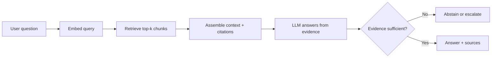

# What Is RAG

## Beginner-Friendly Intuition

Retrieval-augmented generation (RAG) lets a language model answer using documents you fetch at query
time instead of relying only on what it memorized during training. Think of an open-book exam: rather
than trusting the model's memory, you hand it the relevant pages and ask it to answer from them, with
citations. The model supplies fluency and reasoning; the retrieved text supplies the facts.

The simplest way to picture it: take the user question, search a knowledge base for the most relevant
passages, paste those passages into the prompt, and ask the model to answer using only that context.

## Formal Explanation

A RAG system couples a retriever with a generator. Given a query q, the retriever returns the top-k
passages from a corpus, usually by embedding q and the passages into vectors and ranking by cosine
similarity (often combined with keyword search). Those passages are concatenated into the prompt, and
the generator produces an answer conditioned on both q and the retrieved context.

The contract that makes RAG trustworthy: the model should answer only from the retrieved evidence,
cite its sources, and abstain when the evidence does not contain the answer. RAG decouples knowledge
(in the corpus, updatable any time) from reasoning (in the model weights, fixed until retraining).

A useful **citation schema** for production systems formalizes this. Each generated claim carries a
span-level reference to the passage that supports it, typically as `[doc_id:chunk_id]` or `[1]` with a
trailing source list. Production tools (LangSmith, OpenAI structured outputs, Cohere citations) emit
citations as a structured field alongside the answer rather than relying on the model to format them
in prose. The validation step (covered in [10-answer-generation.md](10-answer-generation.md)) checks
that each cited span actually contains the claim.

RAG addresses one form of knowledge cutoff (external facts) but not all. The model's **reasoning
patterns** (how to compare, how to summarize, how to follow a multi-step argument) come from training,
not retrieval; if the model was never taught a reasoning skill, RAG cannot teach it. Retrieval also
fails on **ambiguous queries** ("what is the rate?" without context) where multiple corpus passages
could be the intended answer; the system must either ask a clarifying question or abstain rather than
guess.

## Why It Matters in Real Jobs

RAG is the default way to make an LLM answer over private, large, or fast-changing knowledge without
retraining. Company wikis, product docs, support histories, and policies change weekly; you cannot
fine-tune for every edit, and you should not, because the model would still hallucinate confidently.
RAG also gives you citations and access control, which compliance and trust require.

It is one of the most common AI-engineer interview topics because it forces real system thinking:
chunking, hybrid search, reranking, citations, permissions, and prompt injection.

## How It Works Step by Step

1. **Ingest:** parse documents, clean text, keep source metadata (owner, date, URL, permissions).
2. **Chunk:** split each document into passages sized to answer a question without losing context.
3. **Embed and index:** turn chunks into vectors and store them in a vector index.
4. **Retrieve:** embed the query, fetch the top-k nearest chunks, often plus keyword matches.
5. **Generate:** prompt the model to answer from those chunks, cite them, and abstain if unsupported.
6. **Evaluate and monitor:** measure retrieval recall and answer faithfulness, then watch them live.

## Real-World Example

A company support assistant answers "How many vacation days do new hires get?" The retriever finds the
HR policy chunk stating "15 days in year one", the model answers with that number and a citation to the
policy page. If the question were about a policy the corpus does not cover, a well-built system
responds "I could not find that in the policy documents" instead of inventing a number. That single
abstain-or-cite behavior is what separates a usable assistant from a liability.

## Common Mistakes

- Treating a vector database alone as a RAG system, with no generation contract or evaluation.
- Letting the model answer from memory when retrieval returns nothing, producing confident fabrication.
- Ignoring document permissions, so users see content they should not.
- Measuring only the final answer and never checking whether retrieval even found the evidence.

## Interview Angle

Interviewers use RAG to test whether you separate retrieval from generation and reason about failure.

**Question:** What is RAG and when would you choose it over fine-tuning?

**Strong answer:** RAG grounds answers in retrieved evidence, so it fits private or changing knowledge
and gives citations; fine-tuning changes behavior and style but not live facts. I would debug retrieval
and generation separately and require cite-or-abstain.

**Weak answer:** "RAG is when you use a vector database with an LLM," with no mention of grounding,
abstention, or evaluation.

**Follow-up questions:**

- How do you know retrieval found the right passage?
- What does the model do when evidence is missing?
- How do permissions and stale documents change the design?

## Mini Exercise

Pick a corpus you know (your notes, a product's docs). Write the five RAG stages for it: what you would
store as metadata, how you would chunk, the retrieval baseline, the answer contract, and one retrieval
metric and one answer metric you would track.

## Diagram

---
## Navigation

[⬅ Previous](../vector-databases/10-vector-database-interview-patterns.md) | [🏠 Home](../README.md) | [➡ Next](02-rag-vs-fine-tuning.md)
