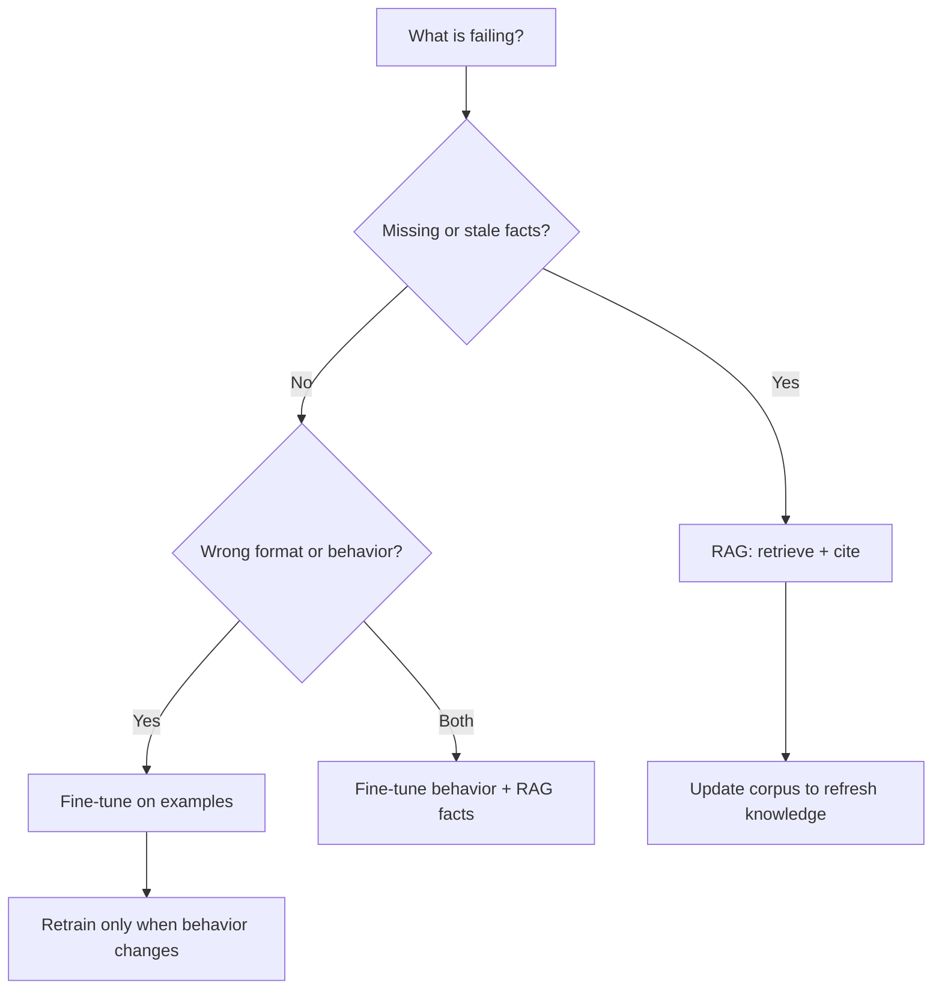

# RAG vs Fine Tuning

## Beginner-Friendly Intuition

RAG and fine-tuning solve different problems, and the most common mistake is using one for the other's
job. RAG changes what the model knows at answer time by handing it documents. Fine-tuning changes how
the model behaves by adjusting its weights on examples. A simple test: if the knowledge changes often
or must be cited, reach for RAG; if the format, tone, or task pattern needs to be reliable, reach for
fine-tuning.

## Formal Explanation

RAG injects external context into the prompt at inference; the model weights are unchanged, so updating
knowledge is as easy as updating the corpus. Fine-tuning continues training the model on task-specific
input-output pairs, shifting its parameters so it internalizes a style or skill. They are not rivals;
production systems often use both: fine-tune for the response format and tool-use behavior, and use RAG
for the live facts and citations.

## Why It Matters in Real Jobs

Choosing wrong is expensive. Fine-tuning a model to memorize a product catalog means re-training every
time prices change, and the model will still hallucinate confidently between updates. Conversely,
stuffing thousands of style examples into a RAG prompt wastes context and money when a small fine-tune
would bake the behavior in. Interviewers probe this because it reveals whether you reach for the
narrowest effective tool.

## How It Works Step by Step

1. **Name the failure.** Is the model missing facts, or producing the wrong format and behavior?
2. **If facts or freshness:** build RAG; the fix is retrieval, not weights.
3. **If style, format, or a narrow skill:** collect input-output pairs and fine-tune.
4. **If both:** fine-tune the behavior, then ground facts with RAG at inference.
5. **Measure:** prove the chosen approach fixed the specific failure before adding the other.

## Real-World Example

A legal assistant must answer using current case documents and always respond in a fixed clause-by-clause
format. Facts change as cases are added, so RAG retrieves the relevant filings and cites them.
Fine-tuning is not used for the facts; instead a light fine-tune (or strong few-shot prompt) enforces the
output format. Knowledge updates flow through the corpus, behavior stays stable, and answers carry
citations.

## Common Mistakes

- Fine-tuning to memorize facts that change, then re-training endlessly.
- Using RAG to fix a formatting or behavior problem that needs examples.
- Assuming fine-tuning removes hallucination (it does not add live knowledge).
- Treating them as either-or when production often needs both.

## Interview Angle

**Question:** A model gives outdated answers about our products. RAG or fine-tuning?

**Strong answer:** RAG, because the knowledge changes and must be cited; fine-tuning would memorize a
snapshot and still hallucinate between updates. I would only fine-tune if the response format or task
behavior were the problem.

**Weak answer:** "Fine-tune it on our data," with no distinction between knowledge and behavior.

**Follow-up questions:**

- When would you use both together?
- How do you keep RAG knowledge fresh versus a fine-tuned snapshot?
- What does fine-tuning give you that prompting cannot?

## Mini Exercise

List three problems with an LLM feature (one factual, one stylistic, one behavioral). For each, decide
RAG, fine-tuning, or both, and write one sentence justifying the choice and how you would measure it.

## Diagram

---
## Navigation

[⬅ Previous](01-what-is-rag.md) | [🏠 Home](../README.md) | [➡ Next](03-document-ingestion.md)
