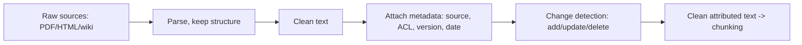

# Document Ingestion

## Beginner-Friendly Intuition

Ingestion is the unglamorous first stage of RAG that decides everything downstream. You take raw
sources (PDFs, HTML, wikis, tickets), pull out clean text, and attach metadata about where each piece
came from. If ingestion is sloppy (broken tables, lost headings, no source URL), no clever retrieval or
prompting will recover. Garbage in, ungrounded answers out.

## Formal Explanation

Ingestion is an extract-transform-load pipeline for unstructured content. For each document you parse the
format, normalize the text, preserve structure (headings, tables, lists), and record metadata: source
URL, author, department, permission/ACL, version, and timestamp. The output is a clean, attributed text
representation ready to be chunked and embedded. Crucially, ingestion must handle change: new documents,
updates, and deletes, so the index reflects reality.

## Why It Matters in Real Jobs

The two failure modes that ingestion prevents are wrong citations and stale or leaked content. If you do
not capture source metadata, you cannot cite or enforce permissions. If you do not handle deletes, a
document removed for legal reasons keeps answering questions. Most "the RAG system gave a wrong answer"
incidents trace back to ingestion losing structure or missing an update.

## How It Works Step by Step

1. **Parse** each format (PDF, HTML, DOCX) into text, keeping headings and tables intact.
2. **Clean** boilerplate (nav bars, footers) and fix encoding issues.
3. **Attach metadata:** source, owner, permissions, version, date, and a stable document ID.
4. **Detect changes:** add new docs, re-index updates, and tombstone deletes.
5. **Hand off** clean, attributed text to the chunking stage.

**Format-specific failure modes** worth budgeting for:

- **Scanned PDFs** require OCR (Tesseract for cheap; Amazon Textract, Google Document AI, or hosted
  vision models for accuracy). OCR cost can be 10-100x basic parsing; quality varies wildly with scan
  resolution. Always run a sample through QA before bulk ingestion.
- **Tables in PDFs** lose structure when flattened to text. Specialized parsers (Camelot, Unstructured.io,
  Azure Document Intelligence) extract tables as structured data; embedding the table separately or as
  a markdown table preserves searchability.
- **Embedded images.** Diagrams and charts contain information that text parsing misses. Use a
  multimodal model (CLIP, GPT-4V) to caption or describe images, then embed the caption alongside the
  text.
- **Code and structured documents.** Preserve code blocks; embedding them with surrounding prose
  helps retrieval against natural-language queries about the code.

**ACL schema patterns**:

- **Per-user array.** `allowed_users = [u1, u2, ...]`. Simple but does not scale past a few hundred
  users per document.
- **Per-group array.** `allowed_groups = [g1, g2, ...]`. The user's group membership is computed at
  query time; filter on intersection. Standard for SaaS.
- **Hierarchical inheritance.** A document inherits permissions from its parent folder/space.
  Resolved at ingestion time and cached, or at query time by walking the tree.
- **Row-level security at the database layer.** PostgreSQL RLS policies, when pgvector backs the
  store; the database enforces ACL transparently.

**Update SLAs.** Nightly sync covers most enterprise corpora. Real-time ingestion (within seconds)
requires event-driven pipelines (webhooks, queues) plus eventual consistency between source-of-truth
and index. Plan for the latency budget on deletes, not just adds: a deleted compliance document still
answering queries is a real incident.

## Real-World Example

A company ingests its Confluence wiki. The parser keeps page headings so chunks stay coherent, records
each page's space and permission group, and stores the last-edited timestamp. When a page is deleted, a
nightly sync removes its chunks from the index. Later, when an employee asks a question, the answer cites
the exact page and never surfaces content from a space they cannot access, because the permission
metadata rode along from ingestion.

## Common Mistakes

- Flattening PDFs so tables and headings turn into unusable text soup.
- Dropping source metadata, making citations and permissions impossible.
- Ingesting once and never handling updates or deletes.
- Indexing duplicate or near-duplicate documents that crowd out the best source.

## Interview Angle

**Question:** Where do most RAG quality problems actually originate?

**Strong answer:** Often in ingestion. If parsing loses structure or metadata, retrieval and citations
degrade no matter how good the model is. I would preserve headings, attach source and permission
metadata, and handle updates and deletes.

**Weak answer:** Jumping straight to embeddings without mentioning parsing, metadata, or freshness.

**Follow-up questions:**

- How do you handle a document that gets deleted?
- How do you keep citations accurate?
- What metadata is essential and why?

## Mini Exercise

Pick a real document type (a PDF report or a wiki page). List the metadata fields you would capture, one
parsing pitfall for that format, and how you would propagate a deletion to the index.

## Diagram

---
## Navigation

[⬅ Previous](02-rag-vs-fine-tuning.md) | [🏠 Home](../README.md) | [➡ Next](04-chunking-strategies.md)
