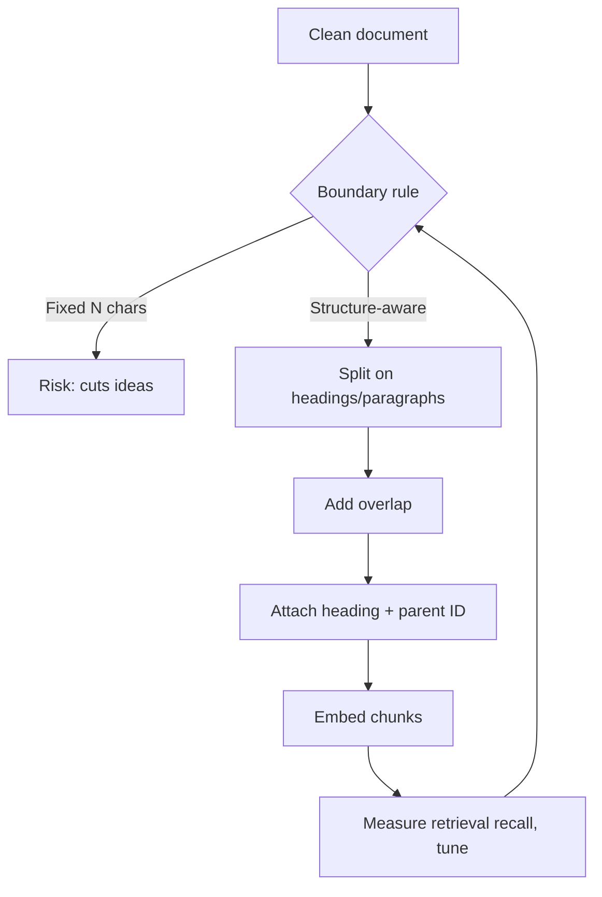

# Chunking Strategies

## Beginner-Friendly Intuition

Chunking is how you cut documents into pieces small enough to retrieve precisely but large enough to
carry meaning. Too small and a chunk loses the context needed to answer; too large and retrieval pulls
in noise and wastes the context window. Good chunking respects the document's natural boundaries
(paragraphs, sections) instead of slicing blindly every N characters.

## Formal Explanation

A chunk is the unit that gets embedded and retrieved. Key parameters are size (in tokens), overlap (how
much adjacent chunks share, to avoid cutting an idea in half), and boundary rule (fixed-size,
sentence-aware, or structure-aware). More advanced schemes attach a chunk to its parent section or store
small chunks for retrieval precision while returning the larger parent for generation context
(parent-document retrieval). The goal is that each retrievable unit can answer a real question on its
own.

**Semantic chunking** uses an embedding model to find natural breaks rather than fixed character or
token counts. Slide a window through the document; embed adjacent sentences; when the cosine similarity
between consecutive sentences drops below a threshold, place a chunk boundary. The result is chunks
that contain semantically coherent ideas and break at topic shifts. Implementations: LangChain's
`SemanticChunker`, LlamaIndex's `SemanticSplitter`. Cost: an embedding call per sentence at ingestion
time. Quality: typically 5-15 percent retrieval recall improvement over fixed-size chunking on
unstructured text.

**Domain-dependent chunk size**:

- **FAQ and support docs.** Short chunks (100-300 tokens). Each Q+A pair is its own chunk.
- **Technical documentation.** Medium chunks (300-600 tokens). Section-aware boundaries; keep code
  blocks intact.
- **Legal contracts and policies.** Longer chunks (500-1500 tokens). Clauses and provisions span
  paragraphs; cutting them mid-clause loses meaning.
- **Academic papers.** Long structured chunks per section, with parent-document retrieval to surface
  context.

**Chunk overlap and pollution.** Overlap of 10-20 percent helps when an idea spans a boundary, but
high overlap creates duplicate-ish chunks in the embedding space, which can pollute ranking (the same
content appears multiple times in top-K). Mitigate with deduplication at retrieval time
(near-duplicate detection on chunk content) or with parent-document retrieval where the small chunks
serve only for similarity matching while the larger parent is what gets returned to the LLM.

## Why It Matters in Real Jobs

Chunking is one of the highest-leverage knobs in RAG and one of the cheapest to tune. A poorly chunked
corpus produces retrievals that contain part of the answer or none of it, which the generator cannot
fix. Many "retrieval recall is low" problems are really "chunks are the wrong size or break mid-thought"
problems.

## How It Works Step by Step

1. **Start structure-aware:** split on headings, then paragraphs, not raw character counts.
2. **Pick a size:** often a few hundred tokens; align to the embedding model's sweet spot.
3. **Add overlap:** a small overlap (for example 10 to 20 percent) so ideas are not cut at the seam.
4. **Keep metadata on each chunk:** source, heading path, and the parent document ID.
5. **Measure:** check retrieval recall and adjust size and overlap with real queries.

## Real-World Example

A policy doc has short clauses under clear headings. Fixed 500-character chunks cut clauses in half, so a
query about "parental leave eligibility" retrieves a fragment missing the eligibility rule. Switching to
heading-and-paragraph-aware chunks, each carrying its section heading, lifts retrieval recall sharply
because each chunk now contains a complete, self-describing rule. No model change was needed.

## Common Mistakes

- Fixed character-count chunking that slices sentences and clauses.
- Chunks so large they dilute the embedding and blow the context budget.
- No overlap, so answers that span a boundary are never fully retrieved.
- Dropping the heading or section context that makes a chunk interpretable.

## Interview Angle

**Question:** Retrieval recall is low. Before changing the embedding model, what do you check?

**Strong answer:** Chunking. I would check size, overlap, and whether chunks respect section boundaries
and carry their headings, because a fragmented chunk cannot be retrieved as a complete answer.

**Weak answer:** Immediately swapping the embedding model without inspecting the chunks.

**Follow-up questions:**

- How would you choose chunk size and overlap?
- What is parent-document retrieval and when does it help?
- How does chunking interact with the context budget?

## Mini Exercise

Take a structured document you know. Propose a chunking rule (boundary, size, overlap), and write one
query that a bad fixed-size chunking would fail and your rule would answer.

## Diagram

---
## Navigation

[⬅ Previous](03-document-ingestion.md) | [🏠 Home](../README.md) | [➡ Next](05-embedding-models.md)
