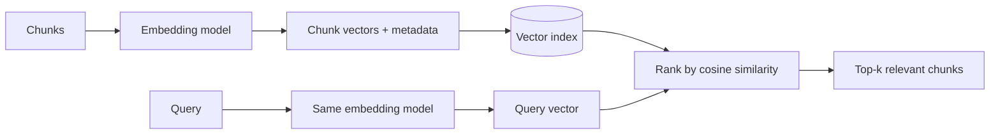

# Embedding Models

## Beginner-Friendly Intuition

An embedding model turns text into a vector of numbers so that similar meanings land near each other in
space. That is what lets retrieval find "trainers" when you search "running shoes". The embedding model
is the lens through which your whole corpus is seen; choose it well and semantically related chunks
cluster, choose it poorly and retrieval misses obvious matches.

## Formal Explanation

An embedding model maps text to a fixed-length dense vector (for example 384, 768, or 1536 dimensions)
trained so that semantically similar texts have high cosine similarity. For RAG, you embed every chunk
once at ingestion and the query at search time, then rank by similarity. Key properties: the dimension
(memory and speed), the max input length (must fit your chunks), the domain it was trained on, and the
distance metric it expects (usually cosine). The query and the documents must use the same model.

## Why It Matters in Real Jobs

The embedding model sets the ceiling on retrieval quality. A general model may miss domain jargon
(medical, legal, code), so chunks that are clearly relevant to a human never get retrieved. Switching to
a domain-appropriate or stronger embedding model is often the single biggest retrieval improvement, and
it is cheaper than re-architecting the pipeline. But changing it means re-embedding the entire corpus,
which is a real operational cost.

## How It Works Step by Step

1. **Pick a model** matching your domain, language, and chunk length.
2. **Embed all chunks** at ingestion and store vectors plus metadata.
3. **Embed the query** with the same model at search time.
4. **Rank** chunks by cosine similarity (or dot product if the model expects it).
5. **Re-embed** the whole corpus whenever you change the model, and version the index.

## Real-World Example

A code-search tool uses a general text embedding model and fails to match a query like "deduplicate a
list" to the relevant function, because the model does not understand code semantics. Swapping to a
code-trained embedding model lifts retrieval recall@10 from 0.6 to 0.9 on the eval set. The fix was the
embedding model, not the LLM or the prompt, and it required re-embedding the repository once.

## Common Mistakes

- Using different models for query and documents, so vectors are not comparable.
- Picking a general model for a specialized domain and missing jargon.
- Choosing a metric the model was not trained for.
- Forgetting that swapping models requires re-embedding the entire corpus.

## Interview Angle

**Question:** How do you choose an embedding model for RAG, and what changes if you switch later?

**Strong answer:** Match the model to domain, language, and chunk length; use the same model for queries
and documents; rank by the metric it expects. Switching means re-embedding the whole corpus and
re-indexing, so I version it.

**Weak answer:** "Use the most popular embedding model," with no domain or operational reasoning.

**Follow-up questions:**

- How would you evaluate one embedding model against another?
- What is the cost of changing the model in production?
- Why must the query and documents share a model?

## Mini Exercise

For a domain you know (legal, medical, code, support), name one reason a general embedding model might
fail, the metric you would use to compare two models, and the operational step required to adopt a new
one.

## Diagram

---
## Navigation

[⬅ Previous](04-chunking-strategies.md) | [🏠 Home](../README.md) | [➡ Next](06-retrieval-strategies.md)
