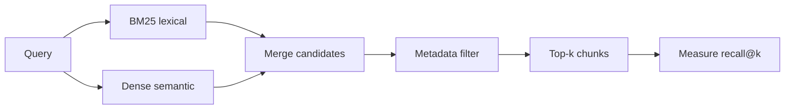

# Retrieval Strategies

## Beginner-Friendly Intuition

Retrieval is the part of RAG that decides which passages the model gets to see, and it is where most
answer quality is won or lost. There are two big families: lexical search, which matches words (great
for exact terms, names, codes), and semantic search, which matches meaning via embeddings (great for
paraphrases). The best systems use both, because each catches what the other misses.

## Formal Explanation

Given a query, a retriever returns the top-k candidate chunks. Lexical retrieval (BM25 over an inverted
index) scores by term frequency and rarity, so it nails exact tokens but misses synonyms. Dense
retrieval embeds query and chunks and ranks by vector similarity, capturing meaning but sometimes
missing rare exact terms. The parameter k trades recall (more candidates, more likely to include the
answer) against precision and cost (more noise and tokens). Retrieval is judged by recall@k and context
precision, separately from the final answer.

## Why It Matters in Real Jobs

If the right passage is not in the retrieved set, the generator cannot produce a grounded answer; it
will either abstain or hallucinate. So retrieval recall is the upstream gate on everything. Teams that
only measure final answer quality cannot tell whether a wrong answer came from bad retrieval or bad
generation. Measuring retrieval separately is what makes RAG debuggable.

## How It Works Step by Step

1. **Start with a lexical baseline (BM25):** cheap, strong, and a fair reference.
2. **Add dense retrieval:** embed the query, fetch nearest chunks by similarity.
3. **Tune k:** raise it until recall is high, watching token cost and noise.
4. **Apply metadata filters:** restrict to permitted, fresh, or relevant sources before ranking.
5. **Measure recall@k** on a labeled query set and iterate.

**Pre-filter vs post-filter ordering matters because it changes the score distribution.** Pre-filter
restricts the candidate pool first, then ANN-searches the restricted set. Recall is preserved; latency
depends on filter selectivity. Post-filter retrieves the global top-K, then drops candidates that fail
the filter; on selective filters this can leave near-empty results because most of the top-K were not
permitted. **Always pre-filter ACL and other selective constraints**; post-filter only for low-
selectivity filters like language tags.

**BM25 parameter tuning.** Defaults `k1 = 1.5, b = 0.75` work for most domains. Tune when:

- Documents are very short (FAQ entries): lower `k1` (1.0-1.2) so term frequency saturates faster.
- Documents are very long (legal, academic): lower `b` (0.3-0.5) to reduce length normalization.
- Domain has heavy term repetition: experiment with `k1` 1.8-2.0.

Always tune against an eval set; intuition is rarely accurate.

**Recall@k vs cost tradeoff.** Higher k means more chunks in the prompt, more tokens, more cost, and
diminishing returns past the answer. For most chat-style RAG, k=4-10 after reranking. For exploration
or research-style tasks, k=20-50 with aggressive compression. Plot recall@k vs cost curves on the
eval set; pick the smallest k that hits faithfulness target.

## Real-World Example

A support assistant must answer "error code E-450". Pure semantic search returns conceptually similar
but wrong passages because the exact code is rare and the embedding blurs it. BM25 retrieves the precise
troubleshooting entry instantly. For "how do I cancel my plan", semantic search wins because users
phrase it many ways. Running both and merging covers both query types, which is why production retrieval
is rarely semantic-only.

## Common Mistakes

- Skipping the BM25 baseline and assuming dense retrieval is always better.
- Cranking k up to mask poor chunking, inflating cost and noise.
- Filtering by metadata after ranking instead of before, leaking or wasting slots.
- Never measuring recall@k, so retrieval failures hide behind the generator.

## Interview Angle

**Question:** Your RAG answers are wrong even though the documents exist. How do you isolate the cause?

**Strong answer:** Measure retrieval recall@k separately. If the right chunk is not retrieved, fix
chunking, lexical/dense balance, or filters before touching the prompt. Lexical catches exact terms,
dense catches meaning.

**Weak answer:** Editing the generation prompt without checking whether retrieval found the evidence.

**Follow-up questions:**

- When does lexical beat semantic search and vice versa?
- How do you choose k?
- How do you measure retrieval quality?

## Mini Exercise

Write two queries for a corpus you know: one where BM25 should win and one where dense retrieval should
win. Explain why, and state the metric you would use to confirm.

## Diagram

---
## Navigation

[⬅ Previous](05-embedding-models.md) | [🏠 Home](../README.md) | [➡ Next](07-hybrid-search-and-reranking.md)
