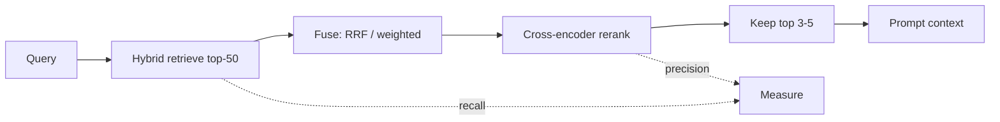

# Hybrid Search and Reranking

## Beginner-Friendly Intuition

Hybrid search runs lexical and semantic retrieval together and fuses their results, so you get exact-term
matches and meaning-based matches in one candidate set. Reranking then takes those candidates and reorders
them with a slower, smarter model that reads the query and each passage together. Think of it as a fast,
wide net followed by a careful second look that pushes the truly relevant passages to the top.

## Formal Explanation

Hybrid search combines BM25 and dense scores, commonly with Reciprocal Rank Fusion (RRF) or a weighted
sum, to produce one ranked list. A reranker is usually a cross-encoder: unlike the bi-encoder used for
retrieval (which embeds query and document separately), a cross-encoder processes the query and a
candidate together and outputs a relevance score. It is far more accurate but too slow to run over the
whole corpus, so it reorders only the top candidates (for example the top 50 down to the top 5).

## Why It Matters in Real Jobs

First-stage retrieval optimizes recall (do not miss the answer); reranking optimizes precision (put the
best passage first and trim the rest). Trimming to a few high-quality passages cuts token cost and
reduces the chance the model is distracted by irrelevant context. This two-stage pattern, retrieve wide
then rerank narrow, is the standard production recipe and a frequent interview expectation.

## How It Works Step by Step

1. **Retrieve wide:** get top-50 candidates from hybrid (BM25 + dense) search.
2. **Fuse scores:** combine with RRF or a tuned weighting.
3. **Rerank:** score each candidate with a cross-encoder against the query.
4. **Trim:** keep the top 3 to 5 reranked passages for the prompt.
5. **Measure:** track recall after stage one and precision (and answer quality) after reranking.

## Real-World Example

A documentation assistant retrieves 50 candidates, several of which mention the query terms but are
release notes, not the how-to guide. The cross-encoder reranker, reading the query with each passage,
scores the actual how-to chunk highest and demotes the release notes. The prompt now contains 4 precise
passages instead of 20 noisy ones, the answer improves, and the token bill drops.

## Common Mistakes

- Skipping reranking and stuffing 20 raw retrievals into the prompt.
- Reranking the entire corpus (a cross-encoder is too slow for that).
- Fusing lexical and dense scores without normalizing or tuning weights.
- Trimming so aggressively that the answer passage gets cut.

## Interview Angle

**Question:** Walk me through a production retrieval pipeline.

**Strong answer:** Hybrid retrieval for recall, then a cross-encoder reranker for precision, then trim
to a few passages to control cost and noise. Retrieval uses a fast bi-encoder; reranking uses a slower
cross-encoder on the shortlist only.

**Weak answer:** "Embed and return the top 20," with no fusion or reranking.

**Follow-up questions:**

- Bi-encoder vs cross-encoder, and why one for retrieval and one for reranking?
- How many candidates would you rerank and how many would you keep?
- How does reranking affect cost?

## Mini Exercise

Sketch a two-stage retrieval pipeline with concrete numbers (candidates retrieved, candidates reranked,
passages kept). State which metric each stage optimizes and one reason reranking improves the final
answer.

## Diagram

---
## Navigation

[⬅ Previous](06-retrieval-strategies.md) | [🏠 Home](../README.md) | [➡ Next](08-query-rewriting.md)
