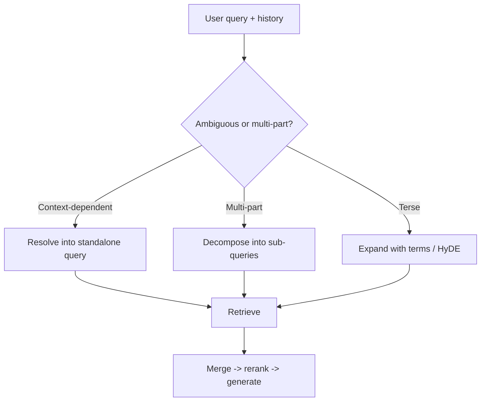

# Query Rewriting

## Beginner-Friendly Intuition

Users ask messy, short, or context-dependent questions, and raw queries often retrieve poorly. Query
rewriting reshapes the user's question into one or more better search queries before retrieval. It fixes
problems like "it" referring to something said three messages ago, vague phrasing, or a single query that
really contains two questions.

## Formal Explanation

Query rewriting is a pre-retrieval transformation. Common techniques: resolving coreference and
conversation context into a standalone query; expanding with synonyms or related terms; decomposing a
multi-part question into sub-queries retrieved separately; and HyDE, where the model drafts a hypothetical
answer and you embed that to retrieve real passages similar to it. Each technique aims to make the
retrieval query better match how the answer is actually phrased in the corpus.

## Why It Matters in Real Jobs

In chat, follow-up questions like "what about for contractors?" are meaningless to a retriever without the
prior turn folded in. Rewriting that into "what is the vacation policy for contractors?" is the difference
between retrieving the right chunk and retrieving nothing. For complex questions, decomposition retrieves
evidence for each part, which a single blended query would miss.

## How It Works Step by Step

1. **Add conversation context:** rewrite follow-ups into standalone queries.
2. **Expand or normalize:** add synonyms or domain terms when queries are terse.
3. **Decompose:** split multi-part questions into sub-queries and retrieve each.
4. **Optionally use HyDE:** draft a hypothetical answer and embed it to retrieve.
5. **Retrieve and merge** results, then continue to reranking and generation.

## Real-World Example

A user asks "How much is it?" right after discussing the enterprise plan. The retriever alone has no idea
what "it" is. A rewriting step uses the conversation to produce "How much does the enterprise plan cost?",
which retrieves the pricing chunk directly. For "compare the refund and cancellation policies", the system
decomposes into two sub-queries, retrieves both policies, and the answer can actually compare them.

## Common Mistakes

- Sending raw follow-up questions to the retriever with no context resolution.
- Over-expanding queries until they retrieve unrelated content.
- Rewriting so aggressively that the user's real intent is changed.
- Adding rewriting latency without checking it actually improves recall.
- **Query-rewriting failure modes.** Rewriting can introduce errors as well as fix them: entity
  resolution can pick the wrong entity from history ("the contract" might refer to either of two
  recent ones), multi-turn context loss can discard the relevant turn, and aggressive expansion
  can pull in synonyms that the corpus does not actually use. Always validate the rewritten query
  on an eval set; do not assume rewriting is monotonically positive.
- **HyDE limitations.** Hypothetical Document Embeddings (HyDE) drafts a fake answer with the LLM and
  embeds that to retrieve passages similar to it. Costs: one extra LLM call per query (latency and
  spend), risk that the hypothetical hallucinates and pulls retrieval toward the wrong region,
  diminishing returns on simple factual queries. HyDE helps most on complex multi-aspect queries
  where the literal query terms differ from how the answer is phrased; it hurts on short factual
  queries. Always measure.
- **Decomposition complexity.** Splitting "compare X and Y" into separate sub-queries seems clean,
  but: detecting that a query is multi-part is itself a classification problem; merging sub-results
  back into a coherent answer requires deduplication and synthesis; failure modes compound across
  sub-queries. For most chat RAG, single-shot retrieval with strong reranking wins; reach for
  decomposition only when measured comparative-question failures justify it.

## Interview Angle

**Question:** A multi-turn chat RAG retrieves badly on follow-up questions. Why and what do you do?

**Strong answer:** Follow-ups depend on prior turns, so the retriever sees an ambiguous query. I would
add a query-rewriting step that resolves context into a standalone query, and decompose multi-part
questions into sub-queries.

**Weak answer:** Blaming the embedding model without addressing the ambiguous query.

**Follow-up questions:**

- What is query decomposition and when does it help?
- What is HyDE and what problem does it solve?
- How would you measure whether rewriting helped?

## Mini Exercise

Write a two-turn conversation where the second question is meaningless to a retriever alone. Then write
the rewritten standalone query, and one multi-part question you would decompose into two sub-queries.

## Diagram

---
## Navigation

[⬅ Previous](07-hybrid-search-and-reranking.md) | [🏠 Home](../README.md) | [➡ Next](09-context-compression.md)
