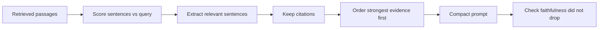

# Context Compression

## Beginner-Friendly Intuition

Retrieved passages contain a lot of text that does not help answer the question. Context compression trims
that down to the sentences that actually matter before sending it to the model. Less irrelevant text means
lower cost, faster responses, and fewer chances for the model to get distracted or "lost in the middle" of
a long context.

## Formal Explanation

Context compression sits between retrieval and generation. Approaches include extractive filtering (keep
only the sentences in each chunk that are relevant to the query, often scored by a small model),
abstractive summarization (condense passages into a shorter synopsis), and selective inclusion (drop
low-scoring chunks entirely). The tradeoff is information loss: compress too hard and you remove the
sentence that held the answer. The goal is maximum relevant signal per token.

## Why It Matters in Real Jobs

LLM cost and latency scale with input tokens, and quality can actually drop when relevant facts are buried
in a long, noisy context (the "lost in the middle" effect). Compression directly attacks both: a prompt
with 4 tight, on-topic passages often beats one with 20 raw chunks, costing less and answering better.
This matters most at scale where token spend is a real budget line.

## How It Works Step by Step

1. **Score relevance:** rate each sentence or chunk against the query.
2. **Extract:** keep only sentences above a threshold, preserving citations.
3. **Optionally summarize:** condense long passages while keeping facts and sources.
4. **Order well:** put the most relevant evidence where the model attends best.
5. **Measure:** confirm answer faithfulness did not drop as tokens fell.

## Real-World Example

A legal RAG retrieves five long contract sections, but only two sentences across them answer "what is the
termination notice period?". An extractive compressor keeps those sentences plus their citations, cutting
the prompt from 4,000 tokens to 600. The answer is the same and correct, latency drops, and the cost per
query falls noticeably. The key was not removing a citation or the one sentence that mattered.

## Common Mistakes

- Compressing so aggressively that the answer sentence is removed.
- Losing citations during summarization, breaking traceability.
- Summarizing when extraction would preserve facts more safely.
- Assuming more context is always better and skipping compression entirely.

## Interview Angle

**Question:** Your RAG prompts are expensive and sometimes worse with more context. What do you do?

**Strong answer:** Add context compression: extract the query-relevant sentences, keep citations, and
order the strongest evidence well. This cuts tokens and fights the lost-in-the-middle effect, but I would
verify faithfulness did not regress.

**Weak answer:** Just lowering k blindly without checking what got dropped.

**Follow-up questions:**

- Extractive vs abstractive compression tradeoffs?
- What is the lost-in-the-middle problem?
- How do you make sure compression does not drop the answer?

## Mini Exercise

Take a long retrieved passage and a question. Mark the one or two sentences you would keep, explain what
you would drop, and note how you would confirm the answer is still supported and cited.

## Diagram

---
## Navigation

[⬅ Previous](08-query-rewriting.md) | [🏠 Home](../README.md) | [➡ Next](10-answer-generation.md)
