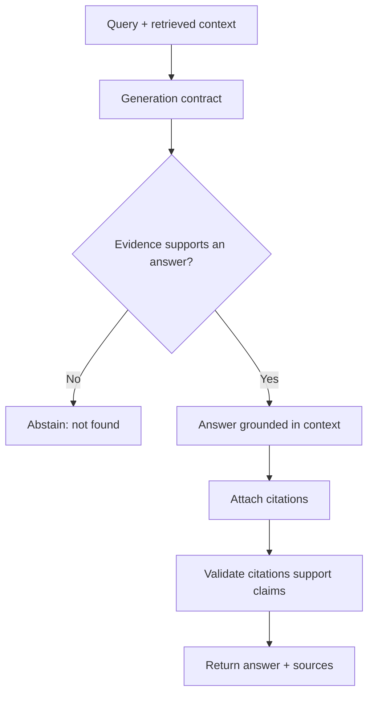

# Answer Generation

## Beginner-Friendly Intuition

This is the stage where the model finally writes the answer, but the goal is the opposite of free
creativity: the model should answer only from the retrieved context, cite where each claim came from,
and say "I do not know" when the evidence is missing. Good generation is disciplined, not clever. The
prompt is a contract that constrains the model to the evidence.

## Formal Explanation

Answer generation conditions the model on the user query plus the retrieved (and possibly compressed)
context, under an instruction contract: ground every claim in the provided passages, attach citations,
abstain when unsupported, and handle conflicting sources explicitly. The system prompt defines this
behavior; the retrieved text is treated as data to reason over, never as instructions to obey. Output
can be plain prose with citations or a structured format with answer, sources, and a confidence or
"not found" signal.

## Why It Matters in Real Jobs

The whole value of RAG is grounded, trustworthy answers. Without a strict generation contract, the model
will smooth over gaps by inventing plausible text, which is worse than abstaining because it looks
authoritative. Citations let users verify, and abstention prevents confident fabrication. This contract
is also the main defense against a retrieved document that tries to hijack the model (prompt injection).

## How It Works Step by Step

1. **Set the contract:** answer only from context, cite sources, abstain if unsupported.
2. **Provide evidence:** insert the retrieved passages with their source identifiers.
3. **Generate:** the model answers and attaches citations to claims.
4. **Handle conflict and gaps:** surface disagreement, or say the answer was not found.
5. **Validate:** check that citations exist and support the claims before returning.

**Citation validation algorithm.** Three layers, in increasing strictness:

- **Existence check.** The cited `doc_id:chunk_id` must be in the retrieved set. If the model
  fabricated a citation (a known failure), reject and retry once.
- **Span match.** Use a small classifier (sentence-transformer cosine similarity, or a fine-tuned
  NLI model) to score whether the cited chunk semantically supports the claim. Threshold at
  cosine 0.7 or higher; below, treat the citation as unsupported.
- **NLI entailment check.** For high-stakes domains (medical, legal), run an entailment model
  (DeBERTa-v3-NLI, or LLM-as-judge with NLI prompt) on (claim, citation). If the citation does
  not entail the claim, mark the answer as unsupported.

**Multi-source conflict resolution.** When two retrieved passages disagree:

- **Surface the conflict.** Tell the user "Source A says X, Source B says Y" rather than picking
  silently.
- **Score by recency.** Newer documents often supersede older ones; use the recency metadata.
- **Score by authority.** Per-source trust scores (vendor docs > random support tickets).
- **Abstain on conflict.** For high-stakes decisions, refuse to answer when conflict cannot be
  resolved.

**Confidence scoring.** Useful for downstream routing (is this answer good enough to show, or
should it go to human review?). Sources of confidence: faithfulness score from the validation step,
retrieval score (top-1 vs top-K margin), abstention probability from the model itself
(`logprob` on the abstention token, when supported). Combine into a single 0-1 score; tune the
threshold per use case.

## Real-World Example

An HR assistant is asked about a benefit the corpus does not cover. With a strong contract, it replies "I
could not find this in the current policy documents" instead of guessing a number. For a covered question,
it answers "New hires receive 15 vacation days [HR-Policy-2024, p.3]". A user can click the citation and
verify. If two policy versions conflict, a good system flags the conflict rather than silently picking one.

## Common Mistakes

- No abstention path, so the model fabricates when evidence is missing.
- Citations that do not actually support the sentence they are attached to.
- Letting retrieved text override the system instructions (injection).
- Allowing the model to blend its own memory with the retrieved facts.

## Interview Angle

**Question:** How do you stop a RAG system from hallucinating?

**Strong answer:** A generation contract: answer only from retrieved evidence, cite sources, and abstain
when unsupported. Validate that citations exist and support the claim, and treat retrieved text as data,
not instructions, to resist injection.

**Weak answer:** "Use a better model," with no contract, citations, or abstention.

**Follow-up questions:**

- How do you verify a citation actually supports a claim?
- What should happen when sources conflict?
- How does the generation contract help against prompt injection?

## Mini Exercise

Write a system-prompt contract for a RAG answerer in five rules. Include the abstention rule, the
citation rule, and the conflict rule, then describe one validation check you would run on the output.

## Diagram

---
## Navigation

[⬅ Previous](09-context-compression.md) | [🏠 Home](../README.md) | [➡ Next](11-rag-evaluation.md)
