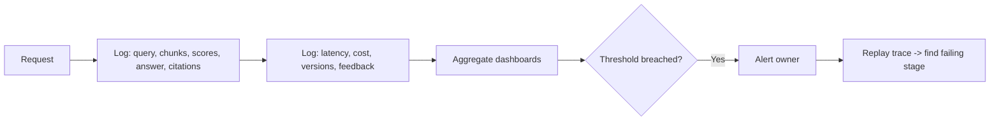

# RAG Observability

## Beginner-Friendly Intuition

Offline evaluation tells you how the system does on a fixed test set. Observability tells you what is
happening with real users right now. It means logging each stage (query, retrieved chunks, scores, final
answer, citations, latency, cost, feedback) so that when something goes wrong in production you can trace
exactly where. Without it, a wrong answer is a mystery; with it, you replay the trace.

## Formal Explanation

RAG observability instruments the full pipeline. For each request you capture: the rewritten query,
retrieved chunk IDs and scores, which chunks made the final prompt, the generated answer and its
citations, token counts, latency per stage, model and prompt versions, and user feedback (thumbs,
edits, escalations). Aggregated, these power dashboards and alerts on retrieval hit rate, abstention
rate, latency, cost, and answer quality drift. Per-request, they enable root-cause tracing of any
specific bad answer.

## Why It Matters in Real Jobs

Production traffic differs from your eval set: new question types, new documents, adversarial inputs. A
rising abstention rate may mean the corpus went stale; a latency spike may mean reranking is overloaded;
a cluster of bad answers may trace to one poisoned document. Observability turns these from invisible
slow failures into alertable, traceable events with an owner.

## How It Works Step by Step

1. **Log per stage:** query, retrieval IDs and scores, prompt, answer, citations, latency, cost.
2. **Version everything:** embedding model, index, prompt, and generator versions on each trace.
3. **Aggregate metrics:** retrieval hit rate, abstention rate, latency, cost, feedback.
4. **Alert on thresholds:** page an owner when a metric breaches.
5. **Trace incidents:** replay a specific request end to end to find the failing stage.

## Real-World Example

Users report the assistant suddenly "does not know" common answers. The abstention-rate dashboard spiked
yesterday. Tracing sample requests shows retrieval scores collapsed for one document space, which a sync
job had emptied. The fix is a re-ingest, found in minutes because every stage was logged and versioned.
Without observability, this would have been days of guessing.

## Common Mistakes

- Logging only the final answer, so retrieval failures are invisible.
- No versioning, so you cannot tell which change caused a regression.
- Capturing sensitive query or document content without access controls.
- Dashboards with no alert thresholds, so nobody notices until users complain.

## Interview Angle

**Question:** A user says the assistant gave a wrong answer yesterday. How do you investigate?

**Strong answer:** Pull the request trace: the query, retrieved chunks and scores, the prompt, and the
answer with citations. That tells me whether retrieval missed the evidence or generation misused it, plus
the versions in play.

**Weak answer:** "I would try the question again," with no logging or tracing.

**Follow-up questions:**

- What would you log at each stage?
- What metrics would you alert on?
- How do you protect sensitive content in logs?

## Mini Exercise

List the fields you would log for one RAG request to make any bad answer traceable. Then name three
aggregate metrics you would alert on and the likely cause behind a spike in each.

## Diagram

---
## Navigation

[⬅ Previous](11-rag-evaluation.md) | [🏠 Home](../README.md) | [➡ Next](13-rag-security.md)
