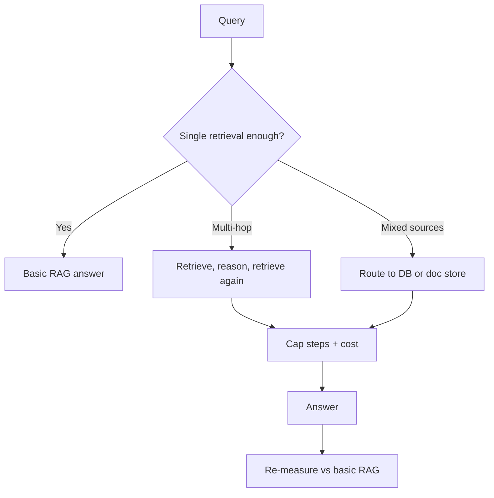

# Advanced RAG Patterns

## Beginner-Friendly Intuition

Basic RAG (retrieve once, then answer) breaks on hard questions: ones that need multiple lookups, reasoning
across documents, or fresh decisions about what to retrieve. Advanced patterns add structure: retrieve in
multiple steps, let the model decide when to search again, route different questions to different sources,
or organize knowledge so retrieval follows relationships. They trade simplicity for capability, so you add
them only when basic RAG measurably falls short.

## Formal Explanation

Common advanced patterns: multi-hop retrieval (retrieve, reason, retrieve again to chain facts); agentic
or iterative RAG (the model decides whether and what to retrieve next, looping until confident); query
routing (send the query to the right index or tool, for example structured DB vs document store);
self-correction (the model critiques its draft and re-retrieves to fill gaps); and graph or
hierarchical RAG (use relationships or summaries-of-summaries so retrieval can traverse structure). Each
adds latency, cost, and failure surface in exchange for handling harder queries.

## Why It Matters in Real Jobs

Some real questions genuinely require more than one retrieval. "Which of our products launched after the
CEO joined?" needs the CEO's start date and then a filtered product lookup. Basic RAG cannot chain that.
But advanced patterns are also where teams over-engineer, adding agentic loops that triple cost for
questions a single retrieval would answer. Knowing when to escalate is the senior skill.

## How It Works Step by Step

1. **Start basic:** single retrieval plus a strong generation contract.
2. **Diagnose the gap:** are failures multi-hop, routing, or freshness problems?
3. **Add the matching pattern:** multi-hop for chained facts, routing for mixed sources.
4. **Cap the loop:** for iterative RAG, set a max number of retrieval steps and a cost budget.
5. **Re-measure:** confirm the added complexity actually improved the failing cases.

## Real-World Example

A research assistant must answer comparative questions across many filings. Single retrieval returns
passages from one filing and misses the others. Switching to multi-hop retrieval (find each entity, then
retrieve its details, then compare) fixes the comparative questions, while simple lookups still use the
cheap single-retrieval path via query routing. Cost rises only for the hard questions that need it.

## Common Mistakes

- Adding agentic loops before basic RAG is measured and tuned.
- Iterative retrieval with no step or cost cap, so it loops and overspends.
- Routing logic so complex it becomes its own source of bugs.
- Assuming a fancy pattern fixes problems that were really chunking or retrieval quality.

## Interview Angle

**Question:** When would you move beyond basic single-shot RAG?

**Strong answer:** When measured failures are multi-hop or cross-source, not chunking. I would add
multi-hop or query routing for those cases, cap any retrieval loop, and keep the cheap single-retrieval
path for simple questions.

**Weak answer:** "Use an agentic RAG framework," with no diagnosis of why basic RAG failed.

**Follow-up questions:**

- What is multi-hop retrieval and what does it solve?
- How do you prevent an iterative RAG loop from running away?
- When is routing worth the added complexity?

## Mini Exercise

Write one question basic RAG would fail and an advanced pattern would solve. Name the pattern, explain the
extra steps, and state the budget cap you would put on it.

## Diagram

---
## Navigation

[⬅ Previous](13-rag-security.md) | [🏠 Home](../README.md) | [➡ Next](15-production-rag-system-design.md)
