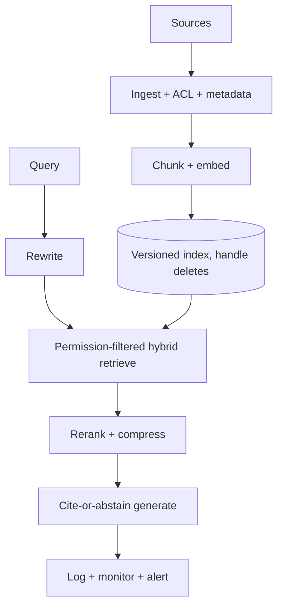

# Production RAG System Design

## Beginner-Friendly Intuition

A production RAG system is a pipeline, not a prompt. It has an offline path (ingest, chunk, embed, index)
that runs as documents change, and an online path (rewrite, retrieve, rerank, compress, generate, log)
that runs per request under a latency budget. Designing it well means deciding each stage's component, the
freshness strategy, the evaluation gates, and the operational controls, all together.

## Formal Explanation

The reference architecture has two planes. Offline: a sync job parses sources, attaches metadata and ACLs,
chunks, embeds, and writes to a versioned vector index, handling adds, updates, and deletes. Online: the
query is rewritten, retrieved via hybrid search with permission filters, reranked, compressed, and passed
to a generator under a cite-or-abstain contract, with every stage logged. Around both sit evaluation gates
(component metrics before deploy), monitoring (drift, abstention, latency, cost), and security (ACLs,
injection defenses, audit). Caching and model routing manage cost and latency.

## Why It Matters in Real Jobs

This is the canonical AI-engineer system design interview, and the canonical real build. The hard parts
are not the happy path; they are freshness (deleted docs must stop answering), permissions (per-user
filtering before ranking), evaluation (catching regressions before users do), and cost at scale. A
candidate who only describes "embed and retrieve" has not designed a system.

## How It Works Step by Step

1. **Offline:** ingest with metadata and ACLs, chunk, embed, index, handle updates and deletes.
2. **Online retrieve:** rewrite query, hybrid search with permission filter, rerank, compress.
3. **Online generate:** cite-or-abstain contract, validate citations, return sources.
4. **Operate:** log every stage, monitor drift and abstention, alert an owner.
5. **Control cost and latency:** cache common answers, route easy queries to smaller models.

## Real-World Example

An enterprise assistant serves 5,000 employees over 2M documents with per-team permissions. Offline syncs
re-index changed pages nightly and tombstone deletes within minutes for compliance. Online, each query is
permission-filtered before ranking, reranked to 4 passages, and answered with citations or an abstention.
Dashboards track abstention rate and p95 latency; a drift alert triggered a re-ingest when one space went
stale. Caching common HR questions cut cost by a third.

## Common Mistakes

- Designing only the online path and ignoring ingestion, freshness, and deletes.
- Filtering permissions after retrieval, risking leaks.
- No evaluation gate, so regressions reach users.
- No caching or routing, so cost scales linearly with traffic.

## Interview Angle

**Question:** Design a production RAG assistant over internal docs with permissions.

**Strong answer:** Separate offline (ingest, chunk, embed, index, handle deletes) from online (rewrite,
permission-filtered hybrid retrieve, rerank, compress, cite-or-abstain generate). Add component-level
evaluation gates, monitoring, security, and cost controls.

**Weak answer:** "Embed the docs and call the LLM with the top results."

**Follow-up questions:**

- How do you keep the index fresh and handle deletes?
- Where do permissions get enforced?
- How do you control cost and latency at scale?

## Mini Exercise

Draw the offline and online planes for a RAG assistant. Mark where permissions are enforced, where the
evaluation gate sits, and one cost-control mechanism on the online path.

## Diagram

---
## Navigation

[⬅ Previous](14-advanced-rag-patterns.md) | [🏠 Home](../README.md) | [➡ Next](16-rag-interview-patterns.md)
