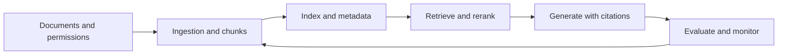

# RAG Interview Patterns

## Beginner-Friendly Intuition

RAG interviews test whether you can ground model answers in the right evidence. The model is only the
last step. The quality depends on document ingestion, permissions, chunking, embeddings, lexical
retrieval, reranking, prompt construction, answer generation, citations, evaluation, and monitoring.

The main pattern is to separate retrieval quality from generation quality. If retrieval misses the
right evidence, the generator cannot reliably recover. If generation ignores or distorts retrieved
evidence, better retrieval will not fix the answer.

## Formal Explanation

A RAG interview answer should define:

- **Knowledge scope:** document types, freshness, source authority, permissions, and retention.
- **Ingestion pipeline:** parsing, cleaning, chunking, metadata, embedding, indexing, and versioning.
- **Retrieval path:** query rewriting, filters, lexical search, vector search, hybrid search,
  reranking, and context compression.
- **Generation contract:** citations, uncertainty, refusal when evidence is missing, and tone.
- **Evaluation:** retrieval recall, context precision, answer faithfulness, citation accuracy,
  latency, cost, and user resolution.
- **Security and operations:** access control, prompt injection, document poisoning, monitoring,
  feedback, and rollback.

## Why It Matters in Real Jobs

Most production RAG failures are not vague hallucination problems. They are specific evidence
problems: stale documents, missing permissions, bad chunk boundaries, weak metadata filters, poor
recall for long-tail queries, or generated answers that cite sources without actually using them.

Interviewers want to see that you can debug the pipeline. A strong answer can say whether the issue
is ingestion, retrieval, reranking, generation, evaluation, or governance.

## How It Works Step by Step

1. **Clarify the corpus and users.** Define who can ask questions, what sources matter, and what
   permissions apply.
2. **Build an ingestion baseline.** Parse documents, store metadata, chunk predictably, and keep
   source identifiers.
3. **Start with search.** Use BM25 or keyword search before dense retrieval so you have a simple
   reference point.
4. **Add hybrid retrieval and reranking.** Improve recall and ordering only after measuring misses.
5. **Constrain generation.** Require evidence-backed answers, citations, and abstention when context
   is insufficient.
6. **Evaluate end to end and by component.** Measure retrieval separately from answer quality.
7. **Monitor production.** Track no-answer rate, citation issues, latency, cost, stale sources, and
   user feedback.

## Real-World Example

For an enterprise policy assistant, the baseline could be permission-filtered keyword search with
snippets. The first RAG version should ingest policy documents with owner, date, department,
permission, and version metadata. Retrieval should combine lexical and vector search, filter by
permissions, rerank the top passages, and instruct the model to cite only retrieved policy sections.

The highest-risk failure is leaking restricted policy or inventing an answer when policy is absent.
That means access control and refusal behavior are product requirements, not optional guardrails.

## Common Mistakes

- Treating RAG as "put documents in a vector database" and stopping there.
- Skipping lexical search and metadata filters.
- Evaluating only final answers without retrieval recall.
- Ignoring document freshness, deletion, and permission changes.
- Chunking by arbitrary length without checking answer boundaries.
- Letting retrieved prompt-injection text override system instructions.
- Citing sources that do not support the generated claim.

## Interview Angle

Interviewers often ask RAG questions to test pipeline debugging.

**Question:** Users say the RAG assistant often answers with irrelevant sources. What do you do?

**Strong answer:** Separate retrieval and generation evaluation, inspect query-document pairs,
measure recall at k and context precision, check chunking and metadata filters, compare BM25, dense,
and hybrid retrieval, add reranking if recall is acceptable but order is poor, and require citations
that support the answer.

**Weak answer:** Increase top-k or switch embedding models without measuring the failure.

**Follow-up questions:**

- How would you evaluate retrieval when no labels exist?
- What metadata must be stored with each chunk?
- How do you handle stale or conflicting documents?
- How do you defend against prompt injection in retrieved text?

## Mini Exercise

Choose a RAG product such as policy support, developer docs search, or customer support. Write the
corpus scope, chunking rule, metadata fields, baseline search method, retrieval metric, answer
metric, and highest-risk security failure.

## Diagram

---
## Navigation

[⬅ Previous](15-production-rag-system-design.md) | [🏠 Home](../README.md) | [➡ Next](../agents/01-what-is-an-ai-agent.md)
