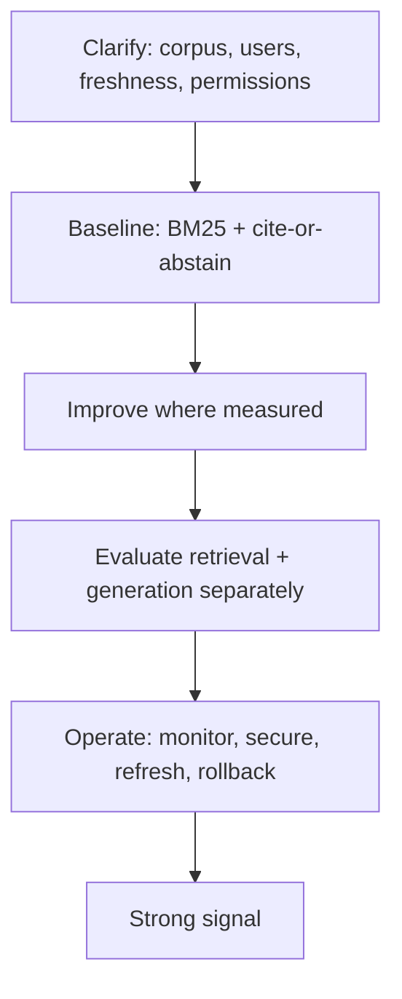

# RAG Interview Patterns

## Beginner-Friendly Intuition

RAG interview questions almost always reward one habit: separate retrieval from generation, and reason
about each. Whatever the prompt, you score points by clarifying the corpus and users, proposing a simple
baseline, naming component-level metrics, and addressing the unglamorous parts (permissions, freshness,
prompt injection) that weaker candidates skip.

## Formal Explanation

The recurring interview frame for any RAG prompt:

- **Clarify:** who asks, what corpus, how it changes, permissions, latency, and the cost of a wrong answer.
  Add: user scale (1 user vs 1M), document volatility (stable corpus vs daily updates), adversarial
  threat model (closed internal vs public-facing).
- **Baseline:** BM25 plus a simple cite-or-abstain prompt, so you have a measurable reference. For
  high-precision domains (medical, legal), also state that abstention bias should lean conservative
  even at the cost of recall.
- **Improve where measured:** chunking, hybrid search, reranking, query rewriting, compression, each
  justified by a failure you observed.
- **Evaluate:** retrieval (recall@k, context precision) and generation (faithfulness, citations)
  separately, with a hard-example suite. Reference RAGAS metrics where applicable (see
  [`11-rag-evaluation.md`](11-rag-evaluation.md)).
- **Operate:** monitoring, security (ACLs, injection), freshness, cost, and rollback. Add: rollback
  strategy on embedding model upgrade (parallel index, dual-write window, atomic swap, retire old).

**Domain-specific baseline adjustments.** "BM25 + cite-or-abstain" is the right baseline for FAQ
and general chat; it is not the right baseline for medical or legal RAG, where:

- **Precision matters more than recall.** A wrong abstention is much cheaper than a wrong answer.
- **Citation accuracy must be verified.** NLI entailment check on every claim, not just span match.
- **Provenance and audit are mandatory.** Every retrieval and answer logged with full context for
  post-hoc review.

The domain shapes the baseline; explicitly note this in the interview to score points.

## Why It Matters in Real Jobs

These patterns are not interview tricks; they are how real RAG systems are debugged and run. An engineer
who instinctively asks "is the right passage even retrieved?" before editing a prompt will fix problems
faster than one who keeps tuning the generator. The interview is testing for exactly that production
instinct.

## How It Works Step by Step

1. **Restate the problem** and clarify corpus, users, freshness, permissions, and constraints.
2. **Propose the baseline** and the two metric families.
3. **Walk the pipeline** stage by stage, naming the failure each improvement addresses.
4. **Cover the hard parts:** permissions before ranking, injection defenses, deletes, cost.
5. **Close with operations:** monitoring, evaluation gates, and rollback.

## Real-World Example

Asked to "design a docs assistant", a strong candidate clarifies that docs change weekly and have team
permissions, proposes BM25 plus cite-or-abstain as the baseline, adds hybrid retrieval and reranking after
noting recall and precision gaps, enforces ACLs before ranking, defends against injected pages, and
finishes with abstention-rate and latency monitoring. A weak candidate jumps to "embed everything and call
the LLM" and stalls on the follow-up about permissions.

## Common Mistakes

- Jumping to architecture before clarifying corpus, users, and constraints.
- Conflating retrieval and generation failures.
- Forgetting permissions, freshness, and prompt injection.
- Measuring only final answer quality.

## Interview Angle

**Question:** The interviewer says "answers are sometimes wrong". What is your first move?

**Strong answer:** Determine whether retrieval found the evidence. Measure recall@k; if the passage is
missing, fix retrieval (chunking, hybrid, rerank). If present, fix the generation contract. I would not
change both at once.

**Weak answer:** Immediately rewriting the prompt or swapping the model.

**Follow-up questions:**

- How do you keep the corpus fresh?
- Where do you enforce permissions and why?
- How do you evaluate before shipping a change?

## Mini Exercise

Take one mock prompt (for example "design a customer-support RAG assistant"). Write a twelve-line answer
following the clarify, baseline, improve, evaluate, operate frame, and include one permission and one
injection consideration.

## Diagram

---
## Navigation

[⬅ Previous](15-production-rag-system-design.md) | [🏠 Home](../README.md) | [➡ Next](../agents/01-what-is-an-ai-agent.md)
