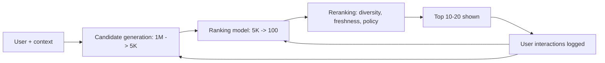

# Recommender Systems Overview

## Beginner-Friendly Intuition

A recommender system answers a deceptively simple question: of all the
items I could show this user, which 10 are most likely to be useful to
them right now? "Items" are anything: products, videos, songs, news
articles, ads, friends-to-add, jobs. "Useful" is operationalized as a
metric: predicted click, predicted purchase, predicted dwell time,
predicted long-term retention. The challenge is that with millions of
candidate items and hundreds of millions of users, you cannot score
every (user, item) pair every time; the system architecture must be
clever about what to score.

The intuition for the standard recommender pipeline: a **two-stage
funnel**. The first stage, **candidate generation** (or retrieval),
narrows millions of items down to a few thousand using cheap
operations. The second stage, **ranking**, scores those few thousand
with an expensive model. A third stage, **reranking**, applies
business rules, diversity, and policy filters. This funnel is the
reference architecture for almost every large-scale recommender:
YouTube, TikTok, Netflix, Spotify, Amazon, LinkedIn, every major ads
system. The details vary; the funnel does not.

## Formal Explanation

### The recommendation problem

Given a user `u` and a set of items `I`, produce a ranked list of
items to show. The ranking is optimized for some objective: predicted
click, predicted purchase value, predicted long-term retention, or a
weighted combination. The output is shown on a "personalization
surface" (home feed, search, related items, recommendations panel).

### The two-stage funnel

```
millions of items
    -> Candidate generation (retrieval): top 1K-10K
    -> Ranking model: top 100
    -> Reranking and policy: top 10-20
    -> Shown to user
```

Each stage trades off accuracy for cost. Candidate generation must be
cheap; ranking can be expensive but only over the candidates;
reranking is even more expensive but over a tiny set.

### Common candidate generation methods

- **Two-tower retrieval (deep retrieval).** A user encoder produces a
  user embedding from features; an item encoder produces an item
  embedding. ANN-search to retrieve top-K items by dot-product
  similarity. Standard in 2026.
- **Collaborative filtering.** Look up items "similar users" liked.
  See [02-collaborative-filtering.md](02-collaborative-filtering.md).
- **Matrix factorization.** Factor the user-item interaction matrix
  into user and item embeddings. See
  [04-matrix-factorization.md](04-matrix-factorization.md).
- **Content-based filtering.** Match items to user preferences by
  content features. See
  [03-content-based-filtering.md](03-content-based-filtering.md).
- **Heuristic.** Recently popular items, items in same category as
  past purchases, friends' items. Often a strong baseline.

Production systems combine multiple sources of candidates (each
contributing 100-1000 items) and unify them in the ranking stage.

### Ranking

A learned model that scores `(user, item, context)` tuples. Standard
in 2026: a deep model with embeddings for high-cardinality features
(user_id, item_id, video_id) plus dense features (recency, popularity,
content embeddings, demographics). See
[05-ranking-systems.md](05-ranking-systems.md).

### Cold start

The hardest problem in recommender systems.

- **User cold start.** New user with no history. Use demographics,
  context, popularity, or onboarding questions.
- **Item cold start.** New item with no interactions. Use content
  features (text, image embeddings) plus heuristics.
- **System cold start.** New product line entirely. Often hand-curated
  before learning.

Content-based methods help with item cold start; CF and matrix
factorization fail on cold-start items. Hybrid systems combine both.

### Diversity, freshness, and exploration

Pure relevance maximization produces bad user experiences. The system
must also balance:

- **Diversity.** Don't show 10 items from the same category. MMR
  (maximum marginal relevance) and DPP (determinantal point processes)
  formalize this.
- **Freshness.** New content gets a boost; otherwise the system
  drowns it under historical popular items.
- **Exploration.** The system must occasionally show items it is
  uncertain about, to learn. Bandit algorithms (epsilon-greedy,
  Thompson sampling, LinUCB) balance exploit-explore.
- **Fairness.** Ensure a long tail of providers (creators, sellers)
  get exposure, not just the top 1 percent.

These constraints typically live in the reranking stage as
modifications to the ranking score.

### Feedback loops

Recommender systems shape what users see, which shapes what users
click, which shapes the training data for the next model. This
feedback loop can amplify popularity bias and reduce diversity. Common
mitigations:

- **Inverse propensity weighting.** Up-weight underexposed items
  during training.
- **Counterfactual evaluation.** Use logged data to estimate offline
  what a different policy would have done.
- **Exploration.** Force the model to occasionally see items outside
  its current ranking.

### Metrics

Two layers of evaluation:

- **Offline.** Recall@K, NDCG@K, MAP, MRR. Computed on a held-out set
  of (user, clicked_item) tuples.
  See [07-evaluation-metrics.md](07-evaluation-metrics.md).
- **Online.** A/B tests on real users. CTR, conversion rate, retention,
  long-term engagement. The decisive metric.

Offline-online gap is huge for recommenders: a model that wins
offline by 2 percent NDCG often produces zero or negative online lift.
Reasons include: position bias, exploration data, distribution shift
from changing what is shown, novelty effects.

## Why It Matters in Real Jobs

Recommender systems power feeds, search, advertising, and every
"things you might like" surface. Three production reasons. First,
**revenue impact**: recommenders directly drive sessions, purchases,
ads, and retention; small accuracy gains often translate into large
revenue. Second, **system complexity**: a real recommender has
dozens of components (candidate sources, ranker, reranker, policy
filters, monitoring, retraining), and design choices interact. Third,
**ethical and legal stakes**: recommendation drives content
exposure, which has real societal effects (filter bubbles, content
moderation, fairness).

## How It Works Step by Step

1. **Define the surface and the objective.** Home feed, search,
   related items, ads. Optimize for clicks, purchases, dwell time,
   retention, or a composite.
2. **Build the labeled data.** User interactions (clicks, purchases,
   dwell). Treat unobserved interactions as implicit negatives,
   weighted appropriately.
3. **Build candidate generation.** Two-tower retrieval is a strong
   default. Add other sources (popular, category-based) for
   robustness.
4. **Build the ranking model.** Deep model over user, item, and
   context features. Train on logged interactions with weights.
5. **Build the reranker.** Diversity, freshness, exploration, policy
   filters.
6. **Evaluate offline.** Recall@K for retrieval, NDCG@K for ranking.
7. **A/B test.** The only metric that matters in the end.
8. **Monitor.** CTR, conversion, retention, per-segment metrics.
   Distribution shift, popularity drift, abuse vectors.
9. **Retrain regularly.** User behavior shifts; recommender models
   degrade fast without retraining.

## Real-World Example

A team builds the home feed for a video platform. The architecture.

1. **Candidate generation.** Two-tower model produces user and video
   embeddings (128-dim). Plus three other candidate sources: most-
   recent, category-similar to recent watches, and friends' watches.
   Combined: 5,000 candidates per user.
2. **Ranking.** Deep model with user_id, video_id, channel_id
   embeddings; recency features; predicted watch time as the target.
   Trained on logged sessions with watch time as the label.
3. **Reranking.** Diversity boost (limit any single channel to 3 of
   top 20). Freshness boost (50 percent uplift for videos under 24
   hours old). Bandit-style exploration (5 percent of slots reserved
   for exploration items).

The team A/B tests several variants. Adding the deep ranker over a
matrix-factorization baseline lifts watch time by 8 percent. Adding
diversity reranking drops short-term watch time by 1 percent but
increases 7-day retention by 3 percent. The team ships diversity
reranking because retention is the north star. Monitoring catches a
case where the bandit exploration accidentally promotes copyright-
violating content; they add a content-policy filter to the reranker.

## Common Mistakes

- Skipping candidate generation; trying to score the full catalog at
  ranking time is too slow.
- Optimizing pure relevance and watching diversity collapse.
- Ignoring exploration; the system fossilizes around early winners.
- Reporting only offline metrics; offline-online gap kills launches.
- Treating implicit feedback (clicks) as ground-truth interest;
  click-bait, position bias, and curiosity clicks all distort the
  signal.
- Forgetting cold start; the system serves new users badly without
  explicit handling.
- Ignoring the feedback loop; biased data produces biased models that
  produce more biased data.
- Skipping per-segment analysis; popular users dominate aggregate
  metrics.
- Tuning rerank policies without understanding their effect on the
  ranker's training distribution.

## Interview Angle

**Question:** Walk through the standard architecture of a large-scale
recommender system, including why each stage exists.

**Strong answer:** The reference architecture is a two-stage funnel
plus reranking. The constraints that shape it: millions to billions of
items, millions to billions of users, latency budgets in the tens to
low hundreds of milliseconds. You cannot score every (user, item)
pair every time. The funnel handles the cost.

1. **Candidate generation (retrieval).** Goal: produce a few thousand
   candidates from millions of items, in milliseconds. Methods:
   two-tower deep retrieval (user and item encoders into the same
   space, ANN search), collaborative filtering, matrix factorization,
   content-based, heuristics. Production systems combine multiple
   sources and union the candidates. Optimized for **recall@K**: did
   we retrieve a relevant item somewhere in the top K? The ranker
   cannot recover items the retrieval missed.

2. **Ranking.** Goal: precisely score the few thousand candidates and
   pick the top 50-100. Methods: deep models with embeddings for
   high-cardinality features (user_id, item_id), dense features
   (recency, popularity, demographics), and content embeddings. The
   model can be expensive (millions of parameters) because it runs
   over only thousands of candidates per query. Optimized for
   **NDCG@K** or business-aligned metrics like predicted watch time.

3. **Reranking and policy.** Goal: apply diversity, freshness,
   exploration, fairness, and policy filters on top of the ranker's
   scores. Methods: maximum marginal relevance for diversity, bandit
   algorithms for exploration, business rule filters, hard
   constraints (no copyright violations, no harmful content). This
   stage often modifies but does not replace the ranker's ordering.

Why each stage exists.

- **Candidate generation** exists because scoring the full catalog at
  ranker quality is too expensive. Cheap, scalable retrieval is the
  only way to handle millions of items.
- **Ranking** exists because retrieval alone is not accurate enough.
  The ranker's deeper feature interactions and richer features
  produce better top-K precision.
- **Reranking** exists because pure relevance maximization produces
  bad user experiences (no diversity, all popular items, no
  exploration, exposure bias to top creators). Policy and diversity
  must be applied as a separate, controllable layer.

Production trade-offs.

- **Latency budget.** Retrieval at 5-15 ms, ranking at 30-80 ms,
  reranking at 5-20 ms. Total under 150 ms p99.
- **Training cost.** Retrieval and ranker are usually trained
  independently on shifted distributions; getting their training
  signals consistent is engineering effort.
- **Offline-online gap.** Common because the offline distribution is
  driven by the current model; new models exposed to new candidates
  produce different behavior than offline metrics suggest. A/B
  testing is the decisive evaluation.

A senior engineer's instinct: every recommender problem is a
funnel-design problem. Where do candidates come from? How are they
scored? What policies apply on top? How does the system explore? How
is feedback closed? Every component touches the others.

**Weak answer:** "Recommend items by similarity" without addressing
the two-stage architecture or production constraints.

**Follow-up questions:**

- How does a two-tower retrieval model work?
- What is exposure bias and how do you handle it?
- Why is offline NDCG often disconnected from online metrics?
- How would you handle cold-start users and items?

## Mini Exercise

Pick a product (e-commerce, video, music). Sketch its recommender
architecture: candidate sources, ranker features, reranking
policies, evaluation metrics. Identify the single biggest risk.

## Diagram



---
## Navigation

[⬅ Previous](../computer-vision/08-multimodal-models.md) | [🏠 Home](../README.md) | [➡ Next](02-collaborative-filtering.md)
