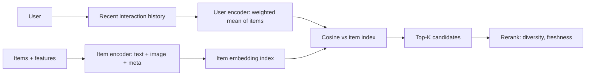

# Content-Based Filtering

## Beginner-Friendly Intuition

Content-based filtering recommends items by **what they are**, not by
who else liked them. Build a representation of each item from its
features (text description, image, category, tags, audio for music).
Build a representation of each user from items they liked. Recommend
items whose representation is closest to the user's.

The intuition: if the system knows what features a user has liked
before, it can find new items with similar features without needing
any other user's data. This works for cold-start items (a new product
just added, with no interactions yet) and respects user privacy
(no sharing of user behavior across recommendations).

Content-based filtering's strengths and weaknesses are roughly the
mirror image of collaborative filtering. CB handles new items well;
CF struggles. CF discovers non-obvious patterns; CB does not. Modern
systems use **hybrid** approaches that combine both, getting the
benefits of each while mitigating the drawbacks.

## Formal Explanation

### Item representations

Build a vector for each item from its features:

- **Text-based.** TF-IDF on description, title, tags. Or sentence-
  transformer embeddings of the same.
- **Categorical features.** One-hot encoded category, brand, genre.
- **Numeric features.** Price, duration, year, rating count.
- **Image-based.** CNN or ViT embedding of the item image.
- **Multimodal.** CLIP-style joint image-text embedding.
- **Genre and metadata.** Hand-crafted features from domain
  knowledge.

Combined into a single item vector by concatenation, weighted
combination, or learned projection.

### User representations

Build a user vector from items they liked:

- **Mean of liked items.** Simplest; works surprisingly well.
- **Weighted mean.** Recent interactions weighted higher;
  positive interactions (purchase) weighted more than negative
  (skipped after 5 seconds).
- **Profile-based.** Explicit user preferences (set during onboarding).
- **Sequence model.** Encode the sequence of recent interactions
  with an RNN or transformer to capture order and context.

The simple mean is a strong baseline; sequence models help when
recent context matters (search session, current mood).

### Scoring

Cosine similarity (or dot product) between user vector and candidate
item vector. Top-K by score is the recommendation.

### Strengths

- **Item cold start.** New items have features, so they can be
  recommended immediately. The classical advantage over CF.
- **Privacy-friendly.** No user-user sharing required; each user's
  recommendations depend only on their own behavior.
- **Interpretability.** "Recommended because it shares the
  'mystery' tag with what you watched" is straightforward.
- **Long-tail discovery.** Items with niche features can be
  recommended to users with the same niche.
- **Domain knowledge encoding.** Hand-crafted features encode expert
  insights.

### Weaknesses

- **Limited serendipity.** Recommendations stay close to past
  preferences; users can get stuck in a "filter bubble" of similar
  items.
- **Feature quality dependence.** If features are sparse or low-
  quality, CB does poorly. Garbage in, garbage out.
- **No cross-user learning.** Each user's recommendations are
  independent. Misses patterns like "users who like X also tend to
  like Y" if X and Y do not share features.
- **User cold start partially solved, partially not.** A new user's
  vector is empty until they interact; need explicit onboarding or
  default vectors.
- **Feature engineering effort.** Good item features require domain
  knowledge or upstream embedding models.

### When CB beats CF

- **Item cold start dominant.** New products launch frequently;
  catalogs change daily.
- **Sparse interactions.** Users do not interact with many items;
  CF has too little data.
- **Privacy or regulatory constraints.** Cannot share user-user
  patterns.
- **Niche or long-tail products.** Co-occurrence is rare for
  obscure items; content features are not.
- **Content-rich items.** Articles, videos, products with detailed
  descriptions where feature extraction is high-quality.

### When CB loses

- **Sparse features but rich interactions.** CF (especially matrix
  factorization or deep retrieval) finds patterns CB cannot.
- **Cross-genre discovery matters.** Users who like sci-fi may also
  like documentaries; CB stays in the same genre.
- **Items lack distinguishing features.** Two products with similar
  metadata may behave very differently to users.

### Hybrid systems

Production systems almost always combine CB and CF. Common patterns:

- **Weighted combination.** Linear combination of CB and CF scores.
- **Switching.** Use CB for cold-start items, CF for warm.
- **Feature augmentation.** Use CF embeddings as features in a CB
  ranker.
- **Two-tower hybrid.** User and item encoders that use both
  collaborative and content features. The default architecture in
  2026.

## Why It Matters in Real Jobs

Three production reasons. First, **cold-start handling**: new
products, new articles, new content launch every day in most
businesses; CB is how the system serves them. Second, **content-
heavy domains** (news, articles, music) where content features are
abundant and behavior alone misses subtle preferences. Third,
**explanation and trust**: regulators and stakeholders trust feature-
based recommendations more than opaque collaborative patterns.

The cost is real: CB requires building and maintaining good item
features, which is engineering work. Modern systems use pretrained
encoders (sentence-transformer, CLIP) to reduce this cost
dramatically.

## How It Works Step by Step

1. **Identify item features.** Text, images, categorical metadata,
   numeric attributes, behavior (warm-start CB).
2. **Build item representations.** Sentence-transformer for text,
   CNN/ViT for images, one-hot for categoricals. Concatenate or
   learn a projection.
3. **Build user representations.** Mean, weighted mean, or sequence
   encoder over the user's interaction history.
4. **Score candidates.** Cosine or dot product between user and
   item.
5. **Index for fast retrieval.** Item embeddings in HNSW or similar.
6. **Filter and rerank.** Already-interacted items, business rules,
   diversity.
7. **Evaluate.** Offline NDCG@K plus per-segment cold-start metric.
8. **A/B test.** Compare to CF or hybrid.
9. **Iterate.** Add features, refine the user encoder, fine-tune
   representations.

## Real-World Example

A team builds a news recommender for a fast-moving product (1000+
new articles per day). Pure CF fails: most articles are less than 24
hours old and have few interactions. They build a CB system.

- **Item features.** Sentence-transformer embedding of the headline +
  first paragraph. Plus topic tag, source, publication time.
- **User features.** Weighted mean of article embeddings the user
  read in the last 7 days, weighted by recency and read-completion.
- **Scoring.** Cosine similarity between user and item embedding,
  plus a freshness boost (articles under 6 hours old get +0.05).
- **Reranking.** Diversity (no more than 3 articles from one
  source in top 20).

NDCG@10 on a held-out set: 0.34. They add a CF component (matrix
factorization on user-article interactions); hybrid score is a
weighted combination of CB and CF. NDCG@10 rises to 0.41 for warm
articles. For new articles (under 1 hour old), the hybrid falls back
to pure CB; CTR on those is comparable to a hand-tuned editorial
ranking. The lesson: CB carries the cold-start traffic; CF improves
the warm tail; the hybrid wins on both.

## Common Mistakes

- Using shallow features (just category and tag) when deep features
  (text embeddings) are available.
- Forgetting to update item embeddings when content changes (e.g.,
  article rewritten, product description updated).
- Mean-pooling user embedding without recency weighting; old
  preferences drown new ones.
- Using user embeddings that change every interaction; serving
  becomes expensive.
- Building CB without an interaction signal at all; warm-start CB
  uses past interactions to weight features, not just static
  features.
- Skipping diversity reranking; CB without diversity stays in a
  filter bubble.
- Comparing pure CB to pure CF and concluding one is "better"; in
  production, hybrid is the answer.
- Forgetting that CB requires upstream feature engineering or
  embedding pipelines, which are themselves systems to maintain.

## Interview Angle

**Question:** When does content-based filtering beat collaborative
filtering, and how do hybrid systems combine the two?

**Strong answer:** CB and CF have complementary strengths.

**CB wins when:**

- **Item cold start is frequent.** New products, articles, or videos
  launch daily and have no interactions yet. CB can recommend them
  immediately based on features.
- **Interactions are sparse.** Users have few interactions; CF has
  too little signal. CB uses the rich item features instead.
- **Content is rich.** Articles, videos, products with detailed text
  or image features. CB exploits this directly.
- **Privacy or regulatory constraints** prevent cross-user pattern
  learning.
- **Niche tastes.** Long-tail items where CF's co-occurrence signal
  is too weak.

**CF wins when:**

- **Items lack distinguishing features.** Many products have similar
  metadata but very different user response.
- **Cross-genre discovery matters.** "Users who like X also like Y"
  patterns that no feature would predict.
- **Interaction data is abundant.** Plenty of behavior signal to
  learn from.
- **Long-term taste modeling.** Implicit feedback at scale captures
  subtle patterns.

**Hybrid systems** combine them in several ways.

1. **Score combination.** Linear combination of CB and CF scores
   per candidate. Weight tuned offline or via A/B test.
2. **Cascade.** Use CB to retrieve cold-start candidates, CF for
   warm. The ranker scores all candidates regardless of source.
3. **Feature augmentation.** Use CF embeddings as features in a CB
   ranker. The model learns to use both signals.
4. **Two-tower hybrid.** The user and item encoders consume both
   collaborative features (user_id, item_id embeddings) and content
   features (text, image embeddings). Trained on interactions, the
   model learns to weight them. This is the default architecture in
   2026.

For a new system, I would build CB and CF as separate candidate
sources, combine their candidates in a unified ranker, and let the
ranker decide how to weight the signals. The ranker's training data
is logged interactions, and it learns from the combined feature space
which signal matters when.

A simpler version that works on cold-start-heavy products: heavy CB
with a CF boost when warm. Pure CB serves new items; CF re-ranks
warm items.

The pattern across systems: hybrid wins because the failure modes of
CB and CF are different. Where one is weak, the other is strong.

**Weak answer:** "CB and CF can be combined" without naming when each
wins or how to combine them.

**Follow-up questions:**

- How would you build item embeddings for a video recommender?
- What is the curse of dimensionality and how does it affect content-
  based filtering?
- How would you handle a constantly-changing catalog?
- What is a two-tower model?

## Mini Exercise

Build a news recommender on a small public dataset. Use sentence-
transformer for article embeddings; mean-pool the user's last 5
articles for the user vector. Compute NDCG@10. Compare to a
popularity baseline.

## Diagram

---
## Navigation

[⬅ Previous](02-collaborative-filtering.md) | [🏠 Home](../README.md) | [➡ Next](04-matrix-factorization.md)
