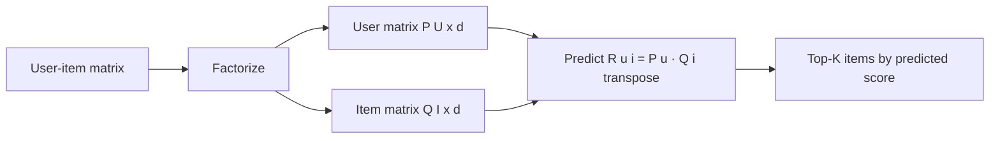

# Matrix Factorization

## Beginner-Friendly Intuition

Matrix factorization decomposes the giant user-item interaction matrix
into two smaller matrices: one of user embeddings, one of item
embeddings. The dot product of a user's embedding with an item's
embedding predicts how strongly that user will engage with that item.
The whole interaction matrix, with billions of entries, gets compressed
into a few hundred dimensions per user and per item.

The intuition: even though there are millions of users and items,
their preferences live in a much lower-dimensional latent space. There
are not a million distinct kinds of taste; there are dozens of latent
factors (genre preferences, novelty preference, price sensitivity,
mood) and each user is a combination of those factors. Matrix
factorization discovers the latent factors automatically, without
hand-engineering.

Matrix factorization won the Netflix Prize in 2009. For a decade it
was the standard recommender baseline. It has been largely replaced by
deep two-tower retrieval and gradient-boosted ranking models, but the
factorization idea is still everywhere: every modern embedding model
is, at its core, a fancy matrix factorization.

## Formal Explanation

### The factorization

Given user-item interaction matrix `R ∈ R^{U × I}` (mostly missing
entries), find user matrix `P ∈ R^{U × d}` and item matrix
`Q ∈ R^{I × d}` such that:

```
R[u, i] ≈ P[u] · Q[i]^T
```

`d` is the embedding dimension (typically 16-256). Each row of `P` is
a user's embedding; each row of `Q` is an item's embedding.

### Loss for explicit feedback

Minimize squared error on observed entries:

```
L = Σ_{observed (u, i)} (R[u, i] - P[u] · Q[i]^T)² + λ (||P||² + ||Q||²)
```

Solved by alternating least squares (ALS), gradient descent, or SGD.
Standard implementations: Spark MLlib ALS, Surprise, implicit (Python
library).

### Loss for implicit feedback

Implicit feedback (clicks, purchases) does not have ratings. Two
common approaches:

1. **Weighted ALS (Hu et al., 2008).** Treat all (user, item) pairs as
   labeled, with weight `1 + α · interaction` (high weight for
   observed interactions, weight 1 for unobserved). Loss:

   ```
   L = Σ_{u, i} c_{u,i} (p_{u,i} - P[u] · Q[i]^T)² + λ (||P||² + ||Q||²)
   ```

   where `p_{u,i} = 1` if interaction observed, 0 otherwise, and
   `c_{u,i}` is the confidence weight.

2. **BPR (Bayesian Personalized Ranking; Rendle et al., 2009).**
   Pairwise ranking loss: for each (user, observed item, unobserved
   item) triple, the observed item should score higher:

   ```
   L = - Σ log σ(P[u] · Q[i]^T - P[u] · Q[j]^T)
   ```

   Stochastic mini-batch training; works well for implicit feedback.

### Optimization

- **Alternating Least Squares (ALS).** Fix `Q`, solve for `P` (a
  least-squares problem per user). Fix `P`, solve for `Q`. Repeat.
  Each subproblem is closed-form. Highly parallelizable; the
  standard for explicit feedback at scale.
- **SGD on (user, item) pairs.** Sample a pair, take a gradient step.
  Standard for implicit feedback and BPR.

### Embedding dimension

`d = 16` to `d = 256` typical. Larger `d` captures more nuance but
overfits more easily; tune by cross-validation. For very large
catalogs (millions of items), embedding tables can be gigabytes;
`d = 64` is a common compromise.

### Cold start

Matrix factorization fails on cold-start items: a new item has no
interactions, so no embedding can be learned. Workarounds:

- **Hybrid models.** Use content features for cold-start items; switch
  to learned embeddings once enough interactions exist.
- **Side information.** Append item features to the embedding (LCE,
  learned content embedding).
- **Bandit warm-up.** Show new items occasionally to gather
  interaction data.

### Bias terms

Standard matrix factorization adds user and item biases:

```
R[u, i] ≈ μ + b_u + b_i + P[u] · Q[i]^T
```

`μ` is the global mean, `b_u` is the user's tendency to rate high or
low, `b_i` is the item's tendency to be rated high or low. Biases
account for "this user always rates 4 stars" or "this movie is
universally hated", separating those effects from the latent factors.

### Variants

- **SVD++ (Koren, 2008).** Adds implicit feedback as a sum of feedback
  embeddings. Won part of the Netflix Prize.
- **TimeSVD++.** Adds time-varying biases and embeddings.
- **Factorization Machines (Rendle, 2010).** Generalize matrix
  factorization to arbitrary feature combinations; the predecessor of
  modern deep recommenders.
- **Neural Matrix Factorization.** Replace dot product with an MLP.
  Often less accurate than well-tuned matrix factorization for the
  cost.
- **EASE (Steck, 2019).** Closed-form linear method that beats matrix
  factorization on many benchmarks. Worth trying as a baseline.

### Two-tower retrieval as generalized MF

Modern two-tower retrieval is conceptually a learned matrix
factorization with rich features:

```
score(u, i) = f_user(features(u)) · f_item(features(i))^T
```

`f_user` and `f_item` are deep encoders that consume not just IDs but
all available features. Trained on interaction data. This is what
production systems use in 2026 instead of pure matrix factorization.

## Why It Matters in Real Jobs

Three production reasons. First, **strong baseline**. A well-tuned
matrix factorization model often achieves within 10-20 percent of a
deep model at 100x lower training cost. Useful as the baseline against
which deep models are validated. Second, **interpretability**. The
embeddings are inspectable; you can find item neighborhoods, user
clusters, and check that the factorization captures meaningful
preferences. Third, **understanding**. Every modern recommender uses
the embedding-similarity idea. Understanding matrix factorization
deeply is the foundation for understanding two-tower retrieval, deep
candidate generation, and learned-to-rank models.

## How It Works Step by Step

1. **Build the interaction matrix.** Sparse format. For implicit
   feedback, weights per interaction (longer dwell = higher weight).
2. **Pick the loss.** Squared error for explicit feedback. Weighted
   ALS or BPR for implicit.
3. **Pick the embedding dimension.** Start with d=64. Tune by
   cross-validation.
4. **Train.** ALS for explicit feedback at moderate scale; SGD or
   BPR for implicit.
5. **Add bias terms.** Global, user, item.
6. **Regularize.** L2 on embeddings, weight 0.01 to 1.0.
7. **Index for retrieval.** Item embeddings in HNSW or FAISS.
8. **Retrieve.** Top-K nearest items by dot product or cosine.
9. **Evaluate.** Recall@K, NDCG@K offline; A/B test online.

## Real-World Example

A music streaming service has 80M users, 100M tracks, 10B listening
events in the last year. They build matrix factorization with
weighted ALS, d=128, λ=0.01. Training takes 4 hours on a 50-node
Spark cluster. The model produces 128-dim track embeddings indexed
in FAISS. Recommendation: encode the user (mean of last 100 listened
tracks' embeddings, weighted by recency), retrieve top-200 nearest
tracks.

Offline Recall@200 is 0.74. They add CF features (track-track
similarity from co-listening) and a recency feature; combined NDCG@10
on a held-out set is 0.42.

Six months later they migrate to a two-tower deep retrieval model
that uses user demographics, listening history embeddings, and
track audio embeddings as features. Recall@200 rises to 0.81 and
NDCG@10 to 0.46. They keep the matrix factorization model as a
fallback (when the deep model service is down) and as a candidate
source feeding the ranker. The MF embeddings are also used directly
in the ranker as features.

## Common Mistakes

- Using squared error for implicit feedback; the missing-vs-observed
  asymmetry is wrong. Use weighted ALS or BPR.
- Skipping bias terms; user and item average effects dominate; the
  factorization captures user-item interactions on top.
- Setting d too high without regularization; overfitting on small
  data.
- Forgetting that MF cannot handle cold-start items; hybrid or fall-
  back is needed.
- Comparing MF on a different held-out split than the deep model;
  results are not comparable.
- Using random splitting for evaluation when temporal splits are
  appropriate (recommender data is time-ordered).
- Forgetting popularity bias; MF tends to recommend popular items
  unless explicitly debiased.
- Not normalizing embeddings before computing cosine; raw dot product
  is biased toward longer vectors (which often correspond to popular
  items).

## Interview Angle

**Question:** Walk through how matrix factorization for
recommendations works, and explain the difference between the
explicit-feedback and implicit-feedback variants.

**Strong answer:** Matrix factorization decomposes the user-item
interaction matrix `R` into two low-rank matrices: a user matrix `P`
of shape `(U, d)` and an item matrix `Q` of shape `(I, d)`. The
prediction for user `u` interacting with item `i` is the dot product
of their embeddings: `r_hat = P[u] · Q[i]^T` (often with bias terms).
The dimension `d` is the latent-factor count, typically 16-256.

The intuition is that user preferences and item characteristics live
in a low-dimensional latent space. There are not millions of distinct
tastes; there are dozens of latent factors (genre preference, novelty
preference, mood) and each user and item is a combination. Matrix
factorization learns these factors directly from the interactions,
without hand-engineering them.

**Explicit feedback** (ratings 1-5).

The interaction matrix has explicit values where observed. Loss:

```
L = Σ_{observed (u, i)} (R[u, i] - P[u] · Q[i]^T)² + λ (||P||² + ||Q||²)
```

Solved by Alternating Least Squares (ALS): fix Q and solve for P
(closed form per user); fix P and solve for Q. Highly parallelizable;
fast convergence. Or by SGD on (user, item, rating) tuples.

**Implicit feedback** (clicks, purchases, watch time).

The interaction matrix has 1 where observed, 0 elsewhere. The
asymmetry: a 0 means "did not see" or "did not like"; we cannot tell
which. Two main approaches.

1. **Weighted ALS (Hu et al., 2008).** Treat the matrix as fully
   observed but weight the squared-error loss by a confidence:
   `c_{u,i} = 1 + α · interaction_count`. Observed interactions get
   high weight; unobserved get weight 1. The model learns to predict 1
   for observed and 0 for unobserved with appropriate confidence.

2. **BPR (Bayesian Personalized Ranking; Rendle et al., 2009).** A
   pairwise ranking loss. For each (user, observed item, unobserved
   item) triple, the model is trained to score the observed item
   higher:
   `L = -log σ(P[u] · Q[i]^T - P[u] · Q[j]^T)`. SGD on triples.

The pairwise BPR formulation often beats weighted ALS on ranking
metrics because it directly optimizes ordering. Weighted ALS can be
faster to train at scale (Spark ALS, in particular, is highly
optimized).

In production, implicit feedback dominates (clicks are abundant;
ratings are not), so weighted ALS or BPR is the default. Modern
systems have largely replaced pure matrix factorization with two-
tower deep retrieval (which generalizes the same idea to richer
features and a learned encoder), but matrix factorization remains a
strong baseline and a useful interpretability tool.

**Weak answer:** Reciting the formula without explaining the
explicit-vs-implicit distinction or why ALS works.

**Follow-up questions:**

- What is BPR loss?
- How does matrix factorization handle cold start?
- What is the difference between weighted ALS and BPR?
- How does two-tower retrieval generalize matrix factorization?

## Mini Exercise

Take MovieLens 1M. Train an explicit-feedback ALS model with d=64,
λ=0.1. Compute RMSE on a held-out test set. Then build a BPR model
on the implicit version (treat ratings >= 4 as positive). Compute
NDCG@10. Note the differences.

## Diagram



---
## Navigation

[⬅ Previous](03-content-based-filtering.md) | [🏠 Home](../README.md) | [➡ Next](05-ranking-systems.md)
