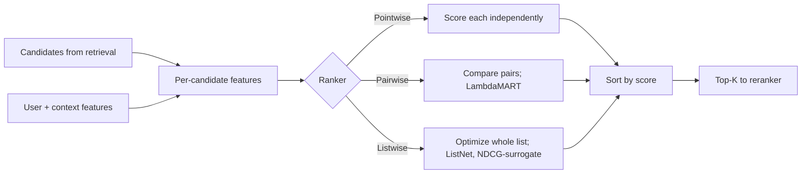

# Ranking Systems

## Beginner-Friendly Intuition

A ranking system takes a candidate set (typically a few thousand
items, produced by a retrieval stage) and orders them by predicted
relevance to the user. This is the second stage of the recommender
funnel: after candidate generation gives you a manageable set, the
ranker assigns each candidate a score and sorts them so the top-K
are shown to the user.

The intuition: ranking is not classification. The model does not need
to predict the exact probability of a click; it only needs to put the
items in the right order. This shift in objective changes the loss
function (pointwise vs pairwise vs listwise), the metric (NDCG, MAP,
MRR instead of accuracy), and what features matter most. A ranker
that scores all items at 0.0001 but in the right order is far better
than one that scores items at 0.5 but in the wrong order.

In 2026, the standard production ranker is a deep learning-to-rank
model: gradient boosted trees (LambdaMART) or a deep neural network
(deep & cross, DLRM, DCN-V2) that consumes user and item features
plus interaction signals and produces a per-item score.

## Formal Explanation

### Three formulations

#### Pointwise

Predict a score per (user, item) pair independently. Sort by score.
Loss: cross-entropy on click prediction or MSE on rating regression.

Pros: simple, scales well, calibrated probabilities. Cons: optimizes
each item independently; does not directly optimize ranking metric.
Often a good default.

#### Pairwise

Predict which of two items the user will prefer. For each (user,
item_high, item_low) triple where item_high was clicked and item_low
was not, train the model so `score(item_high) > score(item_low)`.

- **RankNet (Burges et al., 2005).** Cross-entropy on pairwise
  preference; the model outputs a score, the loss compares pairs.
- **LambdaRank (Burges, 2010).** RankNet weighted by the change in
  NDCG that swapping the pair would cause. Directly optimizes
  ranking metrics.

Pros: optimizes for ranking; standard in many production systems.
Cons: more complex than pointwise.

#### Listwise

Optimize the entire ranked list at once.

- **LambdaMART.** GBM with LambdaRank loss. Standard for tabular
  ranking; the workhorse of search and many recommender systems.
- **ListNet, ListMLE.** Neural alternatives.
- **NDCG-based losses.** Direct surrogates for NDCG.

Pros: optimizes ranking quality directly. Cons: harder to train at
scale, more sample-inefficient than pointwise.

### Common features

Per (user, item) candidate, the ranker consumes:

- **User features.** Demographics, country, device, plan tier,
  recency of last visit, recent interactions embedding.
- **Item features.** Category, brand, price, popularity, recency,
  age, content embedding (image, text).
- **Cross features.** Predicted CTR for this user-item from a
  collaborative model; cosine of user and item content embeddings;
  match between user's interest tags and item's tags.
- **Context features.** Time of day, location, device, current
  session state.
- **Position features (for training only).** The position the
  candidate appeared at in the past (to handle position bias). At
  serving, position is unknown until ranked.

### Position bias

Items at higher positions get clicked more, regardless of relevance.
The training data is therefore biased: a click on position 1 is not
the same evidence as a click on position 10. Common mitigations:

- **Position as a feature** at training only; set to 0 (or "unknown")
  at serving so the model learns position-independent relevance.
- **Inverse propensity weighting.** Weight each click by `1 /
  P(click | position)`.
- **Counterfactual learning to rank.** Train on logged data while
  modeling the position effect explicitly.

Without position-bias correction, the ranker tends to learn "what
position got clicked" instead of "what content is relevant".

### Calibration

Pointwise rankers should produce calibrated probabilities (predicted
probability matches observed click rate). Useful for downstream
expected-value calculations: showing the right ad requires knowing
both `P(click)` and the bid value. Calibrate with isotonic regression
or Platt scaling on a held-out fold.

### Multi-task ranking

Modern systems often predict multiple targets jointly: P(click), P(long
watch), P(purchase). The final ranking score is a weighted combination,
or each target has its own ranker and a meta-policy combines them. This
balances short-term engagement against long-term value.

### Common architectures

- **GBM (LightGBM, XGBoost) with LambdaRank.** The default for
  tabular features. Strong, fast, robust.
- **DLRM (Facebook).** Deep & wide; embedding tables for high-
  cardinality features plus dense MLP. Production at Facebook scale.
- **DCN-V2 (Wang et al., 2020).** Deep & cross networks; captures
  feature interactions without exploding parameters.
- **Wide & Deep (Cheng et al., 2016).** Linear "wide" model for
  memorization plus a deep model for generalization. Classical
  Google design.
- **TransAct, BERT4Rec.** Transformer-based rankers that consume
  the user's session history as a sequence.

In 2026, deep models dominate at scale; GBM remains the default for
small-to-medium recommenders and a strong baseline.

## Why It Matters in Real Jobs

Three production reasons. First, **ranking is where the deep model
typically lives**. Candidate generation is often heuristic or two-
tower; ranking is where you can spend compute on richer features and
a more expressive model. Second, **business metric tuning**. The
weights on multi-task objectives directly shape what users see;
adjusting them is how the system aligns with business priorities
(short-term clicks vs long-term retention). Third, **fairness and
exploration** are typically expressed as constraints or auxiliary
objectives in the ranker; getting them right is product-defining.

## How It Works Step by Step

1. **Define the ranking objective.** Click probability? Watch time?
   Multi-task with weighted combination?
2. **Build the labeled data.** Logged interactions with weights for
   the loss.
3. **Choose features.** User, item, cross, context. Engineering
   matters; deep features (recent interaction embedding) help most.
4. **Pick the model.** GBM with LambdaRank for tabular and small-to-
   medium scale. DLRM or DCN-V2 for large-scale deep ranking.
5. **Choose pointwise, pairwise, or listwise loss.** Pointwise for
   simplicity; LambdaRank for direct ranking quality.
6. **Train with position-bias correction.** Position as feature at
   training, 0 at serving; or inverse propensity weights.
7. **Calibrate.** If downstream uses probabilities.
8. **Evaluate offline.** NDCG@K, MAP, MRR.
9. **A/B test.** Online metrics decide.
10. **Monitor.** Per-segment metrics, calibration drift, distribution
    shift in features.

## Real-World Example

A team builds a ranker for a video feed. Candidate generation
produces 5,000 videos per session (deep two-tower retrieval, plus
recently popular and category-similar). The ranker is LightGBM with
LambdaRank, trained on logged sessions with watch time as the target.

Features (200+):

- User: history embedding (mean of last 100 watched videos), recency
  features, demographics.
- Video: video_id embedding from the candidate generator, channel_id
  embedding, duration, recency.
- Cross: cosine of user embedding and video embedding, predicted
  watch time from a separate two-tower model, channel-user match.
- Context: time of day, device, country.

Training: 30B logged impressions over 6 months, weighted by watch
time, position-bias-corrected with position as a training-only
feature.

Offline NDCG@20: 0.42. Online A/B test vs the previous matrix-
factorization-based ranker: +12 percent watch time, +6 percent 7-day
retention. They ship.

Six months later, they migrate to DLRM (deep learning recommender
model) with the same features plus a deep MLP on top of the
embeddings. Offline NDCG@20: 0.45. Online: +5 percent watch time. The
deep model is more expensive but the gain is meaningful at their
scale. The GBM stays as a fallback ranker for when the deep service
is unavailable.

## Common Mistakes

- Ignoring position bias; the model learns to predict position, not
  relevance.
- Using accuracy or AUC as the offline metric for ranking; NDCG and
  MAP are more honest.
- Training on heavily downsampled negatives without weighting; the
  resulting model is uncalibrated.
- Skipping calibration when downstream uses probabilities.
- Using offline metrics as the deployment criterion; online lift
  often differs.
- Training a ranker on data from a different ranker without
  considering the distribution shift; the offline-online gap can be
  large.
- Forgetting that the ranker's output distribution feeds the next
  iteration's training data; feedback loops compound.
- Setting the multi-task objective weights once and never revisiting
  them.
- Not handling new items; if the ranker has never seen an item, its
  score is unpredictable.

## Interview Angle

**Question:** Compare pointwise, pairwise, and listwise approaches to
learning to rank, and explain when each is appropriate.

**Strong answer:** All three predict a score per (user, item) pair.
They differ in the loss function and in what they optimize.

**Pointwise.** Treat each (user, item) pair as an independent
prediction. Loss: cross-entropy on click prediction (binary) or MSE
on rating regression. The model learns to predict P(click | user,
item) or the rating directly. Sort candidates by score at inference.

Pros. Simple to implement; scales to massive data; produces calibrated
probabilities (useful for expected-value calculations like ad bidding).

Cons. Does not directly optimize ranking quality. A model that gets
the absolute scores right but the ordering wrong loses; a model that
gets the ordering right but the absolute scores compressed wins, but
pointwise loss does not reward that.

When to use. As a baseline; when calibrated probabilities matter for
downstream systems; when absolute scores matter (rating prediction,
ad CTR for bidding).

**Pairwise.** For each (user, item_high, item_low) triple where the
user preferred item_high (clicked, watched longer, purchased), train
the model so `score(item_high) > score(item_low)`. Common losses:

- **RankNet.** Cross-entropy on the difference of scores: `L = -log
  σ(score(high) - score(low))`.
- **LambdaRank.** RankNet weighted by the change in NDCG that
  swapping the pair would cause. Approximates direct NDCG
  optimization.

Pros. Directly optimizes ordering. LambdaRank is widely used in
search and recommendation rankers (LambdaMART = GBM + LambdaRank).

Cons. Quadratic in candidate count if naively trained; usually
sampled. Pairwise comparisons mix easy and hard pairs without
distinguishing.

When to use. When ranking quality matters more than calibrated
probabilities; standard in search and many production rankers.
LambdaMART is the production workhorse for tabular ranking.

**Listwise.** Optimize the entire ranked list at once. Methods:

- **ListNet, ListMLE.** Cross-entropy over permutations or top-K.
- **Direct NDCG approximations.** Smooth surrogates for NDCG that can
  be optimized by gradient descent.
- **LambdaRank itself** is sometimes classified as listwise because
  it weights pairs by their effect on the listwise NDCG.

Pros. Directly optimizes the ranking metric; theoretically the
right thing to do.

Cons. More complex to implement; harder to scale; sample-inefficient
because each training example is a whole list, not individual items.

When to use. When ranking metrics matter most and you can afford the
training complexity.

In production, the practical defaults are:

- **Pointwise** for small recommenders, ad CTR (where calibrated
  probabilities feed bidding), and as the baseline.
- **LambdaMART (pairwise/listwise GBM)** for search and tabular
  ranking; the production standard.
- **Deep neural rankers (DLRM, DCN-V2, BERT4Rec)** for large-scale
  recommenders where deep features matter.

A senior engineer's instinct: start with pointwise as a baseline,
move to LambdaMART if ranking quality matters, move to deep rankers
when scale and feature richness justify the engineering cost.

**Weak answer:** Listing the three without explaining when each is
appropriate.

**Follow-up questions:**

- What is position bias and how do you handle it?
- How does LambdaRank differ from RankNet?
- What is calibration and why does it matter for rankers?
- How would you handle multi-task ranking?

## Mini Exercise

Take a small ranking dataset (LETOR or a public e-commerce dataset).
Train pointwise XGBoost (predict click) and LambdaMART (predict rank).
Compare NDCG@10. Note the difference.

## Diagram

---
## Navigation

[⬅ Previous](04-matrix-factorization.md) | [🏠 Home](../README.md) | [➡ Next](06-candidate-generation-and-ranking.md)
