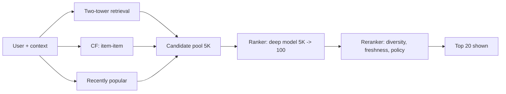

# Candidate Generation and Ranking

## Beginner-Friendly Intuition

A real recommender cannot score every item in the catalog every time
a user requests recommendations. With 100M items and 100K requests
per second, that is 10 trillion scoring operations per second; not
feasible. The two-stage funnel exists to keep the cost manageable: a
fast candidate generator narrows the catalog to a few thousand items
per query, and a more expensive ranker scores those few thousand
precisely.

The intuition: split the work into a high-recall, low-precision stage
(retrieval) and a high-precision, lower-throughput stage (ranking).
The retrieval stage's job is "do not miss the relevant items"; it is
allowed false positives because the ranker will sort them out. The
ranking stage's job is "given these candidates, pick the very best";
it is allowed to be slow because it only sees a few thousand items.

This file covers the architectural pattern (two-tower retrieval, ANN
indexing, multi-source candidates, ranking architecture) and the
practical engineering of running a production funnel. Files
[02](02-collaborative-filtering.md), [03](03-content-based-filtering.md),
[04](04-matrix-factorization.md), and [05](05-ranking-systems.md)
cover individual building blocks.

## Formal Explanation

### Two-tower retrieval

The dominant candidate generation architecture in 2026.

```
user features  -> user encoder f_user  -> user embedding (d-dim)
item features  -> item encoder f_item  -> item embedding (d-dim)
score = f_user(u) · f_item(i)^T
```

Two encoders, separately applied. The "tower" name reflects the
parallel architecture. Trained on logged interactions with a
contrastive loss: positive (user, item) pairs from observed
interactions, negative pairs from sampled non-interactions.

At serving time:

1. Encode all items offline; index in HNSW or FAISS.
2. Encode the user online (from features available at request time).
3. ANN-search the item index for top-K nearest items.

Latency: 5-15 ms for 1M items, comparable for 100M with proper
indexing.

### Why two-tower

- **Decoupling.** User and item embeddings are computed
  independently. Items can be encoded in batch overnight; users at
  request time.
- **ANN-friendly.** The score is a dot product, which ANN indexes
  optimize for. No interaction-aware features (e.g., features that
  combine user and item) at retrieval.
- **Generalizes matrix factorization.** Two-tower with embedding-only
  encoders is exactly matrix factorization. Adding rich features and
  deeper encoders extends it.

### Limitations

- **No early interaction.** The user and item are encoded
  independently; the model cannot consider how this specific user
  matches this specific item with rich cross-features. That is the
  ranker's job.
- **Cold start.** New items need feature encoders to produce
  embeddings; ID-only embeddings cannot represent unseen IDs.
- **Distribution mismatch.** The encoder is trained on a specific
  task; generalization to fresh distributions requires retraining.

### Multi-source candidates

Production systems combine multiple candidate sources:

- **Two-tower retrieval.** The main personalized source.
- **Item-item collaborative filtering.** Items similar to user's
  recent.
- **Recently popular.** Trending items, hot in the last hour.
- **Diverse explore.** Random-sampled items for exploration.
- **Editorial.** Hand-curated lists for important moments.
- **Bandit-driven.** Items selected by exploration policies (Thompson
  sampling, LinUCB).

Each source contributes 100-1000 items. Union them, dedupe, send to
the ranker. The ranker then learns which source's items deserve
which scores from training data.

### Ranking architecture

Common ranker designs:

- **GBM (LightGBM, XGBoost) with LambdaRank.** Strong, fast,
  baseline. Tabular features.
- **DLRM (Deep Learning Recommendation Model).** Embedding tables
  for high-cardinality features (user_id, item_id, channel_id) plus
  a deep MLP for interactions. Standard at Facebook, similar designs
  elsewhere.
- **DCN-V2.** Cross networks that capture feature interactions
  efficiently.
- **TransAct, BERT4Rec.** Transformer over user history. Better at
  sequential context.
- **Multi-task ranking.** Predict multiple targets (click, long
  watch, retention) jointly; weight at serving.

The ranker consumes user, item, and cross features (e.g., predicted
CTR from a separate model, content similarity, recency). 100s to
1000s of features typical.

### Position bias correction

Logged data is biased by where items appeared. Train with position
as a feature; serve with position = 0. Or use inverse propensity
weighting.

### Calibration

For multi-task ranking with downstream consumers (ads), calibrated
probabilities matter. Isotonic regression on a held-out fold.

### Reranking

A third stage on top of ranking that applies:

- **Diversity.** Limit any single category, channel, or topic.
  MMR-style reranking.
- **Freshness.** Boost recent items.
- **Exploration.** Reserve a small fraction of slots for less-certain
  items.
- **Policy filters.** Hard constraints (no copyright violations, no
  harmful content, no products user opted out of).
- **Business rules.** Boost specific partners, suppress competitors.

Reranking is fast (operates on top 50-100 items), but its design
shapes the user experience as much as the ranker.

### End-to-end latency

A typical recommender query:

- Retrieval: 5-15 ms.
- Ranking: 30-80 ms (depends on model and candidate count).
- Reranking: 5-15 ms.
- Total: 50-150 ms p99.

Each stage is a separate service or thread, often parallel where
possible (multiple retrieval sources run in parallel).

### Training pipelines

- **Candidate generator training.** Daily or weekly. Trained on
  logged interactions over a recent window. Updated item embeddings
  pushed to the index.
- **Ranker training.** Daily. Trained on more recent logs (often the
  last 7-30 days).
- **Reranker tuning.** Often offline simulation followed by online
  A/B test. Less frequent retraining.

Each stage's training data is filtered by what the previous stage
served, which creates feedback loops. Mitigated with exploration data
and inverse propensity weighting.

## Why It Matters in Real Jobs

The two-stage funnel is the standard architecture for production
recommenders. Three production reasons. First, **scale**: the funnel
is the only way to serve millions of items at low latency. Second,
**team structure**: candidate generation, ranking, and reranking are
typically owned by separate teams; the architecture defines the
interface contract. Third, **iteration speed**: each stage can be
improved independently; the team can ship a new ranker without
touching retrieval, or vice versa.

## How It Works Step by Step

1. **Define the surface and objective.** Home feed, search,
   recommendations panel; click, watch time, retention.
2. **Build candidate generation.** Two-tower retrieval as the main
   source. Add 1-3 other sources for robustness.
3. **Build the ranker.** GBM as a baseline; deep model when scale
   justifies. Choose features carefully.
4. **Build the reranker.** Diversity, freshness, exploration, policy.
5. **Train end-to-end on logged data.** Each stage trained on data
   from the previous stage's outputs (with awareness of distribution
   shift).
6. **A/B test.** End-to-end metrics; per-stage metrics for diagnosis.
7. **Monitor in production.** Latency per stage, click-through rate
   per stage, distribution drift.
8. **Iterate.** Improve one stage at a time; measure end-to-end lift
   even when changing a single stage.

## Real-World Example

A team builds an e-commerce home feed. Architecture.

1. **Candidate generation.** Three sources.
   - Two-tower deep retrieval (primary): 1,500 candidates.
   - Co-purchase CF (item-item from past purchases): 300 candidates.
   - Recently popular by user's category preference: 200 candidates.
   - Total after dedup: ~1,800 candidates.
2. **Ranker.** LightGBM with LambdaRank. 220 features (user,
   product, cross, context). Predicts a multi-task score: 0.5 *
   P(click) + 0.4 * P(add_to_cart) + 0.1 * P(purchase).
3. **Reranker.** Diversity (max 4 items per category in top 20).
   Freshness boost (new arrivals get +0.1 multiplier). Exploration
   slot (1 of top 20 reserved for an exploration item). Policy
   filter (no items the user explicitly hid).
4. **Latency.** Retrieval 12 ms, ranking 55 ms, reranking 8 ms.
   Total p99 = 95 ms.
5. **A/B test vs the previous purely heuristic ranking.** +18 percent
   click-through rate, +8 percent purchase rate, neutral retention.
6. **Iteration.** Six months later, they upgrade the ranker to DLRM;
   click rate +5 percent. They add a third candidate source from a
   sequence model (next-item prediction); recall coverage of long-
   tail products improves.

## Common Mistakes

- Skipping the funnel and trying to score everything; latency
  blows up.
- Running candidate generation and ranking with the same architecture
  (defeats the point of stages).
- Using just one candidate source; missing the long tail or new
  items.
- Skipping reranking; pure relevance produces filter bubbles and bad
  exposure.
- Training the ranker on data from the previous ranker without
  position bias correction.
- Forgetting that retrieval and ranking have different objectives;
  retrieval optimizes Recall@K, ranking optimizes NDCG@K.
- Letting one team optimize their stage in isolation; end-to-end
  metrics matter more than per-stage metrics.
- Using offline metrics as the deployment criterion.
- Not handling cold start at the candidate generation stage; new
  items never reach the ranker.

## Interview Angle

**Question:** Design a recommender system for a video platform with
100M videos and 1B users. Latency budget 200 ms.

**Strong answer:** The constraints rule out scoring every video for
every user. The two-stage funnel is the only viable architecture.

**Candidate generation (target: 5K candidates in 15 ms).**

Multiple sources, run in parallel.

1. **Two-tower deep retrieval.** User encoder consumes user history
   (last 100 videos as a sequence, demographics, recent search
   queries) and produces a 128-dim embedding. Item encoder consumes
   video metadata (channel, category, content embedding) and
   produces a 128-dim embedding. Trained on logged watches with
   in-batch negatives plus hard negatives mined from previous
   model's wrong predictions. Item embeddings indexed in HNSW; user
   encoded online; ANN search returns top 1500 candidates.

2. **Co-watching CF.** Item-item similarity precomputed nightly from
   sessions. For each video user recently watched, retrieve top 20
   co-watched videos. Total: 200-500 candidates.

3. **Recently popular by category.** Top videos by watch time in user's
   top 3 categories from last 24 hours. ~200 candidates.

Union, dedupe, send to ranker. Total: about 5,000 candidates.

**Ranking (target: top 100 in 80 ms).**

DLRM-style deep model. Features:

- User embedding (128-dim) from candidate generation.
- Video embedding (128-dim) from candidate generation.
- High-cardinality embeddings: user_id (64-dim), video_id (64-dim),
  channel_id (32-dim).
- Recency features: hours since user's last visit, hours since video
  upload, recency-weighted user history embedding.
- Cross features: cosine of user and video embeddings, channel-user
  match score, predicted watch time from a separate model.
- Context: time of day, device, country.

Multi-task target: 0.6 * P(watch > 30s) + 0.3 * P(watch_completion) +
0.1 * P(7-day-retention-correlated-action).

Trained with position-bias correction (position as training-only
feature).

Output: scored top 100.

**Reranking (target: 5 ms over top 100).**

- Diversity: max 3 videos per channel in top 20.
- Freshness boost for videos under 24 hours old.
- Exploration: 5 percent of slots reserved for high-uncertainty videos
  (selected by Thompson sampling).
- Policy filter: copyright, age-appropriate, user mutes.
- Final top 20 returned.

**Total latency.** Retrieval 12 ms, ranking 60 ms, reranking 5 ms.
Total p99 around 100 ms, well within budget.

**Training pipelines.**

- Two-tower retrieval: weekly retrain on last 30 days of logs.
- Ranker: daily retrain on last 14 days.
- Item embeddings: daily refresh; new items get content-only embeddings
  until they have enough interactions.

**Monitoring.**

- Per-stage latency p50, p95, p99.
- Per-stage success metrics: Recall@5K (retrieval), NDCG@20 (ranking).
- End-to-end: click rate, watch time, 7-day retention.
- Drift: input feature distributions, model output distributions.
- Fairness: per-creator-decile exposure.

**Cold start.**

- New users: rely on context (location, device) plus default popular
  recommendations until 5+ interactions.
- New videos: content-only embeddings until 100+ interactions; add
  exposure boost.

**Feedback loop mitigation.**

- 5 percent exploration slots regardless of model uncertainty.
- Inverse propensity weighting on training data.
- Periodic offline counterfactual evaluation.

The architecture is standard; the details (which features, which
candidate sources, which reranking policies) are where the team
spends most of its effort.

**Weak answer:** "Use a deep learning model" without addressing the
funnel, candidate sources, or production constraints.

**Follow-up questions:**

- How does two-tower retrieval scale to 100M items?
- What is exposure bias and how do you handle it?
- How would you cold-start new users and items?
- How do you balance short-term clicks vs long-term retention?

## Mini Exercise

Pick a domain (videos, products, music). Sketch the candidate
sources, ranker features, and reranking policies. Identify which
single change would matter most.

## Diagram



---
## Navigation

[⬅ Previous](05-ranking-systems.md) | [🏠 Home](../README.md) | [➡ Next](07-evaluation-metrics.md)
