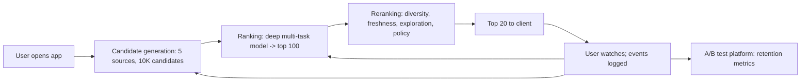

# Recommender System Case Study: Short-Video Feed

## Beginner-Friendly Intuition

This file walks through designing a recommender system end to end, for
a concrete product: a short-video feed (TikTok-style). The goal is to
keep users watching by recommending videos they will like, balanced
with diversity, freshness, and exploration. Every component covered
in earlier files (candidate generation, ranking, reranking,
evaluation) appears here in context.

The intuition for a case study: design choices interact. You cannot
think about the ranker without thinking about candidate generation;
you cannot think about evaluation without thinking about feedback
loops; you cannot think about latency without thinking about which
stage spends the budget. A real system is a set of trade-offs that
together must satisfy product, engineering, and business constraints.

This file is one example. The architecture pattern (two-stage funnel
plus reranking, with multiple candidate sources, deep ranker, and
careful exploration) generalizes to most production recommenders.

## Formal Explanation

### The product

- **Surface.** Infinite scrolling feed of short videos (15-60
  seconds). Users open the app, watch, occasionally like, share, or
  follow. Sessions 10-30 minutes; multiple sessions per day.
- **Scale.** 100M users. 500M videos in catalog. 100K queries per
  second peak. Latency budget 200 ms p99.
- **Objective.** Long-term engagement: 7-day and 30-day retention.
  Short-term proxies: watch time, completion, like rate. Anti-goals:
  user-reported "I want to see less of this", drop in creator
  diversity.

### The architecture

A two-stage funnel plus reranking. Five candidate sources, a deep
multi-task ranker, and a reranker that applies diversity, freshness,
exploration, and policy.

```
500M videos
    -> Candidate generation (5 sources, ~10K candidates after dedup)
    -> Ranking (deep multi-task model, top 100)
    -> Reranking (diversity, freshness, exploration, policy)
    -> Top 20 to client
    -> User watches; logged for retraining
```

Each stage is its own service. Total latency p99 ~150 ms.

### Candidate generation

- **Two-tower deep retrieval.** User encoder over watch history
  (Transformer over last 100 videos). Video encoder over content
  features (audio + text + metadata). 128-dim embeddings; HNSW
  index; ~5,000 candidates per query.
- **Co-watch CF.** Item-item similarity from co-watching; ~500
  candidates.
- **Following / friend graph.** Videos from creators the user
  follows or whose followers overlap; ~200.
- **Trending in user's preferences.** Top videos by recent watch time
  in user's top categories; ~300.
- **Exploration.** Random sample of high-uncertainty recent videos;
  ~200.

Total after dedup: ~10K candidates per query.

### Ranking

DLRM-style deep model. ~250 features (user, video, cross, context).
Multi-task: predict P(watch >= 30s), P(completion), P(like), P(share),
P(7-day-retention-correlated-action). Final score is a learned weighted
combination tuned for retention. Trained on 14 days of logs with
position-bias correction. Quantized to int8 at serving; ~60 ms over
10K candidates on a single GPU.

### Reranking

Operates on the top 100 from the ranker.

- **Diversity.** Max 3 videos per channel, 5 per category in top 20.
  MMR with `λ = 0.7` on channel diversity.
- **Freshness.** Boost (multiplicative score) for recent videos:
  1.4x under 1 hour, 1.2x under 6 hours.
- **Exploration.** 5 percent of slots reserved for exploration items
  (Thompson-sampled from high-uncertainty candidates).
- **Policy filters.** Copyright, age-appropriate, user mutes,
  per-creator-per-day frequency caps.

## Why It Matters in Real Jobs

Three production reasons. First, **case studies are interview
currency**. Senior ML interviews almost always include "design a
recommender for product X" prompts; the funnel architecture covered
here is the answer pattern. Second, **the funnel pattern generalizes**.
The same structure (multi-source retrieval, deep ranker, policy
reranker) works for ads, search, e-commerce, and any large-scale
recommender. Knowing the pattern is the foundation for every
production rec system. Third, **failure modes accumulate at the
system level**. Filter bubbles, creator concentration, position bias,
feedback loops are all system-level problems that appear only when
all stages interact; the case study makes them visible.

## How It Works Step by Step

1. **Define product, scale, latency, objective.** Without these, no
   architecture decisions are anchored.
2. **Build candidate generation.** Multiple sources for robustness;
   two-tower as the primary; a small exploration bucket reserved.
3. **Build the ranker.** Deep multi-task model with rich features and
   position-bias correction.
4. **Build the reranker.** Diversity, freshness, exploration, policy.
5. **Train end to end.** Each stage on logged data; refresh new-item
   embeddings frequently; ranker retrained daily; retrieval weekly.
6. **Evaluate offline per stage.** Recall@5K for retrieval, NDCG@20
   for ranking. Diversity and per-creator-decile coverage for
   reranking.
7. **A/B test for 14+ days.** Primary: 7-day retention. Guardrails:
   latency, complaints, diversity. Per-segment metrics for
   diagnosis.
8. **Monitor and iterate.** Per-stage latency, per-stage success
   metrics, distribution drift, creator fairness.

## Real-World Example

The team launches the architecture above. Several iterations follow,
each addressing a specific failure mode.

**Iteration 1: filter bubble.** After launch, user reports of "I
keep seeing the same kinds of videos" rise 8 percent. Investigation:
the ranker over-weights similar content. Fix: diversity rerank with
channel and category caps; reports drop and watch time holds.

**Iteration 2: creator concentration.** Six months in, top 1 percent
of creators get 80 percent of impressions. Long-tail creator opt-out
rate rises. Fix: inverse propensity weighting on training data plus
soft per-creator exposure caps. Top-decile share drops to 60
percent; creator retention rises 4 percent.

**Iteration 3: stale embeddings.** New videos uploaded in the last
hour get poor exposure. Fix: hourly refresh of new-video embeddings;
exploration source biased toward fresh content. New-creator first-
week views rise 22 percent.

**Iteration 4: position bias.** A new ranker fails A/B test despite
strong offline numbers. Investigation: ranker learned position
effects from logged data. Fix: position as training-only feature;
the next ranker version A/B tests cleanly.

**Iteration 5: novelty effects.** A successful ranker shows strong
week-1 effects that revert by week 4. Fix: extend A/B test duration
to 14+ days; require both week-1 and week-4 wins before launch.

The lesson: the architecture is the start. The iterations are where
the work lives. Each failure mode is invisible until it happens, and
the response shapes what the system becomes.

## Common Mistakes

- Skipping the funnel; trying to score the full catalog per query.
- Using a single candidate source; long tail and new items missed.
- Skipping reranking; pure relevance produces filter bubbles.
- Not handling cold start; new users and items underperform.
- Optimizing one short-term metric (CTR) and watching long-term
  metrics regress.
- Skipping exploration; the system fossilizes around early winners.
- Skipping per-segment metrics; new-user or geographic regressions
  hide.
- Not handling position bias; the ranker learns the wrong thing.
- Using offline metrics as the launch criterion; offline-online gap
  is real.
- Ignoring the feedback loop between ranker and candidate generator.
- Not setting guardrails (latency, complaints, diversity) before
  launch; bad changes ship invisibly.

## Interview Angle

**Question:** Design the recommender architecture for a short-video
feed at 100M users with a 200 ms latency budget.

**Strong answer.** The constraints rule out scoring the full catalog
per query. Two-stage funnel with multi-source candidate generation,
a deep ranker, and a reranker.

1. **Candidate generation.** Five sources running in parallel:
   two-tower deep retrieval (primary), co-watch CF, following/friend
   graph, trending-in-user-preferences, and exploration. Total ~10K
   candidates after dedup at ~15 ms.

2. **Ranking.** DLRM-style deep model with rich user/video/cross/
   context features. Multi-task targets (watch time, completion,
   like, share, retention-correlated-action) with learned weights.
   Position-bias-corrected training. ~60 ms over 10K candidates,
   GPU-served.

3. **Reranking.** Diversity (channel and category caps), freshness
   boost, exploration slots (5 percent reserved), policy filters,
   per-creator caps. ~5-10 ms.

Total p99 ~150 ms, leaving headroom in the 200 ms budget.

**Training cadence.** Two-tower retrieval weekly. Ranker daily.
Item embeddings hourly for new content.

**Evaluation.** Offline: Recall@5K (retrieval), NDCG@20 (ranking),
diversity (rerank). Online: 7-day retention as primary, with
guardrails on latency, complaint rate, and per-creator-decile
exposure. A/B tests run for 14+ days to absorb novelty.

**Cold start.** New users: popularity-by-category until 5+
interactions. New videos: content-only embeddings plus exploration
boost until enough interactions.

**Failure modes to watch.** Filter bubbles (diversity rerank),
creator concentration (inverse propensity weighting + per-creator
caps), stale embeddings (hourly refresh), feedback loops
(exploration + counterfactual evaluation), novelty effects (longer
A/B), position bias (training correction).

The architecture is standard; what differs across companies is the
specific features, multi-task weights, diversity rules, and
exploration rate.

**Weak answer.** Suggesting a single deep model without staging or
ignoring reranking, exploration, and feedback loops.

**Follow-up questions:**

- How would you handle creator-side fairness?
- What is exposure bias and how do you mitigate it?
- How would you launch a new ranker safely?
- What would change for a long-form video platform?

## Mini Exercise

Pick a different domain (e-commerce, music, news, ads). Map the same
funnel architecture: candidate sources, ranker features, reranking
policies, evaluation. Identify the constraints that differ from the
short-video case and how they shape the design.

## Diagram



---
## Navigation

[⬅ Previous](07-evaluation-metrics.md) | [🏠 Home](../README.md) | [➡ Next](../mlops/01-what-is-mlops.md)
