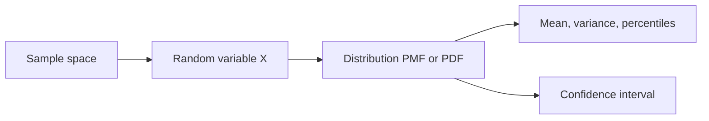

# Random Variables

## Beginner-Friendly Intuition

A random variable is a function that maps outcomes to numbers. The roll of a die is a random variable. The latency of an API call is a random variable. Most ML quantities (predictions, losses, errors) are random variables, which means they have distributions you can describe and reason about, not single fixed values.

## Formal Explanation

Discrete random variables take countable values, characterized by a probability mass function `p(x) = P(X = x)`. Continuous random variables take a continuum, described by a probability density function `f(x)`, with `P(a < X < b) = ∫_a^b f(x) dx`. The CDF `F(x) = P(X ≤ x)` works for both. Two random variables can be independent or dependent; their joint distribution captures the relationship.

## Why It Matters in Real Jobs

Latency, accuracy on a holdout, and revenue per user are all random variables. Reporting a single number without a distribution hides risk. Confidence intervals, A/B tests, and uncertainty estimation all assume you can describe the random variable behind the number.

## How It Works Step by Step

1. Decide whether the quantity is discrete or continuous.
2. Pick a parametric family that matches (Bernoulli, Binomial, Gaussian, Poisson).
3. Estimate parameters from data (MLE, method of moments).
4. Validate with a histogram or QQ plot before using the assumption.
5. Report a distribution or interval, not just a point estimate.

## Real-World Example

A team reports p95 latency as 280 ms. They look at the latency distribution and find a heavy right tail with rare 2-second outliers. The 95th percentile is fine, but the p99 is 1900 ms. Reporting only p95 hid the worst-case experience for a small but important group.

## Common Mistakes

- Reporting only the mean for highly skewed data.
- Treating a sample of size 5 as the true distribution.
- Confusing sample statistics with population parameters.
- Picking a Gaussian model for clearly heavy-tailed data.

## Interview Angle

**Question:** What does it mean to say the model's accuracy is a random variable, and how would you report it?

**Strong answer:** Accuracy on a held-out set is one realization of a random variable: another set would yield a different number. Report a confidence interval, not just the point estimate. For small samples, use bootstrap. For large samples, use a normal approximation.

**Weak answer:** Quote a single accuracy number with no uncertainty.

**Follow-up questions:**

- What is the difference between PMF, PDF, and CDF?
- Why does the law of large numbers matter for evaluation?
- How do you bootstrap a confidence interval?
- How do you handle heavy-tailed metrics like latency?

## Mini Exercise

Take any metric you compute. Bootstrap-resample it 1000 times to get a 95 percent CI. Note how wide the interval is and what would shrink it.

## Diagram

---
## Navigation

[⬅ Previous](01-probability-basics.md) | [🏠 Home](../README.md) | [➡ Next](03-common-distributions.md)
