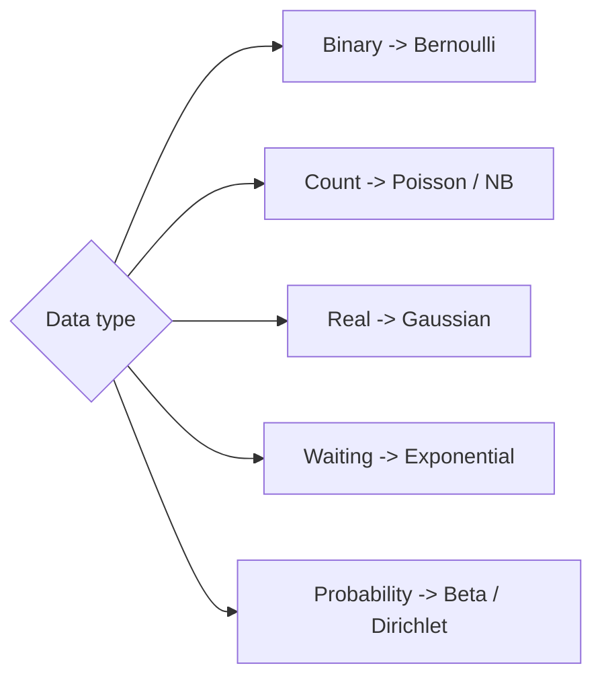

# Common Distributions

## Beginner-Friendly Intuition

A handful of distributions cover most ML use cases. Bernoulli for yes/no, Binomial for counts of yeses out of n, Categorical for multiclass, Gaussian (normal) for noise and many real-valued quantities, Poisson for rates of rare events, Exponential for waiting times, and Beta/Dirichlet for probabilities about probabilities. Recognizing the right one shortcuts a lot of modeling decisions.

## Formal Explanation

- **Bernoulli(p):** 1 with probability `p`, 0 otherwise.
- **Binomial(n, p):** sum of `n` independent Bernoulli(p) trials.
- **Categorical:** generalization of Bernoulli to `K` classes; the softmax output of a classifier.
- **Gaussian(μ, σ²):** continuous, symmetric, defined by mean and variance; central limit theorem makes it ubiquitous.
- **Poisson(λ):** count of events in a fixed interval at rate `λ`; mean equals variance.
- **Exponential(λ):** waiting time between Poisson events; memoryless.
- **Beta(α, β):** distribution over probabilities, conjugate prior to Bernoulli.
- **Dirichlet:** multivariate Beta, conjugate to categorical.

Concrete numeric example. Flip a fair coin 10 times. Each flip is Bernoulli(0.5), and the count of heads is Binomial(10, 0.5). The probability of exactly 5 heads is `C(10, 5) * 0.5^5 * 0.5^5 = 252 / 1024 ≈ 0.246`. The mean is `n p = 5`. The variance is `n p (1 - p) = 2.5`, so the standard deviation is about 1.58. So 5 heads is the most likely single outcome, but not by a huge margin: outcomes from 3 to 7 heads cover roughly 89 percent of the probability mass.

**The CLT and the n >= 30 rule of thumb.** The central limit theorem says that the sample mean of i.i.d. variables with finite variance is approximately Gaussian for large `n`. The "n >= 30" rule is a folk threshold: for many well-behaved distributions, the sample mean's distribution is close to Gaussian by `n = 30`. Two caveats. First, the rule fails for heavy-tailed distributions (Pareto, Cauchy) where finite variance does not exist or convergence is glacial; you may need `n` in the thousands. Second, the rule is about the sample mean, not individual draws; a single observation from a skewed distribution is still skewed no matter how big `n` is.

**Do not use Gaussian on bounded data.** A Gaussian assigns positive probability to all real numbers, including impossible ones. For data on `[0, 1]` (a probability, a proportion), use Beta. For data on `[0, ∞)` (counts, durations), use Poisson, Gamma, or log-normal. A common diagnostic mistake is fitting a Gaussian to conversion rates and reporting confidence intervals that include negative values; switch to a Beta or a logit-Gaussian.

## Why It Matters in Real Jobs

Picking the right distribution gives you the right loss (Bernoulli -> binary cross-entropy, Gaussian -> MSE, Poisson -> Poisson regression), the right confidence interval, and the right A/B test. Misusing a Gaussian assumption on count data is one of the most common analysis errors.

## How It Works Step by Step

1. Look at the data type: binary, count, real, time, set of probabilities.
2. Pick the distribution family that matches the data type.
3. Estimate parameters (MLE for most; conjugate priors for Bayesian).
4. Validate the fit (QQ plots for Gaussian; mean vs variance for Poisson).
5. Use the fitted distribution to compute the quantity you actually need.

## Real-World Example

A product team reports daily signups with a Gaussian-style mean ± stddev. Signups are counts so a Poisson is more appropriate. Switching to Poisson reveals that the variance is much higher than the mean (overdispersion), which suggests the right model is negative binomial. The alert thresholds change because heavy-tailed counts deserve looser bounds.

## Common Mistakes

- Modeling counts with a Gaussian (it allows negatives).
- Treating mean of Poisson as a tight estimate when variance equals mean.
- Forgetting that the central limit theorem requires enough samples and finite variance.
- Using Beta with wrong priors and getting overly tight posterior intervals.

## Interview Angle

**Question:** When would you use Poisson regression instead of linear regression?

**Strong answer:** When the target is a non-negative count and the variance grows with the mean. Linear regression assumes constant variance and continuous values; Poisson naturally models counts with variance equal to mean. If you see overdispersion, switch to negative binomial.

**Weak answer:** Default to Gaussian assumptions for count data.

**Follow-up questions:**

- Why is the Gaussian so common in ML losses?
- What is conjugate prior and why is Beta-Bernoulli so popular?
- How would you detect overdispersion in count data?
- What is the relationship between exponential and Poisson?

## Mini Exercise

Pick a quantity in your data (clicks per day, signups per hour). Plot a histogram and compare with a fitted Poisson. Decide whether the fit is acceptable.

## Diagram

---
## Navigation

[⬅ Previous](02-random-variables.md) | [🏠 Home](../README.md) | [➡ Next](04-expectation-variance-covariance.md)
