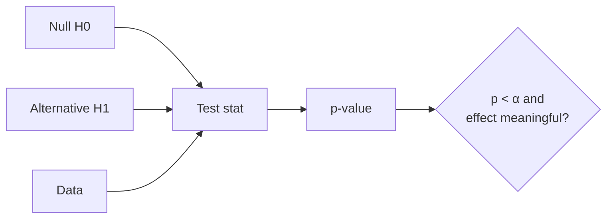

# Hypothesis Testing

## Beginner-Friendly Intuition

Hypothesis testing asks whether an observed effect is real or could be noise. You set up a null (no effect) and an alternative, compute a test statistic, and ask how likely the data would be if the null were true. If unlikely (small p-value), you reject the null.

## Formal Explanation

Two-sample tests (t-test, z-test, Mann-Whitney) compare distributions. Categorical data uses chi-square. The p-value is `P(observed or more extreme | H0)`. A significance level `α` (often 0.05) sets the type-I error rate. Power is `1 - P(type-II error)`; sample size, effect size, and variance set achievable power. Multiple testing inflates false positives; correct with Bonferroni, BH, or sequential methods.

## Why It Matters in Real Jobs

Every A/B test, every claim of a model improvement, every experiment in the wild lives or dies by hypothesis testing. Misusing it produces fake wins, wasted resources, and embarrassing rollbacks.

## How It Works Step by Step

1. State `H0` and `H1` precisely.
2. Pick the right test based on the data (continuous, categorical, paired, sample size).
3. Estimate sample size for desired power before running.
4. Compute the test statistic and p-value.
5. Decide using both p-value and effect size; report a confidence interval.

## Real-World Example

A team A/B tests a UI change with 500 users per arm. p-value is 0.03 with a 0.5 percent lift. The change is statistically significant but the effect is tiny and the CI nearly includes zero. Shipping it provides almost no business value and adds maintenance burden. Statistical significance is necessary, not sufficient.

## Sample Size and Power: Numeric Example

For a two-sample test of means with equal variances, the rough sample size per arm is `n ≈ 2 σ² (z_{α/2} + z_β)² / Δ²`. Set `α = 0.05` (so `z_{α/2} = 1.96`), power = 80 percent (so `z_β = 0.84`). Then `(z_{α/2} + z_β)² ≈ 7.85`. If your metric has `σ = 1.0` and you want to detect a lift of `Δ = 0.05` (a 5 percent change in the standard-deviation units), you need `n ≈ 2 * 1 * 7.85 / 0.0025 = 6,280` per arm. To detect `Δ = 0.025`, the sample size quadruples to roughly 25,120 per arm; halving the effect size requires four times the data. This is why teams that chase small effects need either large traffic or variance reduction (CUPED, stratification).

## Multiple Testing Decision Tree

Different methods fit different scales:

- **Few hypotheses, want to control familywise error rate (probability of any false positive).** Use **Bonferroni**: divide α by the number of tests. Conservative but simple. Fine when you have 5 to 20 pre-registered tests.
- **Many hypotheses, want to control false discovery rate (expected proportion of false positives among rejections).** Use **Benjamini-Hochberg (BH)**. Sort p-values, reject the top `k` such that the `k`-th p-value is below `k * α / m` where `m` is the total. Less conservative than Bonferroni; appropriate for screening hundreds of features for an effect.
- **Sequential or interim looks at an ongoing experiment.** Use **alpha-spending**, **group sequential boundaries**, or **mSPRT** (mixed sequential probability ratio test). Naively peeking at p-values inflates the false-positive rate well above α; sequential methods correct for it.

A common mistake is applying Bonferroni when BH is appropriate (you over-correct and miss real effects), or skipping correction entirely when running many secondary metrics in an A/B test (you find spurious wins).

## Common Mistakes

- Confusing p-value with `P(H0 is true)`.
- Peeking at results and stopping early (inflates false positives).
- Ignoring power; small samples cannot detect small effects.
- Multiple testing without correction.
- Running a one-sided test to chase significance.

## Interview Angle

**Question:** What is a p-value and what are its common misinterpretations?

**Strong answer:** A p-value is the probability of observing data at least as extreme as ours, assuming the null hypothesis. It is not the probability the null is true, not the probability the effect is real, and not the magnitude of the effect. Pair it with a confidence interval and a practical significance threshold.

**Weak answer:** Define a p-value as the probability the null is true.

**Follow-up questions:**

- What is the difference between type-I and type-II error?
- Why is `p < 0.05` a convention rather than a law?
- How do you correct for multiple comparisons?
- What is the difference between statistical and practical significance?

## Mini Exercise

Take any A/B test result you have. Recompute the test, the CI, and the practical effect size. Decide whether the win is worth shipping.

## Diagram

---
## Navigation

[⬅ Previous](06-maximum-likelihood-estimation.md) | [🏠 Home](../README.md) | [➡ Next](08-confidence-intervals.md)
